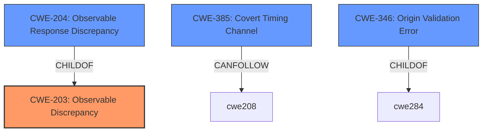

# Raw Analyzer Response for CVE-2022-1146

# Summary
| CWE ID | CWE Name | Confidence | CWE Abstraction Level | CWE Vulnerability Mapping Label | CWE-Vulnerability Mapping Notes |
|---|---|---|---|---|---|
| CWE-203 | Observable Discrepancy | 0.7 | Base | Primary | Allowed |
| CWE-204 | Observable Response Discrepancy | 0.6 | Base | Secondary | Allowed |
| CWE-385 | Covert Timing Channel | 0.4 | Base | Secondary | Allowed |
| CWE-346 | Origin Validation Error | 0.3 | Class | Secondary | Allowed-with-Review |

## Evidence and Confidence

*   **Confidence Score:** 0.7
*   **Evidence Strength:** MEDIUM

## Relationship Analysis
The primary relationship that influenced the selection was the hierarchical relationship between CWE-203 and CWE-204, where CWE-204 is a child of CWE-203. This indicates that CWE-204 is a more specific case of CWE-203. The `CanPrecede` relationship between CWE-208 and CWE-385 was noted as well. Since the vulnerability description mentions leaking cross-origin data, CWE-346 was also considered as a Class level entry.

## Vulnerability Chain
The vulnerability chain involves an **inappropriate implementation in Resource Timing**, which leads to the **leak of cross-origin data**. This could be represented as:

Inappropriate Implementation -> Observable Discrepancy -> Information Leak

## Summary of Analysis
The analysis is primarily based on the provided vulnerability description and the CVE Reference Links Content Summary. The key phrase "leak cross-origin data" suggests an information disclosure vulnerability due to some discrepancy in the way the Resource Timing is implemented.

The description states "**inappropriate implementation in Resource Timing** in Google Chrome prior to 100.0.4896.60 allowed a remote attacker to **leak cross-origin data** via a crafted HTML page."

CWE-203 (Observable Discrepancy) is chosen as the primary CWE because the vulnerability involves leaking information due to some observable difference in behavior.
CWE-204 (Observable Response Discrepancy) is also considered, as it's a child of CWE-203 and focuses on discrepancies in responses.
CWE-385 (Covert Timing Channel) is considered because Resource Timing could potentially be exploited to create a covert timing channel.
CWE-346 (Origin Validation Error) is considered since the vulnerability involves leaking cross-origin data, which could be related to improper origin validation.

The selected CWEs are at the optimal level of specificity because CWE-203 captures the general observable discrepancy, while CWE-204 and CWE-385 represent more specific potential manifestations of this discrepancy.

Relevant CWE Information:

# Enhanced Context (25 CWEs)

## CWE-451: User Interface (UI) Misrepresentation of Critical Information
**Abstraction Level**: Class
**Similarity Score**: 0.80
**Source**: dense

**Description**:
The user interface (UI) does not properly represent critical information to the user, allowing the information - or its source - to be obscured or spoofed. This is often a component in phishing attacks.

**Mapping Guidance**:
- Usage: Allowed-with-Review
- Rationale: This CWE entry is a Class and might have Base-level children that would be more appropriate

*Not Selected*: While a crafted HTML page is involved, the core issue is not misrepresentation of UI but rather leaking cross-origin data, making this less relevant.

## CWE-41: Improper Resolution of Path Equivalence
**Abstraction Level**: Base
**Similarity Score**: 0.79
**Source**: dense

**Description**:
The product is vulnerable to file system contents disclosure through path equivalence. Path equivalence involves the use of special characters in file and directory names. The associated manipulations are intended to generate multiple names for the same object.

**Mapping Guidance**:
- Usage: Allowed
- Rationale: This CWE entry is at the Base level of abstraction, which is a preferred level of abstraction for mapping to the root causes of vulnerabilities.

*Not Selected*: This CWE is specific to path equivalence issues, which are not evident in the vulnerability description.

## CWE-404: Improper Resource Shutdown or Release
**Abstraction Level**: Class
**Similarity Score**: 0.79
**Source**: dense

**Description**:
The product does not release or incorrectly releases a resource before it is made available for re-use.

**Mapping Guidance**:
- Usage: Allowed-with-Review
- Rationale: This CWE entry is a Class and might have Base-level children that would be more appropriate

*Not Selected*: This CWE relates to resource management, which is not directly indicated in the description.

## CWE-843: Access of Resource Using Incompatible Type ('Type Confusion')
**Abstraction Level**: Base
**Similarity Score**: 0.79
**Source**: dense

**Description**:
The product allocates or initializes a resource such as a pointer, object, or variable using one type, but it later accesses that resource using a type that is incompatible with the original type.

**Mapping Guidance**:
- Usage: Allowed
- Rationale: This CWE entry is at the Base level of abstraction, which is a preferred level of abstraction for mapping to the root causes of vulnerabilities.

*Not Selected*: Although it had a high similarity score in the Retriever Results, there is no indication of type confusion in the vulnerability description.

## CWE-668: Exposure of Resource to Wrong Sphere
**Abstraction Level**: Class
**Similarity Score**: 0.79
**Source**: dense

**Description**:
The product exposes a resource to the wrong control sphere, providing unintended actors with inappropriate access to the resource.

**Mapping Guidance**:
- Usage: Discouraged
- Rationale: CWE-668 is high-level and is often misused as a catch-all when lower-level CWE IDs might be applicable. It is sometimes used for low-information vulnerability reports [REF-1287]. It is a level-1 Class (i.e., a child of a Pillar). It is not useful for trend analysis.

*Not Selected*: While the vulnerability leads to cross-origin data leakage, the root cause is more specific than just exposing a resource to the wrong sphere. Furthermore, the usage is discouraged.

## CWE-754: Improper Check for Unusual or Exceptional Conditions
**Abstraction Level**: Class
**Similarity Score**: 0.79
**Source**: dense

**Description**:
The product does not check or incorrectly checks for unusual or exceptional conditions that are not expected to occur frequently during day to day operation of the product.

**Mapping Guidance**:
- Usage: Allowed-with-Review
- Rationale: This CWE entry is a Class and might have Base-level children that would be more appropriate

*Not Selected*: There is no evidence indicating missing checks for unusual conditions.

## CWE-667: Improper Locking
**Abstraction Level**: Class
**Similarity Score**: 0.79
**Source**: dense

**Description**:
The product does not properly acquire or release a lock on a resource, leading to unexpected resource state changes and behaviors.

**Mapping Guidance**:
- Usage: Allowed-with-Review
- Rationale: This CWE entry is a Class and might have Base-level children that would be more appropriate

*Not Selected*: There is no mention of locking or concurrency issues.

## CWE-941: Incorrectly Specified Destination in a Communication Channel
**Abstraction Level**: Base
**Similarity Score**: 0.79
**Source**: dense

**Description**:
The product creates a communication channel to initiate an outgoing request to an actor, but it does not correctly specify the intended destination for that actor.

**Mapping Guidance**:
- Usage: Allowed
- Rationale: This CWE entry is at the Base level of abstraction, which is a preferred level of abstraction for mapping to the root causes of vulnerabilities.

*Not Selected*: The vulnerability doesn't involve incorrectly specified destinations in a communication channel.

## CWE-653: Improper Isolation or Compartmentalization
**Abstraction Level**: Class
**Similarity Score**: 0.78
**Source**: dense

**Description**:
The product does not properly compartmentalize or isolate functionality, processes, or resources that require different privilege levels, rights, or permissions.

**Mapping Guidance**: