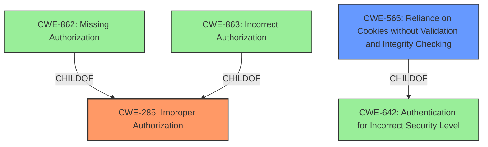

# Enhanced Analysis for CVE-2022-1148

# Summary
| CWE ID | CWE Name | Confidence | CWE Abstraction Level | CWE Vulnerability Mapping Label | CWE-Vulnerability Mapping Notes |
|---|---|---|---|---|---|
| CWE-285 | Improper Authorization | 0.8 | Class | Primary | Discouraged |
| CWE-565 | Reliance on Cookies without Validation and Integrity Checking | 0.7 | Base | Secondary | Allowed |

## Evidence and Confidence

*   **Confidence Score:** 0.75
*   **Evidence Strength:** MEDIUM

## Relationship Analysis
The primary relationship is that CWE-285 **Improper Authorization** is a parent Class of several more specific Base CWEs, including CWE-862 **Missing Authorization** and CWE-863 **Incorrect Authorization**. There's also a relationship between CWE-565 **Reliance on Cookies without Validation and Integrity Checking** as a child of CWE-642 **Authentication for Incorrect Security Level**. These relationships were considered to identify the most appropriate level of abstraction.



## Vulnerability Chain
The chain of events starts with the **improper authorization** in GitLab Pages, leading to the ability for an attacker to steal user access tokens. The **root cause** is the **improper validation** of session cookies, and the cross-subdomain usage of these cookies. This allows an attacker to bypass CSRF protection and intercept the OAuth2 response.

## Summary of Analysis
The initial assessment identified **Improper Authorization** as the primary weakness. The vulnerability description clearly states "**Improper authorization** in GitLab Pages...allowed an attacker to steal a users access token...". The retriever results also list CWE-285 **Improper Authorization**, CWE-863 **Incorrect Authorization**, and CWE-639 **Authorization Bypass Through User-Controlled Key** as potential candidates.

However, further analysis reveals the **root cause** lies in the **improper validation** of session cookies, enabling cross-subdomain usage. This is supported by the "CVE Reference Links Content Summary" which states "The gitlab-pages session cookies are not properly validated to ensure that the requested subdomain is the same as the subdomain to which the session cookie was issued for." This improper validation leads to the authorization bypass.

Considering the MITRE mapping guidance, CWE-285 is discouraged as it is a high-level Class. However, given the information available, a more specific child CWE isn't definitively supported. While CWE-863 **Incorrect Authorization** is a child of CWE-285 and more specific, the description of the vulnerability leans more towards a general **improper authorization** issue. The improper validation of cookies points towards a secondary weakness, CWE-565 **Reliance on Cookies without Validation and Integrity Checking**.

Therefore, while the ideal mapping would involve a Base CWE detailing the specific authorization flaw, the evidence supports CWE-285 as the primary weakness with CWE-565 representing a contributing factor. The selected CWEs are at the optimal level of specificity given the provided evidence, accurately reflecting the **improper authorization** and the **reliance on unvalidated cookies**.

Relevant CWE Information:
- CWE-285: Improper Authorization
- CWE-565: Reliance on Cookies without Validation and Integrity Checking


## CWE Relationship Analysis

Current CWEs represent these abstraction levels: .


### Vulnerability Chain Analysis

**Chain starting from CWE-862:**
- 862 (Missing Authorization) - ROOT


**Chain starting from CWE-642:**
- 642 (External Control of Critical State Data) - ROOT


### CWE Relationship Diagram

```mermaid
graph TD
    classDef primary fill:#f96,stroke:#333,stroke-width:2px
    classDef secondary fill:#69f,stroke:#333
    classDef tertiary fill:#9e9,stroke:#333
```