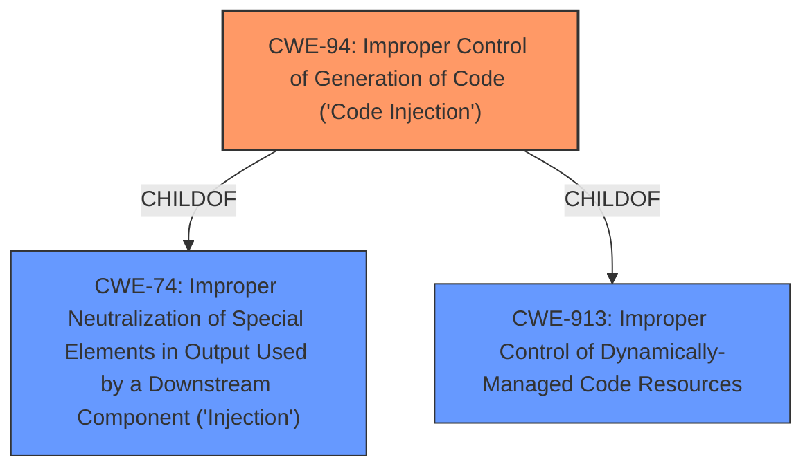

# Analysis for CVE-2022-1159

# Summary
| CWE ID | CWE Name | Confidence | CWE Abstraction Level | CWE Vulnerability Mapping Label | CWE-Vulnerability Mapping Notes |
|---|---|---|---|---|---|
| CWE-94 | Improper Control of Generation of Code ('Code Injection') | 1 | Base | Primary | Allowed-with-Review |

## Evidence and Confidence

*   **Confidence Score:** 1
*   **Evidence Strength:** HIGH

## Relationship Analysis
The primary CWE selected is CWE-94. CWE-94 is a base level CWE which is preferred. There are other CWEs that are related but less descriptive.

## Vulnerability Chain
The vulnerability chain starts with an attacker gaining administrator access on a workstation running Studio 5000 Logix Designer, followed by the attacker injecting malicious code into the controller due to **improper control of generation of code**, which leads to the ability to download a modified program to the controller, potentially causing severe consequences in the industrial control environment.

## Summary of Analysis
The initial analysis identified CWE-94 as the primary candidate based on the "CVE Reference Links Content Summary" that states the root cause is "**Improper control of generation of code (code injection)**". The retriever results also listed CWE-94 as the top candidate.

The final conclusion is that CWE-94 is the most appropriate mapping. This decision is based on the provided evidence, including the vulnerability description and the summary of the CVE reference links. The graph relationships show that CWE-94 is a base-level CWE, making it more specific than its parent classes. The mapping guidance allows for CWE-94 with review due to potential misuse, but the evidence strongly supports this classification.

Relevant CWE Information:

# Enhanced Context (25 CWEs)

## CWE-94: Improper Control of Generation of Code ('Code Injection')
**Abstraction:** Base
**Status:** Draft

### Description
The product constructs all or part of a code segment using externally-influenced input from an upstream component, but it does not neutralize or incorrectly neutralizes special elements that could modify the syntax or behavior of the intended code segment.

### Extended Description
When a product allows a user's input to contain code syntax, it might be possible for an attacker to craft the code in such a way that it will alter the intended control flow of the product. Such an alteration could lead to arbitrary code execution.

### Alternative Terms
None

### Relationships
ChildOf -> CWE-74
ChildOf -> CWE-913

### Mapping Guidance
**Usage:** Allowed-with-Review
**Rationale:** This entry is frequently misused for vulnerabilities with a technical impact of "code execution," which does not by itself indicate a root cause weakness, since dozens of weaknesses can enable code execution.
**Comments:** This weakness only applies when the product's functionality intentionally constructs all or part of a code segment. It could be that executing code could be the result of other weaknesses that do not involve the construction of code segments.

### Observed Examples
- **CVE-2023-29374:** Math component in an LLM framework translates user input into a Python expression that is input into the Python exec() method, allowing code execution - one variant of a "prompt injection" attack.
- **CVE-2024-5565:** Python-based library uses an LLM prompt containing user input to dynamically generate code that is then fed as input into the Python exec() method, allowing code execution - one variant of a "prompt injection" attack.
- **CVE-2024-4181:** Framework for LLM applications allows eval injection via a crafted response from a hosting provider.

**Explanation:** The vulnerability description states that an attacker can **inject controller code**, and the CVE reference summary confirms this as "**Improper control of generation of code (code injection)**". This aligns directly with CWE-94, where the product constructs a code segment using externally-influenced input without proper neutralization. The security implication is the ability to alter the intended control flow of the product, potentially leading to arbitrary code execution. The mapping guidance allows this CWE with review, which is appropriate given the potential for misuse, but the direct evidence supports this classification.