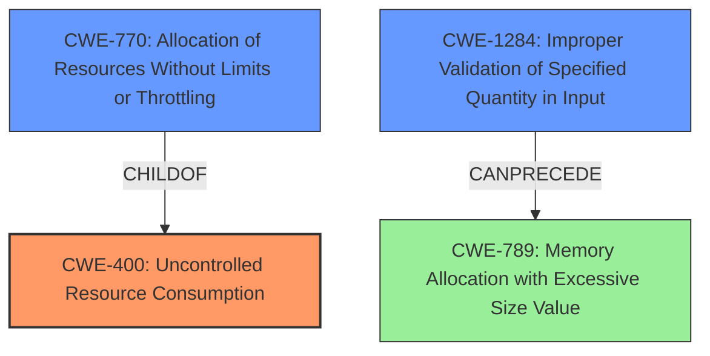

# Raw Analyzer Response for CVE-2022-1174

# Summary

| CWE ID  | CWE Name                                            | Confidence | CWE Abstraction Level | CWE Vulnerability Mapping Label | CWE-Vulnerability Mapping Notes |
| ------- | --------------------------------------------------- | ---------- | --------------------- | ------------------------------- | ------------------------------- |
| CWE-400 | Uncontrolled Resource Consumption                   | 0.9        | Class                 | Primary                         | Discouraged                  |
| CWE-770 | Allocation of Resources Without Limits or Throttling | 0.8        | Base                  | Secondary                       | Allowed                         |
| CWE-1284 | Improper Validation of Specified Quantity in Input  | 0.7        | Base                  | Secondary                       | Allowed                         |

## Evidence and Confidence

*   **Confidence Score:** 0.8
*   **Evidence Strength:** HIGH

## Relationship Analysis

The primary CWE is CWE-400 [CWE-400: Uncontrolled Resource Consumption], which is a Class-level CWE. CWE-770 [CWE-770: Allocation of Resources Without Limits or Throttling] and CWE-1284 [CWE-1284: Improper Validation of Specified Quantity in Input] are both children of higher-level CWEs and are at the Base level of abstraction. CWE-770 is a child of CWE-400 and represents a more specific type of uncontrolled resource consumption related to allocation without limits. CWE-1284 can precede CWE-789 [CWE-789: Memory Allocation with Excessive Size Value] in a chain, where improper quantity validation leads to excessive memory allocation.

## Vulnerability Chain

The vulnerability chain starts with **improper input validation** (lack of validation or incorrect validation of the input size/complexity) when handling Kroki payloads. This leads to **uncontrolled resource allocation** by the Kroki library when rendering the payload, ultimately resulting in **uncontrolled resource consumption** (high CPU usage and denial of service).

## Summary of Analysis

Initial analysis identified CWE-400 [CWE-400: Uncontrolled Resource Consumption] as a primary candidate due to the **impact** of the vulnerability being high CPU usage, which directly aligns with resource exhaustion. However, CWE-400 is discouraged because it is often misused and more precise mappings are available. The evidence from the CVE Reference Links Content Summary indicates "**lack of proper input validation and resource limits when rendering content**" and "**Kroki library does not limit the size of data it is processing**". This points to CWE-770 [CWE-770: Allocation of Resources Without Limits or Throttling] and CWE-1284 [CWE-1284: Improper Validation of Specified Quantity in Input] as more specific root causes.

CWE-770 [CWE-770: Allocation of Resources Without Limits or Throttling] is a strong candidate because the vulnerability arises from the application allocating resources (CPU time) to render the Kroki diagram without any limits or throttling. This directly aligns with the description of CWE-770.

CWE-1284 [CWE-1284: Improper Validation of Specified Quantity in Input] is also relevant because the **specially crafted input** effectively specifies a quantity of processing that the system is not equipped to handle, and the system **fails to validate or incorrectly validates** this quantity. This leads to excessive CPU usage.

The relationships in the graph show that CWE-770 is a child of CWE-400, and CWE-1284 can precede CWE-789 [CWE-789: Memory Allocation with Excessive Size Value]. Given the available evidence, I am choosing CWE-400 [CWE-400: Uncontrolled Resource Consumption] as the primary CWE because the final **impact** is high CPU usage, which is the exhaustion of available resources. I am also including CWE-770 [CWE-770: Allocation of Resources Without Limits or Throttling] and CWE-1284 [CWE-1284: Improper Validation of Specified Quantity in Input] as secondary CWEs to represent the root causes that lead to the resource exhaustion.

The selected CWEs are at the optimal level of specificity because they accurately capture both the root cause (improper input validation and resource allocation without limits) and the resulting impact (uncontrolled resource consumption).

**CWEs Considered but Not Used:**

*   **CWE-1333 [CWE-1333: Inefficient Regular Expression Complexity]:** While the description mentions "special crafted input", there's no specific evidence of regular expression usage or inefficiency.
*   **CWE-863 [CWE-863: Incorrect Authorization]:** Authorization is not the primary issue; the vulnerability stems from resource management and input validation.
*   **CWE-116 [CWE-116: Improper Encoding or Escaping of Output]:** There's no mention of encoding or escaping issues in the vulnerability description.
*   **CWE-285 [CWE-285: Improper Authorization]:** Similar to CWE-863, authorization is not the central problem.
*   **CWE-1286 [CWE-1286: Improper Validation of Syntactic Correctness of Input]:** While input validation is a factor, the core issue is related to limiting resources, not syntax correctness.
*   **CWE-410 [CWE-410: Insufficient Resource Pool]:** The problem is not an insufficient resource pool, but rather the uncontrolled allocation of resources.
*   **CWE-639 [CWE-639: Authorization Bypass Through User-Controlled Key]:** The vulnerability is not about bypassing authorization checks by manipulating keys.
*   **CWE-1390 [CWE-1390: Weak Authentication]:** Authentication is not the primary concern in this vulnerability.
*   **CWE-22 [CWE-22: Improper Limitation of a Pathname to a Restricted Directory ('Path Traversal')]:** Path traversal is not related to this vulnerability.
*   **CWE-73 [CWE-73: External Control of File Name or Path]:** This vulnerability does not directly involve external control of file names or paths.
*   **CWE-190 [CWE-190: Integer Overflow or Wraparound]:** There is no evidence suggesting an integer overflow or wraparound.
*   **CWE-41 [CWE-41: Improper Resolution of Path Equivalence]:** Path equivalence is not a relevant factor in this vulnerability.
*   **CWE-178 [CWE-178: Improper Handling of Case Sensitivity]:** Case sensitivity is not relevant.
*   **CWE-252 [CWE-252: Unchecked Return Value]:** There is no evidence to suggest unchecked return values contribute to this vulnerability.
*    **CWE-789 [CWE-789: Memory Allocation with Excessive Size Value]:** While excessive memory allocation could be a consequence, the description emphasizes CPU usage, making the root cause more closely tied to resource management and lack of input validation.