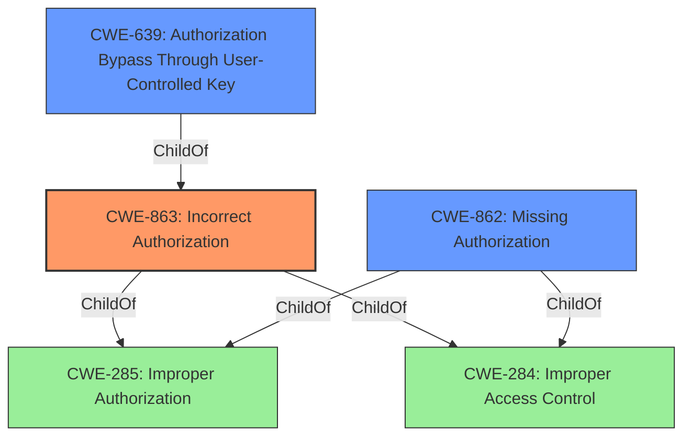

# Analysis for CVE-2022-1223

# Summary
| CWE ID | CWE Name | Confidence | CWE Abstraction Level | CWE Vulnerability Mapping Label | CWE-Vulnerability Mapping Notes |
|---|---|---|---|---|---|
| CWE-863 | Incorrect Authorization | 1.0 | Class | Allowed-with-Review | Primary CWE |
| CWE-639 | Authorization Bypass Through User-Controlled Key | 0.7 | Base | Allowed | Secondary Candidate |
| CWE-862 | Missing Authorization | 0.6 | Class | Allowed-with-Review | Secondary Candidate |

## Evidence and Confidence

*   **Confidence Score:** 1.0
*   **Evidence Strength:** HIGH

## Relationship Analysis
The primary CWE is CWE-863 (**Incorrect Authorization**), a Class-level CWE, which is a child of CWE-285 (**Improper Authorization**) and CWE-284 (**Improper Access Control**). CWE-639 (**Authorization Bypass Through User-Controlled Key**) is a Base-level CWE and a child of CWE-863, representing a more specific type of authorization issue. CWE-862 (**Missing Authorization**) is also a child of CWE-285 and CWE-284, representing a different facet of authorization problems. The choice of CWE-863 as primary reflects that the authorization check was performed but was **incorrect**, as the admin privileges were not correctly enforced.

## Vulnerability Chain
The vulnerability chain starts with the **incorrect authorization** checks in the PHP scripts. The scripts **failed** to verify if the user had admin privileges. This led to the bypass of access control, resulting in unauthorized access to sensitive functions and data.
- **Root Cause:** **Incorrect Authorization** in multiple PHP scripts.
- **Weakness:** **Insufficient Access Control** due to **missing** or **inconsistent privilege checks**.
- **Impact:** **Unauthorized Access** to administrative functions and potential data exposure.

## Summary of Analysis
The initial assessment was guided by the provided evidence, primarily the "CVE Reference Links Content Summary" and "Vulnerability Description Key Phrases." The key phrase **"Incorrect Authorization"** immediately suggested CWE-863. The detailed description confirmed that the vulnerability stemmed from the application failing to properly check if the user had admin privileges, as evidenced by "certain scripts were missing proper checks to ensure that the user had the necessary administrative privileges." The fix involved adding `$Admin->is_admin()` checks.

The retriever results suggested several CWEs related to access control and authorization. CWE-284 (**Improper Access Control**) was deemed too high-level, as the issue was more specifically related to authorization. CWE-639 (**Authorization Bypass Through User-Controlled Key**) was considered as a potential secondary CWE, since the bypass occurred due to the key (user ID) not being properly validated against the required privileges. CWE-862 (**Missing Authorization**) was also considered, but ultimately rejected as the primary CWE, because the code *did* perform authorization checks, albeit **incorrectly**.

The selection of CWE-863 as the primary CWE is justified because it directly addresses the **incorrect implementation of authorization checks**. This aligns with the MITRE mapping guidance of choosing the most specific CWE. The evidence supports this decision, with the vulnerability description highlighting the **lack of consistent and correct privilege checks**.

Relevant CWE Information:

## CWE-472: External Control of Assumed-Immutable Web Parameter
**Abstraction Level**: Base
**Similarity Score**: 0.79
**Source**: dense

**Description**:
The web application does not sufficiently verify inputs that are assumed to be immutable but are actually externally controllable, such as hidden form fields.

**Mapping Guidance**:
- Usage: Allowed
- Rationale: This CWE entry is at the Base level of abstraction, which is a preferred level of abstraction for mapping to the root causes of vulnerabilities.

## CWE-807: Reliance on Untrusted Inputs in a Security Decision
**Abstraction Level**: Base
**Similarity Score**: 0.77
**Source**: dense

**Description**:
The product uses a protection mechanism that relies on the existence or values of an input, but the input can be modified by an untrusted actor in a way that bypasses the protection mechanism.

**Mapping Guidance**:
- Usage: Allowed
- Rationale: This CWE entry is at the Base level of abstraction, which is a preferred level of abstraction for mapping to the root causes of vulnerabilities.

## CWE-639: Authorization Bypass Through User-Controlled Key
**Abstraction Level**: Base
**Similarity Score**: 0.76
**Source**: dense

**Description**:
The system's authorization functionality does not prevent one user from gaining access to another user's data or record by modifying the key value identifying the data.

**Mapping Guidance**:
- Usage: Allowed
- Rationale: This CWE entry is at the Base level of abstraction, which is a preferred level of abstraction for mapping to the root causes of vulnerabilities.

## CWE-274: Improper Handling of Insufficient Privileges
**Abstraction Level**: Base
**Similarity Score**: 0.75
**Source**: dense

**Description**:
The product does not handle or incorrectly handles when it has insufficient privileges to perform an operation, leading to resultant weaknesses.

**Mapping Guidance**:
- Usage: Discouraged
- Rationale: This CWE entry could be deprecated in a future version of CWE.

## CWE-1220: Insufficient Granularity of Access Control
**Abstraction Level**: Base
**Similarity Score**: 0.75
**Source**: dense

**Description**:
The product implements access controls via a policy or other feature with the intention to disable or restrict accesses (reads and/or writes) to assets in a system from untrusted agents. However, implemented access controls lack required granularity, which renders the control policy too broad because it allows accesses from unauthorized agents to the security-sensitive assets.

**Mapping Guidance**:
- Usage: Allowed
- Rationale: This CWE entry is at the Base level of abstraction, which is a preferred level of abstraction for mapping to the root causes of vulnerabilities.

## CWE-212: Improper Removal of Sensitive Information Before Storage or Transfer
**Abstraction Level**: Base
**Similarity Score**: 0.75
**Source**: dense

**Description**:
The product stores, transfers, or shares a resource that contains sensitive information, but it does not properly remove that information before the product makes the resource available to unauthorized actors.

**Mapping Guidance**:
- Usage: Allowed
- Rationale: This CWE entry is at the Base level of abstraction, which is a preferred level of abstraction for mapping to the root causes of vulnerabilities.

## CWE-302: Authentication Bypass by Assumed-Immutable Data
**Abstraction Level**: Base
**Similarity Score**: 0.75
**Source**: dense

**Description**:
The authentication scheme or implementation uses key data elements that are assumed to be immutable, but can be controlled or modified by the attacker.

**Mapping Guidance**:
- Usage: Allowed
- Rationale: This CWE entry is at the Base level of abstraction, which is a preferred level of abstraction for mapping to the root causes of vulnerabilities.

## CWE-552: Files or Directories Accessible to External Parties
**Abstraction Level**: Base
**Similarity Score**: 0.75
**Source**: dense

**Description**:
The product makes files or directories accessible to unauthorized actors, even though they should not be.

**Mapping Guidance**:
- Usage: Allowed
- Rationale: This CWE entry is at the Base level of abstraction, which is a preferred level of abstraction for mapping to the root causes of vulnerabilities.

## CWE-41: Improper Resolution of Path Equivalence
**Abstraction Level**: Base
**Similarity Score**: 0.75
**Source**: dense

**Description**:
The product is vulnerable to file system contents disclosure through path equivalence. Path equivalence involves the use of special characters in file and directory names. The associated manipulations are intended to generate multiple names for the same object.

**Mapping Guidance**:
- Usage: Allowed
- Rationale: This CWE entry is at the Base level of abstraction, which is a preferred level of abstraction for mapping to the root causes of vulnerabilities.

## CWE-668: Exposure of Resource to