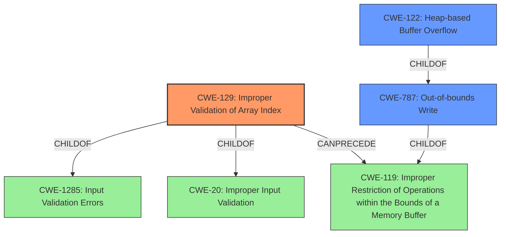

# Enhanced Analysis for CVE-2022-1237

# Summary
| CWE ID | CWE Name | Confidence | CWE Abstraction Level | CWE Vulnerability Mapping Label | CWE-Vulnerability Mapping Notes |
|---|---|---|---|---|---|
| CWE-129 | Improper Validation of Array Index | 1.0 | Variant | Allowed | Primary CWE |
| CWE-787 | Out-of-bounds Write | 0.8 | Base | Allowed | Secondary Candidate |
| CWE-122 | Heap-based Buffer Overflow | 0.7 | Variant | Allowed | Secondary Candidate |

## Evidence and Confidence

*   **Confidence Score:** 0.9
*   **Evidence Strength:** HIGH

## Relationship Analysis
The primary CWE is CWE-129 (Improper Validation of Array Index), a Variant of CWE-1285 and CWE-20. The vulnerability description explicitly mentions **"Improper Validation of Array Index"** as the root cause. The potential consequences, such as **heap overflow** (CWE-122) and **out-of-bounds write** (CWE-787), stem from this improper validation. CWE-129 can precede CWE-119 (Improper Restriction of Operations within the Bounds of a Memory Buffer) which is a parent of CWE-787. CWE-122 is a child of CWE-787, providing a more specific description of the overflow occurring on the heap.



## Vulnerability Chain
The vulnerability chain starts with **Improper Validation of Array Index** (CWE-129), which leads to an **out-of-bounds write** (CWE-787), and manifests as a **heap overflow** (CWE-122) due to writing beyond allocated memory region.

## Summary of Analysis
The initial assessment identified several candidate CWEs, including those related to integer handling (overflow, underflow) and buffer manipulation. However, the vulnerability description and the CVE reference link content summary strongly suggest that the primary weakness lies in the **improper validation of an array index**. The code reads data from a buffer using offsets and sizes derived from the NE header without proper validation, leading to reads/writes beyond the allocated buffer. This aligns perfectly with CWE-129. The heap overflow and out-of-bounds write are consequences of this flawed index validation.

The CWE relationships support this decision. CWE-129 is a Variant-level CWE, providing a specific description of the root cause. CWE-787 (Out-of-bounds Write) and CWE-122 (Heap-based Buffer Overflow) describe the impact or manifestation of the vulnerability, but not the underlying cause.

The evidence is quite strong, as the vulnerability description explicitly mentions **"Improper Validation of Array Index"**. Furthermore, the CVE reference link content summary highlights the lack of proper validation of offsets and sizes.

"Vulnerability Description Key Phrases:
-   **rootcause:** **Improper Validation of Array Index**
-   **weakness:** **heap overflow**"

# Relevant CWE Information:

## CWE-190: Integer Overflow or Wraparound
Was considered but determined not to be the primary issue. While integer overflows may be present during size calculations, the core issue is the improper array index validation that allows access outside the buffer.

## CWE-129: Improper Validation of Array Index
This is the primary CWE. The vulnerability description explicitly mentions **"Improper Validation of Array Index"** as the root cause.

## CWE-122: Heap-based Buffer Overflow
This is a secondary CWE. The vulnerability description mentions **heap overflow** as a weakness. It is the result of the improper validation and subsequent out-of-bounds write.

## CWE-476: NULL Pointer Dereference
Was considered but it doesn't appear to be the root cause or a direct consequence based on the provided descriptions.

## CWE-191: Integer Underflow (Wrap or Wraparound)
Was considered but determined not to be the primary issue. Similar to integer overflow, while integer underflows might be present, the core issue is improper array index validation.

## CWE-788: Access of Memory Location After End of Buffer
Was considered, but it is less specific than CWE-787. CWE-787 directly addresses the out-of-bounds write, while CWE-788 is more general. Additionally, CWE-788 is discouraged.

## CWE-787: Out-of-bounds Write
This is a secondary CWE. It describes the direct consequence of the improper array index validation, where data is written outside the intended buffer.

## CWE-839: Numeric Range Comparison Without Minimum Check
Was considered but is not the primary issue. The vulnerability is more directly related to the index validation rather than a missing minimum check on a numeric range.

## CWE-1284: Improper Validation of Specified Quantity in Input
Was considered, but CWE-129 is a better fit because it specifies that the improper validation is specifically related to an array index.

## CWE-681: Incorrect Conversion between Numeric Types
Was considered but is not the primary issue. The core problem is not the incorrect conversion of numeric types, but the lack of proper validation of the array index.


## CWE Relationship Analysis

Current CWEs represent these abstraction levels: .


### Vulnerability Chain Analysis

**Chain starting from CWE-190:**
- 190 (Integer Overflow or Wraparound) - ROOT


**Chain starting from CWE-839:**
- 839 (Numeric Range Comparison Without Minimum Check) - ROOT


### CWE Relationship Diagram

```mermaid
graph TD
    classDef primary fill:#f96,stroke:#333,stroke-width:2px
    classDef secondary fill:#69f,stroke:#333
    classDef tertiary fill:#9e9,stroke:#333
```