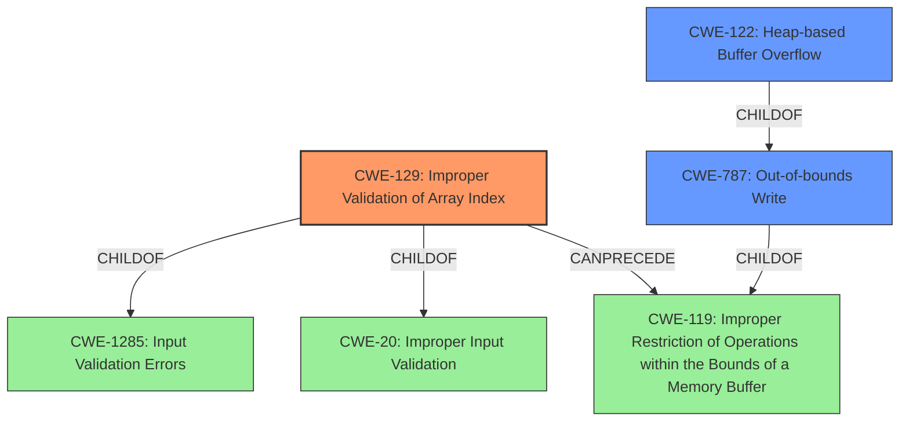

# Analysis for CVE-2022-1237

# Summary
| CWE ID | CWE Name | Confidence | CWE Abstraction Level | CWE Vulnerability Mapping Label | CWE-Vulnerability Mapping Notes |
|---|---|---|---|---|---|
| CWE-129 | Improper Validation of Array Index | 1.0 | Variant | Allowed | Primary CWE |
| CWE-787 | Out-of-bounds Write | 0.8 | Base | Allowed | Secondary Candidate |
| CWE-122 | Heap-based Buffer Overflow | 0.7 | Variant | Allowed | Secondary Candidate |

## Evidence and Confidence

*   **Confidence Score:** 0.9
*   **Evidence Strength:** HIGH

## Relationship Analysis
The primary CWE is CWE-129 (Improper Validation of Array Index), a Variant of CWE-1285 and CWE-20. The vulnerability description explicitly mentions **"Improper Validation of Array Index"** as the root cause. The potential consequences, such as **heap overflow** (CWE-122) and **out-of-bounds write** (CWE-787), stem from this improper validation. CWE-129 can precede CWE-119 (Improper Restriction of Operations within the Bounds of a Memory Buffer) which is a parent of CWE-787. CWE-122 is a child of CWE-787, providing a more specific description of the overflow occurring on the heap.

## Vulnerability Chain
The vulnerability chain starts with **Improper Validation of Array Index** (CWE-129), which leads to an **out-of-bounds write** (CWE-787), and manifests as a **heap overflow** (CWE-122) due to writing beyond allocated memory region.

## Summary of Analysis
The initial assessment identified several candidate CWEs, including those related to integer handling (overflow, underflow) and buffer manipulation. However, the vulnerability description and the CVE reference link content summary strongly suggest that the primary weakness lies in the **improper validation of an array index**. The code reads data from a buffer using offsets and sizes derived from the NE header without proper validation, leading to reads/writes beyond the allocated buffer. This aligns perfectly with CWE-129. The heap overflow and out-of-bounds write are consequences of this flawed index validation.

The CWE relationships support this decision. CWE-129 is a Variant-level CWE, providing a specific description of the root cause. CWE-787 (Out-of-bounds Write) and CWE-122 (Heap-based Buffer Overflow) describe the impact or manifestation of the vulnerability, but not the underlying cause.

The evidence is quite strong, as the vulnerability description explicitly mentions **"Improper Validation of Array Index"**. Furthermore, the CVE reference link content summary highlights the lack of proper validation of offsets and sizes.

"Vulnerability Description Key Phrases:
-   **rootcause:** **Improper Validation of Array Index**
-   **weakness:** **heap overflow**"

# Relevant CWE Information:

## CWE-190: Integer Overflow or Wraparound
Was considered but determined not to be the primary issue. While integer overflows may be present during size calculations, the core issue is the improper array index validation that allows access outside the buffer.

## CWE-129: Improper Validation of Array Index
This is the primary CWE. The vulnerability description explicitly mentions **"Improper Validation of Array Index"** as the root cause.

## CWE-122: Heap-based Buffer Overflow
This is a secondary CWE. The vulnerability description mentions **heap overflow** as a weakness. It is the result of the improper validation and subsequent out-of-bounds write.

## CWE-476: NULL Pointer Dereference
Was considered but it doesn't appear to be the root cause or a direct consequence based on the provided descriptions.

## CWE-191: Integer Underflow (Wrap or Wraparound)
Was considered but determined not to be the primary issue. Similar to integer overflow, while integer underflows might be present, the core issue is improper array index validation.

## CWE-788: Access of Memory Location After End of Buffer
Was considered, but it is less specific than CWE-787. CWE-787 directly addresses the out-of-bounds write, while CWE-788 is more general. Additionally, CWE-788 is discouraged.

## CWE-787: Out-of-bounds Write
This is a secondary CWE. It describes the direct consequence of the improper array index validation, where data is written outside the intended buffer.

## CWE-839: Numeric Range Comparison Without Minimum Check
Was considered but is not the primary issue. The vulnerability is more directly related to the index validation rather than a missing minimum check on a numeric range.

## CWE-1284: Improper Validation of Specified Quantity in Input
Was considered, but CWE-129 is a better fit because it specifies that the improper validation is specifically related to an array index.

## CWE-681: Incorrect Conversion between Numeric Types
Was considered but is not the primary issue. The core problem is not the incorrect conversion of numeric types, but the lack of proper validation of the array index.

# Enhanced Query for CVE-2022-1237

## Vulnerability Description
**Improper Validation of Array Index** in GitHub repository radareorg/radare2 prior to 5.6.8. This vulnerability is **heap overflow** and may be exploitable. For more general description of heap buffer overflow, see [CWE](https//cwe.mitre.org/data/definitions/122.html).

### Vulnerability Description Key Phrases
- **rootcause:** **Improper Validation of Array Index**
- **weakness:** **heap overflow**
- **product:** radareorg/radare2
- **version:** prior to 5.6.8

## CVE Reference Links Content Summary
Based on the provided content, here's an analysis of the vulnerability addressed by the commit, which seems to be related to CVE-2022-1237.

**Root cause of vulnerability:**
The vulnerability is an out-of-bounds read in the NE (New Executable) binary parser of radare2. Specifically, the issue occurs when parsing relocation information within NE files. The code attempts to read data based on offsets and sizes specified in the NE header. However, these offsets and sizes can be manipulated, leading to reads beyond the allocated buffer.

**Weaknesses/vulnerabilities present:**

*   **Out-of-bounds read:** The core issue is that the code reads data from a buffer using offsets and sizes derived from the NE header without proper validation.
    *   Specifically, a loop condition `while (off < start + length * sizeof (NE_image_reloc_item) && off < buf_size)` attempts to prevent out of bounds reads but is not sufficient to prevent all instances, as seen by the patch.
*   **Incorrect Size Calculation:** The code calculates the size of the segment entries based on `bin->ne_header->SegCount * sizeof (NE_image_segment_entry)` which can overflow on large crafted inputs. Later it is corrected by checking against `r_buf_size(bin->buf)`.

**Impact of exploitation:**

*   **Segmentation fault (segfault):** The out-of-bounds read leads to the program attempting to access memory it's not allowed to, resulting in a crash (segfault). This is mentioned in the commit message "Fix oobread segfaults in the NE bin parser". This can lead to denial of service (DoS) and possibly further exploitation (if it can lead to other issues).

**Attack vectors:**

*   **Crafted NE files:** An attacker can craft a malicious NE file with manipulated header values (specifically `SegCount`, `ModRefs`, offsets and sizes for relocation) that trigger the out-of-bounds read.
*   **File Analysis with radare2:** The attacker needs to entice the user to load the malicious NE file with radare2 for analysis.

**Required attacker capabilities/position:**

*   The attacker needs to be able to create a crafted NE file.
*   The attacker needs to be able to get the victim to open the crafted file using the vulnerable version of radare2.

**Additional Notes**
*   The commit message mentions that the issue was reported by `@Han0nly` via huntr.dev, and the bounty ID `ad3c9c4c-76e7-40c8-bd4a-c095acd8bb40`. This confirms that it is a vulnerability.
*   The patch fixes the issue by adding bounds checks to ensure that reads do not go beyond the allocated buffer (as shown by the change in the code). There are other changes such as a change from `malloc` to `calloc` when allocating `modref` and adding size validation for `segment_entries` and `ModRefs` based on available buffer size.
*   The vulnerability is present in `libr/bin/format/ne/ne.c`
*   The fix is in the same file.

The provided information gives more specific details on the vulnerability than a typical CVE description.

## Retriever Results

### Top Combined Results

| Rank | CWE ID | Name | Abstraction | Usage  | Retrievers | Individual Scores |
|------|--------|------|-------------|-------|------------|-------------------|
| 1 | 190 | Integer Overflow or Wraparound | Base | Allowed | alternate_terms | 0.800 |
| 2 | 129 | Improper Validation of Array Index | Variant | Allowed | sparse | 0.329 |
| 3 | 122 | Heap-based Buffer Overflow | Variant | Allowed | sparse | 0.326 |
| 4 | 476 | NULL Pointer Dereference | Base | Allowed | sparse | 0.317 |
| 5 | 191 | Integer Underflow (Wrap or Wraparound) | Base | Allowed | sparse | 0.294 |
| 6 | 788 | Access of Memory Location After End of Buffer | Base | Discouraged | dense | 0.613 |
| 7 | 787 | Out-of-bounds Write | Base | Allowed | graph | 0.002 |
| 8 | 839 | Numeric Range Comparison Without Minimum Check | Base | Allowed | sparse | 0.282 |
| 9 | 1284 | Improper Validation of Specified Quantity in Input | Base | Allowed | sparse | 0.279 |
| 10 | 681 | Incorrect Conversion between Numeric Types | Base | Allowed | sparse | 0.272 |

# Complete CWE Specifications

## CWE-190: Integer Overflow or Wraparound
**Abstraction:** Base
**Status:** Stable

### Description
The product performs a calculation that can
         produce an integer overflow or wraparound when the logic
         assumes that the resulting value will always be larger than
         the original value. This occurs when an integer value is
         incremented to a value that is too large to store in the
         associated representation. When this occurs, the value may
         become a very small or negative number.

### Extended Description
Not provided

### Alternative Terms
Overflow: The terms "overflow" and "wraparound" are used interchangeably by some people, but they can have more precise distinctions by others. See Terminology Notes.
Wraparound: The terms "overflow" and "wraparound" are used interchangeably by some people, but they can have more precise distinctions by others. See Terminology Notes.
wrap, wrap-around, wrap around: Alternate spellings of "wraparound"

### Relationships
ChildOf -> CWE-682
ChildOf -> CWE-682
ChildOf -> CWE-20
CanPrecede -> CWE-119

### Mapping Guidance
**Usage:** Allowed
**Rationale:** This CWE entry is at the Base level of abstraction, which is a preferred level of abstraction for mapping to the root causes of vulnerabilities.
**Comments:** Be careful of terminology problems with "overflow," "underflow," and "wraparound" - see Terminology Notes. Carefully read both the name and description to ensure that this mapping is an appropriate fit. Do not try to 'force' a mapping to a lower-level Base/Variant simply to comply with this preferred level of abstraction.
**Reasons:**
- Acceptable-Use
**Suggested Alternatives:**
- CWE-191: Integer Underflow (Wrap or Wraparound). Consider CWE-191 when the result is less than the minimum value that can be represented (sometimes called "underflows").

### Additional Notes
**[Relationship]** Integer overflows can be primary to buffer overflows when they cause less memory to be allocated than expected.

**[Terminology]** 

"Integer overflow" is sometimes used to cover several types of errors, including signedness errors, or buffer overflows that involve manipulation of integer data types instead of characters. Part of the confusion results from the fact that 0xffffffff is -1 in a signed context. Other confusion also arises because of the role that integer overflows have in chains.

A "wraparound" is a well-defined, standard behavior that follows specific rules for how to handle situations when the intended numeric value is too large or too small to be represented, as specified in standards such as C11.

"Overflow" is sometimes conflated with "wraparound" but typically indicates a non-standard or undefined behavior.

The "overflow" term is sometimes used to indicate cases where either the maximum or the minimum is exceeded, but others might only use "overflow" to indicate exceeding the maximum while using "underflow" for exceeding the minimum.

Some people use "overflow" to mean any value outside the representable range - whether greater than the maximum, or less than the minimum - but CWE uses "underflow" for cases in which the intended result is less than the minimum.

See [REF-1440] for additional explanation of the ambiguity of terminology.

**[Other]** While there may be circumstances in which the logic intentionally relies on wrapping - such as with modular arithmetic in timers or counters - it can have security consequences if the wrap is unexpected. This is especially the case if the integer overflow can be triggered using user-supplied inputs.

### Observed Examples
- **CVE-2021-43537:** Chain: in a web browser, an unsigned 64-bit integer is forcibly cast to a 32-bit integer (CWE-681) and potentially leading to an integer overflow (CWE-190). If an integer overflow occurs, this can cause heap memory corruption (CWE-122)
- **CVE-2022-21668:** Chain: Python library does not limit the resources used to process images that specify a very large number of bands (CWE-1284), leading to excessive memory consumption (CWE-789) or an integer overflow (CWE-190).
- **CVE-2022-0545:** Chain: 3D renderer has an integer overflow (CWE-190) leading to write-what-where condition (CWE-123) using a crafted image.

## CWE-129: Improper Validation of Array Index
**Abstraction:** Variant
**Status:** Draft

### Description
The product uses untrusted input when calculating or using an array index, but the product does not validate or incorrectly validates the index to ensure the index references a valid position within the array.

### Extended Description
Not provided

### Alternative Terms
out-of-bounds array index
index-out-of-range
array index underflow

### Relationships
ChildOf -> CWE-1285
ChildOf -> CWE-20
CanPrecede -> CWE-119
CanPrecede -> CWE-823
CanPrecede -> CWE-789

### Mapping Guidance
**Usage:** Allowed
**Rationale:** This CWE entry is at the Variant level of abstraction, which is a preferred level of abstraction for mapping to the root causes of vulnerabilities.
**Comments:** Carefully read both the name and description to ensure that this mapping is an appropriate fit. Do not try to 'force' a mapping to a lower-level Base/Variant simply to comply with this preferred level of abstraction.
**Reasons:**
- Acceptable-Use

### Additional Notes
**[Relationship]** This weakness can precede uncontrolled memory allocation (CWE-789) in languages that automatically expand an array when an index is used that is larger than the size of the array, such as JavaScript.

**[Theoretical]** An improperly validated array index might lead directly to the always-incorrect behavior of "access of array using out-of-bounds index."

### Observed Examples
- **CVE-2005-0369:** large ID in packet used as array index
- **CVE-2001-1009:** negative array index as argument to POP LIST command
- **CVE-2003-0721:** Integer signedness error leads to negative array index

## CWE-122: Heap-based Buffer Overflow
**Abstraction:** Variant
**Status:** Draft

### Description
A heap overflow condition is a buffer overflow, where the buffer that can be overwritten is allocated in the heap portion of memory, generally meaning that the buffer was allocated using a routine such as malloc().

### Extended Description
Not provided

### Alternative Terms
None

### Relationships
ChildOf -> CWE-788
ChildOf -> CWE-787

### Mapping Guidance
**Usage:** Allowed
**Rationale:** This CWE entry is at the Variant level of abstraction, which is a preferred level of abstraction for mapping to the root causes of vulnerabilities.
**Comments:** Carefully read both the name and description to ensure that this mapping is an appropriate fit. Do not try to 'force' a mapping to a lower-level Base/Variant simply to comply with this preferred level of abstraction.
**Reasons:**
- Acceptable-Use

### Additional Notes
**[Relationship]** Heap-based buffer overflows are usually just as dangerous as stack-based buffer overflows.

### Observed Examples
- **CVE-2021-43537:** Chain: in a web browser, an unsigned 64-bit integer is forcibly cast to a 32-bit integer (CWE-681) and potentially leading to an integer overflow (CWE-190). If an integer overflow occurs, this can cause heap memory corruption (CWE-122)
- **CVE-2007-4268:** Chain: integer signedness error (CWE-195) passes signed comparison, leading to heap overflow (CWE-122)
- **CVE-2009-2523:** Chain: product does not handle when an input string is not NULL terminated (CWE-170), leading to buffer over-read (CWE-125) or heap-based buffer overflow (CWE-122).

## CWE-476: NULL Pointer Dereference
**Abstraction:** Base
**Status:** Stable

### Description
The product dereferences a pointer that it expects to be valid but is NULL.

### Extended Description
Not provided

### Alternative Terms
NPD: Common abbreviation for Null Pointer Dereference
null deref: Common abbreviation for Null Pointer Dereference
NPE: Common abbreviation for Null Pointer Exception
nil pointer dereference: used for access of nil in Go programs

### Relationships
ChildOf -> CWE-710
ChildOf -> CWE-754
ChildOf -> CWE-754

### Mapping Guidance
**Usage:** Allowed
**Rationale:** This CWE entry is at the Base level of abstraction, which is a preferred level of abstraction for mapping to the root causes of vulnerabilities.
**Comments:** Carefully read both the name and description to ensure that this mapping is an appropriate fit. Do not try to 'force' a mapping to a lower-level Base/Variant simply to comply with this preferred level of abstraction.
**Reasons:**
- Acceptable-Use

### Observed Examples
- **CVE-2005-3274:** race condition causes a table to be corrupted if a timer activates while it is being modified, leading to resultant NULL dereference; also involves locking.
- **CVE-2002-1912:** large number of packets leads to NULL dereference
- **CVE-2005-0772:** packet with invalid error status value triggers NULL dereference

## CWE-191: Integer Underflow (Wrap or Wraparound)
**Abstraction:** Base
**Status:** Draft

### Description
The product subtracts one value from another, such that the result is less than the minimum allowable integer value, which produces a value that is not equal to the correct result.

### Extended Description
This can happen in signed and unsigned cases.

### Alternative Terms
Integer underflow: 

"Integer underflow" is sometimes used to identify signedness errors in which an originally positive number becomes negative as a result of subtraction. However, there are cases of bad subtraction in which unsigned integers are involved, so it's not always a signedness issue.

"Integer underflow" is occasionally used to describe array index errors in which the index is negative.

### Relationships
ChildOf -> CWE-682
ChildOf -> CWE-682

### Mapping Guidance
**Usage:** Allowed
**Rationale:** This CWE entry is at the Base level of abstraction, which is a preferred level of abstraction for mapping to the root causes of vulnerabilities.
**Comments:** Carefully read both the name and description to ensure that this mapping is an appropriate fit. Do not try to 'force' a mapping to a lower-level Base/Variant simply to comply with this preferred level of abstraction.
**Reasons:**
- Acceptable-Use

### Observed Examples
- **CVE-2004-0816:** Integer underflow in firewall via malformed packet.
- **CVE-2004-1002:** Integer underflow by packet with invalid length.
- **CVE-2005-0199:** Long input causes incorrect length calculation.

## CWE-788: Access of Memory Location After End of Buffer
**Abstraction:** Base
**Status:** Incomplete

### Description
The product reads or writes to a buffer using an index or pointer that references a memory location after the end of the buffer.

### Extended Description
This typically occurs when a pointer or its index is incremented to a position after the buffer; or when pointer arithmetic results in a position after the buffer.

### Alternative Terms
None

### Relationships
ChildOf -> CWE-119
ChildOf -> CWE-119
ChildOf -> CWE-119

### Mapping Guidance
**Usage:** Discouraged
**Rationale:** The CWE entry might be misused when lower-level CWE entries might be available. It also overlaps existing CWE entries and might be deprecated in the future.
**Comments:** If the "Access" operation is known to be a read or a write, then investigate children of entries such as CWE-787: Out-of-bounds Write and CWE-125: Out-of-bounds Read.
**Reasons:**
- Potential Deprecation
- Frequent Misuse

### Observed Examples
- **CVE-2009-2550:** Classic stack-based buffer overflow in media player using a long entry in a playlist
- **CVE-2009-2403:** Heap-based buffer overflow in media player using a long entry in a playlist
- **CVE-2009-0689:** large precision value in a format string triggers overflow

## CWE-787: Out-of-bounds Write
**Abstraction:** Base
**Status:** Draft

### Description
The product writes data past the end, or before the beginning, of the intended buffer.

### Extended Description
Not provided

### Alternative Terms
Memory Corruption: Often used to describe the consequences of writing to memory outside the bounds of a buffer, or to memory that is otherwise invalid.

### Relationships
ChildOf -> CWE-119
ChildOf -> CWE-119
ChildOf -> CWE-119
ChildOf -> CWE-119

### Mapping Guidance
**Usage:** Allowed
**Rationale:** This CWE entry is at the Base level of abstraction, which is a preferred level of abstraction for mapping to the root causes of vulnerabilities.
**Comments:** Carefully read both the name and description to ensure that this mapping is an appropriate fit. Do not try to 'force' a mapping to a lower-level Base/Variant simply to comply with this preferred level of abstraction.
**Reasons:**
- Acceptable-Use

### Observed Examples
- **CVE-2023-1017:** The reference implementation code for a Trusted Platform Module does not implement length checks on data, allowing for an attacker to write 2 bytes past the end of a buffer.
- **CVE-2021-21220:** Chain: insufficient input validation (CWE-20) in browser allows heap corruption (CWE-787), as exploited in the wild per CISA KEV.
- **CVE-2021-28664:** GPU kernel driver allows memory corruption because a user can obtain read/write access to read-only pages, as exploited in the wild per CISA KEV.

## CWE-839: Numeric Range Comparison Without Minimum Check
**Abstraction:** Base
**Status:** Incomplete

### Description
The product checks a value to ensure that it is less than or equal to a maximum, but it does not also verify that the value is greater than or equal to the minimum.

### Extended Description

Some products use signed integers or floats even when their values are only expected to be positive or 0. An input validation check might assume that the value is positive, and only check for the maximum value. If the value is negative, but the code assumes that the value is positive, this can produce an error. The error may have security consequences if the negative value is used for memory allocation, array access, buffer access, etc. Ultimately, the error could lead to a buffer overflow or other type of memory corruption.

The use of a negative number in a positive-only context could have security implications for other types of resources. For example, a shopping cart might check that the user is not requesting more than 10 items, but a request for -3 items could cause the application to calculate a negative price and credit the attacker's account.

### Alternative Terms
Signed comparison: The "signed comparison" term is often used to describe when the product uses a signed variable and checks it to ensure that it is less than a maximum value (typically a maximum buffer size), but does not verify that it is greater than 0.

### Relationships
ChildOf -> CWE-1023
CanPrecede -> CWE-195
CanPrecede -> CWE-682
CanPrecede -> CWE-119
CanPrecede -> CWE-124

### Mapping Guidance
**Usage:** Allowed
**Rationale:** This CWE entry is at the Base level of abstraction, which is a preferred level of abstraction for mapping to the root causes of vulnerabilities.
**Comments:** Carefully read both the name and description to ensure that this mapping is an appropriate fit. Do not try to 'force' a mapping to a lower-level Base/Variant simply to comply with this preferred level of abstraction.
**Reasons:**
- Acceptable-Use

### Observed Examples
- **CVE-2010-1866:** Chain: integer overflow (CWE-190) causes a negative signed value, which later bypasses a maximum-only check (CWE-839), leading to heap-based buffer overflow (CWE-122).
- **CVE-2009-1099:** Chain: 16-bit counter can be interpreted as a negative value, compared to a 32-bit maximum value, leading to buffer under-write.
- **CVE-2011-0521:** Chain: kernel's lack of a check for a negative value leads to memory corruption.

## CWE-1284: Improper Validation of Specified Quantity in Input
**Abstraction:** Base
**Status:** Incomplete

### Description
The product receives input that is expected to specify a quantity (such as size or length), but it does not validate or incorrectly validates that the quantity has the required properties.

### Extended Description

Specified quantities include size, length, frequency, price, rate, number of operations, time, and others. Code may rely on specified quantities to allocate resources, perform calculations, control iteration, etc. When the quantity is not properly validated, then attackers can specify malicious quantities to cause excessive resource allocation, trigger unexpected failures, enable buffer overflows, etc.

### Alternative Terms
None

### Relationships
ChildOf -> CWE-20
ChildOf -> CWE-20
CanPrecede -> CWE-789

### Mapping Guidance
**Usage:** Allowed
**Rationale:** This CWE entry is at the Base level of abstraction, which is a preferred level of abstraction for mapping to the root causes of vulnerabilities.
**Comments:** Carefully read both the name and description to ensure that this mapping is an appropriate fit. Do not try to 'force' a mapping to a lower-level Base/Variant simply to comply with this preferred level of abstraction.
**Reasons:**
- Acceptable-Use

### Additional Notes
**[Maintenance]** This entry is still under development and will continue to see updates and content improvements.

### Observed Examples
- **CVE-2022-21668:** Chain: Python library does not limit the resources used to process images that specify a very large number of bands (CWE-1284), leading to excessive memory consumption (CWE-789) or an integer overflow (CWE-190).
- **CVE-2008-1440:** lack of validation of length field leads to infinite loop
- **CVE-2008-2374:** lack of validation of string length fields allows memory consumption or buffer over-read

## CWE-681: Incorrect Conversion between Numeric Types
**Abstraction:** Base
**Status:** Draft

### Description
When converting from one data type to another, such as long to integer, data can be omitted or translated in a way that produces unexpected values. If the resulting values are used in a sensitive context, then dangerous behaviors may occur.

### Extended Description
Not provided

### Alternative Terms
None

### Relationships
ChildOf -> CWE-704
ChildOf -> CWE-704
CanPrecede -> CWE-682

### Mapping Guidance
**Usage:** Allowed
**Rationale:** This CWE entry is at the Base level of abstraction, which is a preferred level of abstraction for mapping to the root causes of vulnerabilities.
**Comments:** Carefully read both the name and description to ensure that this mapping is an appropriate fit. Do not try to 'force' a mapping to a lower-level Base/Variant simply to comply with this preferred level of abstraction.
**Reasons:**
- Acceptable-Use

### Observed Examples
- **CVE-2022-2639:** Chain: integer coercion error (CWE-192) prevents a return value from indicating an error, leading to out-of-bounds write (CWE-787)
- **CVE-2021-43537:** Chain: in a web browser, an unsigned 64-bit integer is forcibly cast to a 32-bit integer (CWE-681) and potentially leading to an integer overflow (CWE-190). If an integer overflow occurs, this can cause heap memory corruption (CWE-122)
- **CVE-2007-4268:** Chain: integer signedness error (CWE-195) passes signed comparison, leading to heap overflow (CWE-122)

