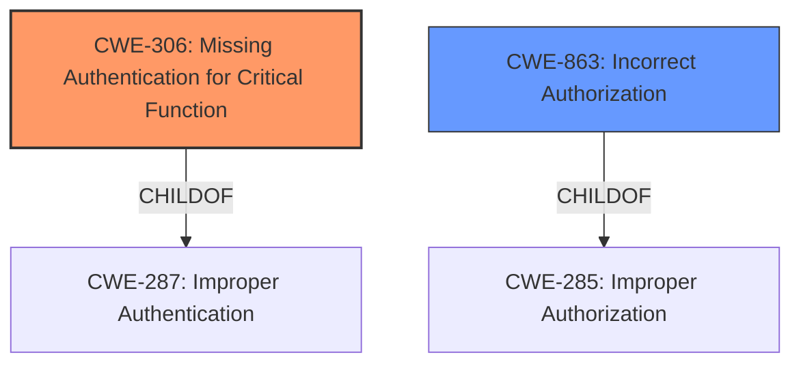

# Analysis Report for CVE-2022-1248

# Vulnerability Analysis Report: CVE-2022-1248

## Description


## Analysis (with Relationship Data)

# Summary
| CWE ID | CWE Name | Confidence | CWE Abstraction Level | CWE Vulnerability Mapping Label | CWE-Vulnerability Mapping Notes |
|---|---|---|---|---|---|
| CWE-306 | Missing Authentication for Critical Function | 1.0 | Base |  Allowed | Primary CWE |
| CWE-863 | Incorrect Authorization | 0.5 | Class | Allowed-with-Review | Secondary Candidate |

## Evidence and Confidence

*   **Confidence Score:** 0.8
*   **Evidence Strength:** HIGH

## Relationship Analysis
The primary relationship that impacted my decision was the child-of relationship between CWE-306 (Missing Authentication for Critical Function) and CWE-287 (Improper Authentication), as well as the parent-child relationship between CWE-863 (Incorrect Authorization) and CWE-285 (Improper Authorization). CWE-306 is a more specific case of CWE-287 where authentication is completely missing, aligning perfectly with the vulnerability description. CWE-863 was considered because authorization issues often arise in conjunction with authentication problems, but the description clearly states the absence of authentication making it less relevant here. The base abstraction level of CWE-306, as opposed to the class level of CWE-863, made it a better fit.



## Vulnerability Chain
The vulnerability chain is simple: the **missing authentication** (CWE-306) allows an unauthenticated attacker to directly create a new admin account.
  - Root Cause: CWE-306 Missing Authentication for Critical Function
  - Impact: Creation of new admin account

## Summary of Analysis
The initial analysis focused on the retriever results, particularly CWE-306, CWE-863, and CWE-200. The description indicates that the application lacks authentication for a critical function, allowing an unauthenticated attacker to create a new admin account. This aligns directly with the description of CWE-306: **"The product does not perform any authentication for functionality that requires a provable user identity or consumes a significant amount of resources."**

The evidence from the vulnerability description is: **"An unauthenticated attacker is able to create a new admin account for the web application with a simple POST request."**

CWE-863 (Incorrect Authorization) was considered but deemed less appropriate because the primary issue is not an incorrect authorization check, but the absence of any authentication mechanism. CWE-200 (Exposure of Sensitive Information to an Unauthorized Actor) was also considered, but it represents the impact of the vulnerability rather than the root cause. The root cause is the **missing authentication**, which then leads to the unauthorized creation of an admin account.

The selected CWE, CWE-306, is at the optimal level of specificity because it directly addresses the root cause weakness: the **lack of authentication** for a critical function. This is a base-level CWE, which is preferred for mapping root causes.
I am confident in this assessment because the vulnerability description clearly indicates the **absence of authentication**, and CWE-306 precisely captures this weakness.

Relevant CWE Information:
*   CWE-306: Missing Authentication for Critical Function
*   CWE-863: Incorrect Authorization


## CWE Relationship Analysis

Current CWEs represent these abstraction levels: .


### Vulnerability Chain Analysis

**Chain starting from CWE-200:**
- 200 (Exposure of Sensitive Information to an Unauthorized Actor) - ROOT


**Chain starting from CWE-287:**
- 287 (Improper Authentication) - ROOT


### CWE Relationship Diagram

```mermaid
graph TD
    classDef primary fill:#f96,stroke:#333,stroke-width:2px
    classDef secondary fill:#69f,stroke:#333
    classDef tertiary fill:#9e9,stroke:#333
```


*Report generated on 2025-03-31 08:10:54*
