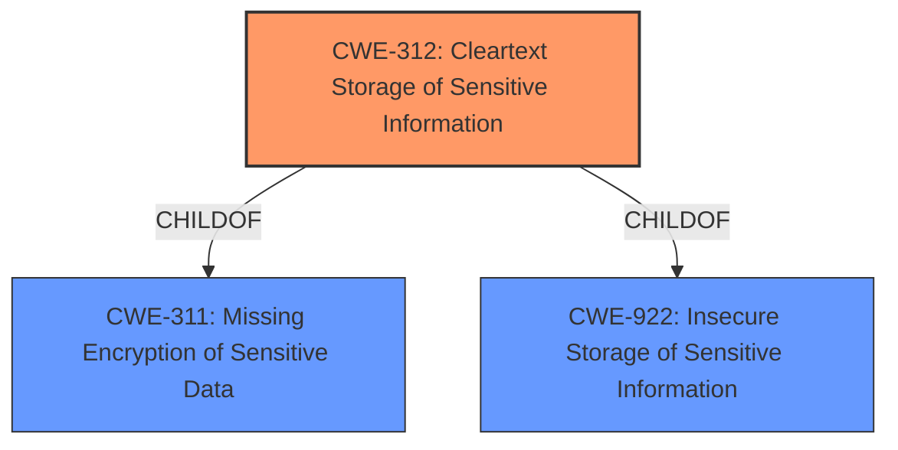

# Raw Analyzer Response for CVE-2022-1257

# Summary
| CWE ID | CWE Name | Confidence | CWE Abstraction Level | CWE Vulnerability Mapping Label | CWE-Vulnerability Mapping Notes |
|---|---|---|---|---|---|
| CWE-312 | Cleartext Storage of Sensitive Information | 0.9 | Base | Allowed | Primary CWE |
| CWE-922 | Insecure Storage of Sensitive Information | 0.7 | Class | Allowed-with-Review | Secondary Candidate |
| CWE-311 | Missing Encryption of Sensitive Data | 0.5 | Class | Discouraged | Secondary Candidate |

## Evidence and Confidence

*   **Confidence Score:** 0.9
*   **Evidence Strength:** HIGH

## Relationship Analysis
The primary CWE is CWE-312 **[Cleartext Storage of Sensitive Information]**, which is a Base level CWE. It is a child of CWE-311 **[Missing Encryption of Sensitive Data]** and CWE-922 **[Insecure Storage of Sensitive Information]**. CWE-922 is a Class level CWE, making CWE-312 more specific. CWE-311 is discouraged because it is high-level and has more precise children available.

## Vulnerability Chain
The vulnerability chain starts with **insecure storage of sensitive information**. The sensitive information is stored in `ma.db`. A local user can then **gain access to sensitive information** because it is not properly protected. The fix was to move the sensitive information to encrypted database files.
- **Root Cause:** **Insecure Storage of Sensitive Information** (CWE-312)
- **Impact:** Gain access to sensitive information

## Summary of Analysis
The vulnerability description clearly states "**insecure storage of sensitive information**" which directly relates to the core problem. The vulnerability description key phrases also include "**rootcause: insecure storage of sensitive information**". This leads to a local user gaining access to sensitive information, highlighting a confidentiality breach. The retriever results also indicate that CWE-922 **[Insecure Storage of Sensitive Information]** and CWE-312 **[Cleartext Storage of Sensitive Information]** are the top candidates.

CWE-922 **[Insecure Storage of Sensitive Information]** is a class-level CWE, while CWE-312 **[Cleartext Storage of Sensitive Information]** is a base-level CWE. Given that the fix moved the sensitive information to encrypted database files, the data was likely stored in cleartext before the fix. Therefore, CWE-312 **[Cleartext Storage of Sensitive Information]** is the more appropriate and specific CWE. While CWE-922 is a valid candidate, it is less specific.

CWE-311 **[Missing Encryption of Sensitive Data]** was also considered, but it is a class-level CWE and is discouraged when more specific children like CWE-312 are available. The relationship analysis shows that CWE-312 is a child of both CWE-311 and CWE-922, solidifying its position as the most accurate representation of the vulnerability.

The final decision to select CWE-312 is based on the evidence from the vulnerability description, the retriever results, and the hierarchical relationships between the candidate CWEs, making it the most specific and appropriate choice.