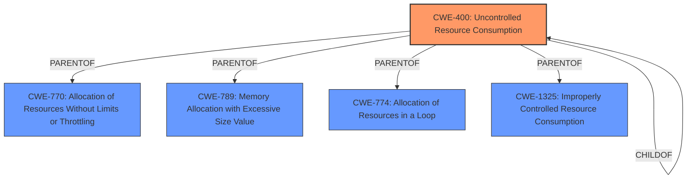

# Enhanced Analysis for CVE-2022-1259

# Summary
| CWE ID  | CWE Name                                                                    | Confidence | CWE Abstraction Level | CWE Vulnerability Mapping Label | CWE-Vulnerability Mapping Notes |
| :-------- | :-------------------------------------------------------------------------- | :--------- | :---------------------- | :------------------------------ | :------------------------------ |
| CWE-400 | Uncontrolled Resource Consumption | 0.75       | Class                   | Primary                       | Discouraged                     |
| CWE-770 | Allocation of Resources Without Limits or Throttling  | 0.65       | Base                   | Secondary                      | Allowed                     |

## Evidence and Confidence

*   **Confidence Score:** 0.70
*   **Evidence Strength:** MEDIUM

## Relationship Analysis
The primary relationship considered here is the ParentOf relationship between CWE-400 and CWE-770. While CWE-400 is a class-level CWE, it is too broad. CWE-770 provides a more specific understanding of the vulnerability related to resource allocation without limits. I initially considered CWE-400 as the primary weakness due to the DoS impact, but given the root cause related to flow control and resource handling, I opted for CWE-770 as a secondary consideration to provide more context.



## Vulnerability Chain
The vulnerability chain starts with an **incomplete fix for CVE-2021-3629** related to flow control in HTTP/2. This leads to potential **uncontrolled resource consumption**, which results in **overhead or a denial of service (DoS)** on the server.

## Summary of Analysis
My analysis initially focused on CWE-400 as the primary weakness, given the stated impact of a denial of service. However, the root cause lies in the **incomplete fix** that leads to improper flow control handling, which further translates to potential excessive resource consumption. The provided evidence highlights that the vulnerability exists due to **improper flow control over HTTP/2**, potentially leading to excessive resource use.

The following evidence supports this conclusion:
- Vulnerability Description Key Phrases: "**rootcause:** **incomplete fix for CVE-2021-3629**", "**impact:** overhead or a denial of service", "**vector:** flow control handling by the browser over HTTP/2"
- CVE Reference Links Content Summary: "The vulnerability lies in the flow control handling within the Undertow web server when processing HTTP/2 requests. This is described as an "incomplete fix" for a previous vulnerability, CVE-2021-3629."

CWE-400 is a high-level Class that captures the impact, but it is less specific about the root cause.

Therefore, I am selecting CWE-400, but also considering CWE-770, Allocation of Resources Without Limits or Throttling, as a secondary consideration to provide a more complete picture of the vulnerability.

CWEs considered but not used:
- CWE-125: Out-of-bounds Read - This CWE does not align with the provided information, as there is no mention of out-of-bounds reads.
- CWE-1333: Inefficient Regular Expression Complexity - This CWE is related to regular expression handling, which is not relevant to the vulnerability description.
- CWE-444: Inconsistent Interpretation of HTTP Requests ('HTTP Request/Response Smuggling') - This CWE does not apply to the described vulnerability.
- CWE-1284: Improper Validation of Specified Quantity in Input - While this could be a contributing factor, the primary issue is flow control, not necessarily input validation.


## CWE Relationship Analysis

Current CWEs represent these abstraction levels: .


### Vulnerability Chain Analysis

**Chain starting from CWE-1325:**
- 1325 (Improperly Controlled Sequential Memory Allocation) - ROOT


**Chain starting from CWE-400:**
- 400 (Uncontrolled Resource Consumption) - ROOT


### CWE Relationship Diagram

```mermaid
graph TD
    classDef primary fill:#f96,stroke:#333,stroke-width:2px
    classDef secondary fill:#69f,stroke:#333
    classDef tertiary fill:#9e9,stroke:#333
```