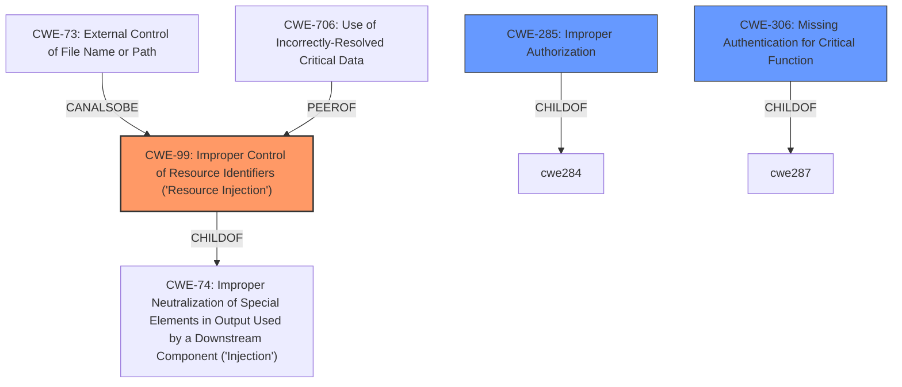

# Enhanced Analysis for CVE-2022-1287

# Summary
| CWE ID | CWE Name | Confidence | CWE Abstraction Level | CWE Vulnerability Mapping Label | CWE-Vulnerability Mapping Notes |
|---|---|---|---|---|---|
| CWE-99 | Improper Control of Resource Identifiers ('Resource Injection') | 0.9 | Class | Allowed-with-Review | Primary CWE |
| CWE-285 | Improper Authorization | 0.6 | Class | Discouraged | Secondary Candidate |
| CWE-306 | Missing Authentication for Critical Function | 0.5 | Base | Allowed | Secondary Candidate |

## Evidence and Confidence

*   **Confidence Score:** 0.7
*   **Evidence Strength:** MEDIUM

## Relationship Analysis
The primary CWE selected is CWE-99, which is a Class-level CWE. While the description indicates a resource injection vulnerability, the exact nature of the resource being injected is not clear. CWE-99 is a parent of CWE-73 (External Control of File Name or Path) and is also related to CWE-706 (Use of Incorrectly-Resolved Critical Data). The secondary candidates, CWE-285 and CWE-306, are also related to access control issues. The relationships influenced the decision to choose a Class-level CWE because the specific type of resource injection and authorization failure is not explicitly detailed in the description.



## Vulnerability Chain
The vulnerability chain starts with the application failing to properly validate user-supplied input used to access a resource. This leads to a resource injection vulnerability, allowing privilege escalation.

Initial Flaw: **Improper Control of Resource Identifiers** (CWE-99)
Impact: Privilege Escalation

## Summary of Analysis
The initial analysis identified CWE-99 as the primary weakness due to the **resource injection** flaw described in the "CVE Reference Links Content Summary": "The vulnerability is due to a resource injection flaw. The application takes input from an upstream component and uses it as an identifier for a resource. The application fails to properly restrict or validate this input before using it, potentially allowing access to resources outside the intended scope." This directly aligns with CWE-99's description: "The product receives input from an upstream component, but it does not restrict or incorrectly restricts the input before it is used as an identifier for a resource that may be outside the intended sphere of control."

The exploit targets `/scas/classes/Users.php?f=save_user`, which strongly indicates that the application is using external input to determine which resource to access. The **lack of validation** on this input allows attackers to potentially access or modify resources they shouldn't have access to, leading to privilege escalation.

CWE-99 is chosen as the primary CWE, even though it's a Class, due to the limited information on the specific type of resource being injected. Child CWEs like CWE-73 (External Control of File Name or Path) are more specific, but there's insufficient evidence to confirm the vulnerability involves file paths.

CWE-285 (Improper Authorization) and CWE-306 (Missing Authentication for Critical Function) were considered because the vulnerability leads to privilege escalation. However, the **root cause** is the **improper control of the resource identifier**, which then results in an authorization bypass.

Other CWEs considered but not selected:
- CWE-79 (Improper Neutralization of Input During Web Page Generation ('Cross-site Scripting')): There is no evidence of XSS in the description.
- CWE-434 (Unrestricted Upload of File with Dangerous Type): There is no evidence of unrestricted file uploads being the root cause.
- CWE-472 (External Control of Assumed-Immutable Web Parameter): Although the vulnerability involves POST requests, there is no direct indication that hidden fields are being tampered with.

The decision is based on the available evidence, focusing on the **resource injection** aspect as the primary **root cause** of the vulnerability.


## CWE Relationship Analysis

Current CWEs represent these abstraction levels: .


### Vulnerability Chain Analysis

**Chain starting from CWE-472:**
- 472 (External Control of Assumed-Immutable Web Parameter) - ROOT


**Chain starting from CWE-706:**
- 706 (Use of Incorrectly-Resolved Name or Reference) - ROOT


### CWE Relationship Diagram

```mermaid
graph TD
    classDef primary fill:#f96,stroke:#333,stroke-width:2px
    classDef secondary fill:#69f,stroke:#333
    classDef tertiary fill:#9e9,stroke:#333
```