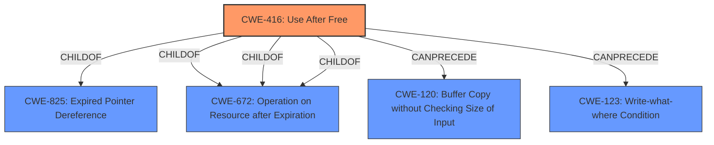

# Analysis for CVE-2022-1308

# Summary
| CWE ID | CWE Name | Confidence | CWE Abstraction Level | CWE Vulnerability Mapping Label | CWE-Vulnerability Mapping Notes |
|---|---|---|---|---|---|
| CWE-416 | Use After Free | 1.0 | Variant | Allowed | Primary CWE |

## Evidence and Confidence

*   **Confidence Score:** 1.0
*   **Evidence Strength:** HIGH

## Relationship Analysis
The primary CWE is CWE-416 **Use After Free**, which is a variant-level CWE. The relationships of CWE-416 show it is a child of CWE-825 **Expired Pointer Dereference** and CWE-672 **Operation on Resource after Expiration**. It can precede CWE-120 **Buffer Copy without Checking Size of Input ('Classic Buffer Overflow')** and CWE-123 **Write-what-where Condition**.

## Vulnerability Chain
The vulnerability chain starts with a **use after free** (CWE-416), which leads to heap corruption and potentially remote code execution.

## Summary of Analysis
The vulnerability description clearly states a **use after free** vulnerability. The key phrases include "**rootcause:** **use after free**" and the CVE Reference Links Content Summary confirms this with the line `"root_cause": "Use after free in BFCache."`. The primary CWE match suggested is CWE-416 **Use After Free**, and it is also the top CWE listed in the Retriever Results.

The other CWEs in the Retriever Results were considered but are not as directly relevant:
*   CWE-366 **Race Condition within a Thread**: While race conditions can sometimes lead to use-after-free vulnerabilities, there's no explicit mention of concurrency or threading in the description, so it's not as accurate.
*   CWE-843 **Access of Resource Using Incompatible Type ('Type Confusion')**: Type confusion isn't mentioned.
*   CWE-122 **Heap-based Buffer Overflow**: The description mentions heap corruption as an impact, but the root cause is the **use after free**, not a buffer overflow.
*   CWE-415 **Double Free**: This is a related memory management issue, but the description specifically says "**use after free**".
*   CWE-113 **Improper Neutralization of CRLF Sequences in HTTP Headers ('HTTP Request/Response Splitting')**: This is related to HTTP header manipulation, which isn't relevant here.
*   CWE-123 **Write-what-where Condition**: This could be a consequence of **use after free**, but is not the direct root cause.
*   CWE-362 **Concurrent Execution using Shared Resource with Improper Synchronization ('Race Condition')**: Same reasoning as CWE-366.
*   CWE-911 **Improper Update of Reference Count**: Reference counting isn't mentioned.
*   CWE-404 **Improper Resource Shutdown or Release**: This is too general; the specific issue is a **use after free**.

The selection of CWE-416 is at the optimal level of specificity because it accurately describes the root cause of the vulnerability, which is the **use after free** condition in the BFCache.

Relevant CWE Information:

# Enhanced Context (25 CWEs)
The following CWEs were identified as potentially relevant to this vulnerability:

## CWE-404: Improper Resource Shutdown or Release
**Abstraction Level**: Class
**Similarity Score**: 0.82
**Source**: dense

**Description**:
The product does not release or incorrectly releases a resource before it is made available for re-use.

**Mapping Guidance**:
- Usage: Allowed-with-Review
- Rationale: This CWE entry is a Class and might have Base-level children that would be more appropriate

## CWE-226: Sensitive Information in Resource Not Removed Before Reuse
**Abstraction Level**: Base
**Similarity Score**: 0.80
**Source**: dense

**Description**:
The product releases a resource such as memory or a file so that it can be made available for reuse, but it does not clear or "zeroize" the information contained in the resource before the product performs a critical state transition or makes the resource available for reuse by other entities.

**Mapping Guidance**:
- Usage: Allowed
- Rationale: This CWE entry is at the Base level of abstraction, which is a preferred level of abstraction for mapping to the root causes of vulnerabilities.

## CWE-366: Race Condition within a Thread
**Abstraction Level**: Base
**Similarity Score**: 0.78
**Source**: dense

**Description**:
If two threads of execution use a resource simultaneously, there exists the possibility that resources may be used while invalid, in turn making the state of execution undefined.

**Mapping Guidance**:
- Usage: Allowed
- Rationale: This CWE entry is at the Base level of abstraction, which is a preferred level of abstraction for mapping to the root causes of vulnerabilities.

## CWE-667: Improper Locking
**Abstraction Level**: Class
**Similarity Score**: 0.77
**Source**: dense

**Description**:
The product does not properly acquire or release a lock on a resource, leading to unexpected resource state changes and behaviors.

**Mapping Guidance**:
- Usage: Allowed-with-Review
- Rationale: This CWE entry is a Class and might have Base-level children that would be more appropriate

## CWE-772: Missing Release of Resource after Effective Lifetime
**Abstraction Level**: Base
**Similarity Score**: 0.76
**Source**: dense

**Description**:
The product does not release a resource after its effective lifetime has ended, i.e., after the resource is no longer needed.

**Mapping Guidance**:
- Usage: Allowed
- Rationale: This CWE entry is at the Base level of abstraction, which is a preferred level of abstraction for mapping to the root causes of vulnerabilities.

## CWE-662: Improper Synchronization
**Abstraction Level**: Class
**Similarity Score**: 0.76
**Source**: dense

**Description**:
The product utilizes multiple threads or processes to allow temporary access to a shared resource that can only be exclusive to one process at a time, but it does not properly synchronize these actions, which might cause simultaneous accesses of this resource by multiple threads or processes.

**Mapping Guidance**:
- Usage: Discouraged
- Rationale: This CWE entry is a level-1 Class (i.e., a child of a Pillar). It might have lower-level children that would be more appropriate

## CWE-362: Concurrent Execution using Shared Resource with Improper Synchronization ('Race Condition')
**Abstraction Level**: Class
**Similarity Score**: 0.76
**Source**: dense

**Description**:
The product contains a concurrent code sequence that requires temporary, exclusive access to a shared resource, but a timing window exists in which the shared resource can be modified by another code sequence operating concurrently.

**Mapping Guidance**:
- Usage: Allowed-with-Review
- Rationale: This CWE entry is a Class and might have Base-level children that would be more appropriate

## CWE-911: Improper Update of Reference Count
**Abstraction Level**: Base
**Similarity Score**: 0.75
**Source**: dense

**Description**:
The product uses a reference count to manage a resource, but it does not update or incorrectly updates the reference count.

**Mapping Guidance**:
- Usage: Allowed
- Rationale: This CWE entry is at the Base level of abstraction, which is a preferred level of abstraction for mapping to the root causes of vulnerabilities.

## CWE-664: Improper Control of a Resource Through its Lifetime
**Abstraction Level**: Pillar
**Similarity Score**: 0.75
**Source**: dense

**Description**:
The product does not maintain or incorrectly maintains control over a resource throughout its lifetime of creation, use, and release.

**Mapping Guidance**:
- Usage: Discouraged
- Rationale: This CWE entry is high-level when lower-level children are available