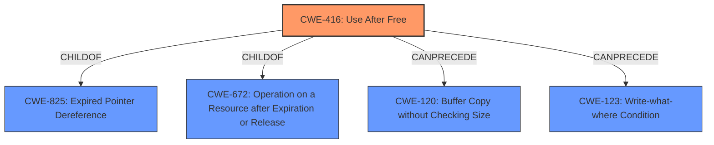

# Analysis for CVE-2022-1310

# Summary
| CWE ID | CWE Name | Confidence | CWE Abstraction Level | CWE Vulnerability Mapping Label | CWE-Vulnerability Mapping Notes |
|---|---|---|---|---|---|
| CWE-416 | Use After Free | 1.0 | Variant | Allowed | Primary CWE |

## Evidence and Confidence

*   **Confidence Score:** 1.0
*   **Evidence Strength:** HIGH

## Relationship Analysis
The primary relationship that influenced the decision was the direct match of the vulnerability description to CWE-416. Specifically, the description contains the phrase "**Use after free**", which is a direct indicator for CWE-416. The **Abstraction Level** of Variant for CWE-416 is appropriate.

## Vulnerability Chain
The vulnerability chain starts with the **Use after free** condition (CWE-416), leading to potential heap corruption. The vulnerability description notes that a remote attacker can exploit this via a crafted HTML page. The "CVE Reference Links Content Summary" provides additional details such as "arbitrary code execution."

## Summary of Analysis
The primary CWE is CWE-416 (**Use After Free**), which is directly stated in the "**Vulnerability Description Key Phrases**" as the **rootcause**. The "CVE Reference Links Content Summary" confirms that "**root_cause**" is "Use after free in regular expressions". The description of CWE-416 accurately reflects the vulnerability where memory is reused or referenced after it has been freed. The abstraction level of Variant is appropriate, as it is a specific type of memory management error. The confidence level is high (1.0) due to the clear and direct evidence from the provided text.

CWE-366 (Race Condition within a Thread), CWE-843 (Access of Resource Using Incompatible Type ('Type Confusion')), CWE-122 (Heap-based Buffer Overflow), CWE-415 (Double Free), CWE-113 (Improper Neutralization of CRLF Sequences in HTTP Headers ('HTTP Request/Response Splitting')), CWE-123 (Write-what-where Condition), CWE-362 (Concurrent Execution using Shared Resource with Improper Synchronization ('Race Condition')), CWE-911 (Improper Update of Reference Count), CWE-156 (Improper Neutralization of Whitespace) were considered, but did not match the root cause description as accurately as CWE-416.