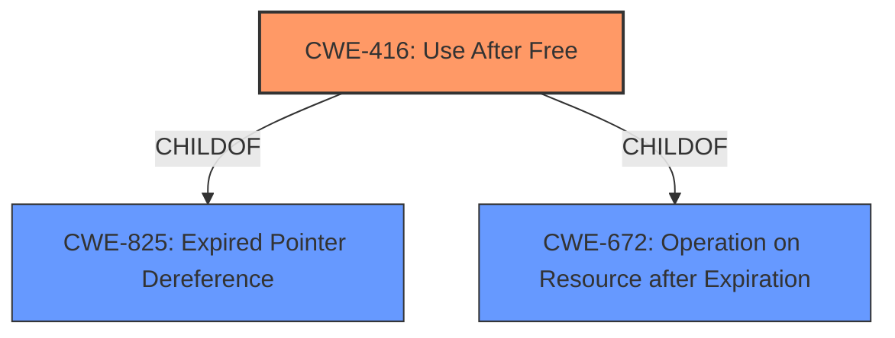

# Analysis Report for CVE-2022-1311

# Vulnerability Analysis Report: CVE-2022-1311

## Description


## Analysis (with Relationship Data)

# Summary
| CWE ID | CWE Name | Confidence | CWE Abstraction Level | CWE Vulnerability Mapping Label | CWE-Vulnerability Mapping Notes |
|---|---|---|---|---|---|
| CWE-416 | Use After Free | 1.0 | Variant | Allowed | Primary CWE |

## Evidence and Confidence

*   **Confidence Score:** 1.0
*   **Evidence Strength:** HIGH

## Relationship Analysis
The primary relationship that influenced the decision was the ChildOf relationship. CWE-416 [CWE-416: Use After Free] is a variant of CWE-825 [CWE-825: Expired Pointer Dereference] and CWE-672 [CWE-672: Operation on Resource after Expiration]. The vulnerability is clearly a **use-after-free**, and the variant is the most specific and accurate representation.



## Vulnerability Chain
The chain of events is straightforward: a **use-after-free** vulnerability leads to potential **heap corruption**, which can then be exploited by a remote attacker. The root cause is the **use-after-free** condition, while the heap corruption is a potential consequence.

## Summary of Analysis
The analysis is based on direct evidence from the vulnerability description and CVE reference. The description explicitly mentions "**Use after free**" and "**heap corruption**". The CVE reference confirms the root cause as a **use-after-free** vulnerability.

The primary CWE match from similar CVE descriptions is CWE-416 [CWE-416: Use After Free], which aligns perfectly with the vulnerability description. The retriever results also list CWE-416 [CWE-416: Use After Free] as the top combined result.

The selection of CWE-416 [CWE-416: Use After Free] is based on the following evidence:

*   Vulnerability Description Key Phrases: "**rootcause:** **Use after free**"
*   CVE Reference Links Content Summary: "**Root Cause of Vulnerability:** Use-after-free vulnerability."
*   Primary CWE Match: CWE-416 [CWE-416: Use After Free]

The selected CWE is at the optimal level of specificity because it directly represents the **use-after-free** condition, which is the root cause of the vulnerability.

CWEs considered but not used:

*   CWE-787 [CWE-787: Out-of-bounds Write]: While heap corruption is mentioned, the root cause is the **use-after-free**, not directly an out-of-bounds write.
*   CWE-362 [CWE-362: Concurrent Execution using Shared Resource with Improper Synchronization ('Race Condition')]: There's no evidence of concurrency issues in the description.
*   CWE-122 [CWE-122: Heap-based Buffer Overflow]: Heap corruption is a consequence, but the root cause is the **use-after-free**, not directly a buffer overflow.
*   CWE-415 [CWE-415: Double Free]: While related to memory management, there is no indication of a double free, only a use after the memory has been freed.
*   CWE-843 [CWE-843: Access of Resource Using Incompatible Type ('Type Confusion')]: There is no evidence of type confusion.
*   CWE-366 [CWE-366: Race Condition within a Thread]: There is no evidence of multiple threads.
*   CWE-451 [CWE-451: User Interface (UI) Misrepresentation of Critical Information]: No evidence of UI misrepresentation is indicated.
*   CWE-123 [CWE-123: Write-what-where Condition]: While potentially a result of heap corruption, is not the root cause.
*   CWE-404 [CWE-404: Improper Resource Shutdown or Release]: The issue is use after free, not improper shutdown.
*   CWE-911 [CWE-911: Improper Update of Reference Count]: There is no evidence of reference count issues.

Relevant CWE Information:


## CWE Relationship Analysis

Current CWEs represent these abstraction levels: .


### Vulnerability Chain Analysis

**Chain starting from CWE-825:**
- 825 (Expired Pointer Dereference) - ROOT


**Chain starting from CWE-843:**
- 843 (Access of Resource Using Incompatible Type ('Type Confusion')) - ROOT


### CWE Relationship Diagram

```mermaid
graph TD
    classDef primary fill:#f96,stroke:#333,stroke-width:2px
    classDef secondary fill:#69f,stroke:#333
    classDef tertiary fill:#9e9,stroke:#333
```


*Report generated on 2025-03-31 08:20:05*
