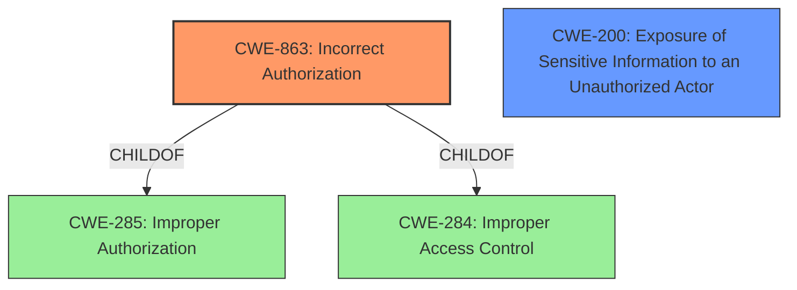

# Analysis for CVE-2022-1332

# Summary
| CWE ID | CWE Name | Confidence | CWE Abstraction Level | CWE Vulnerability Mapping Label | CWE-Vulnerability Mapping Notes |
|---|---|---|---|---|---|
| CWE-863 | Incorrect Authorization | 0.75 | Class | Primary | Allowed-with-Review |
| CWE-200 | Exposure of Sensitive Information to an Unauthorized Actor | 0.6 | Class | Secondary | Discouraged |

## Evidence and Confidence

*   **Confidence Score:** 0.7
*   **Evidence Strength:** MEDIUM

## Relationship Analysis
The primary relationship that influenced the CWE selection was the child-of relationship between CWE-863 (Incorrect Authorization) and CWE-285 (Improper Authorization) and CWE-284 (Improper Access Control). CWE-863 is a more specific Class-level CWE which is preferable to the higher-level CWE-285, which is discouraged. The "fails to properly protect the permissions" indicates an authorization problem. CWE-200 is a potential impact of the authorization bypass.

## Vulnerability Chain
The vulnerability chain starts with an **improper protection of permissions** (likely CWE-863) which leads to the ability for authenticated members to bypass restrictions and, ultimately, view sensitive information (CWE-200).

## Summary of Analysis
The initial analysis focused on the **root cause**, which is the **failure to properly protect permissions**. The vulnerability description clearly states this as the reason why authenticated members with restricted custom admin roles can bypass restrictions. This points towards an authorization issue.

The key evidence from the vulnerability description is: "One of the API in Mattermost version 6.4.1 and earlier **fails to properly protect the permissions**, which allows the authenticated members with restricted custom admin role to bypass the restrictions and view the server logs and server config.json file contents."

CWE-863 (Incorrect Authorization) is a strong candidate because it directly addresses the scenario where a product performs an authorization check, but it does not correctly perform the check. The vulnerability description indicates that Mattermost attempts to restrict access based on custom admin roles, but the implementation **fails**, leading to an authorization bypass.

CWE-200 (Exposure of Sensitive Information to an Unauthorized Actor) is considered a secondary CWE because it describes the impact of the authorization bypass, which is the ability to view server logs and the config.json file. While the exposure of sensitive information is a significant consequence, the **root cause** lies in the **incorrect authorization**. CWE-200 is often misused and should not be mapped to root causes, but to impacts, as noted in its mapping guidance.

The decision to prioritize CWE-863 is also supported by the Retriever Results, where it is listed as a highly relevant CWE. While CWE-285 (Improper Authorization) is also a possibility, CWE-863 is more specific.

Therefore, CWE-863 is the optimal choice because it directly addresses the **root cause** of the vulnerability, which is an **incorrect authorization** check. CWE-200, while relevant to the impact, is secondary to the underlying authorization issue.