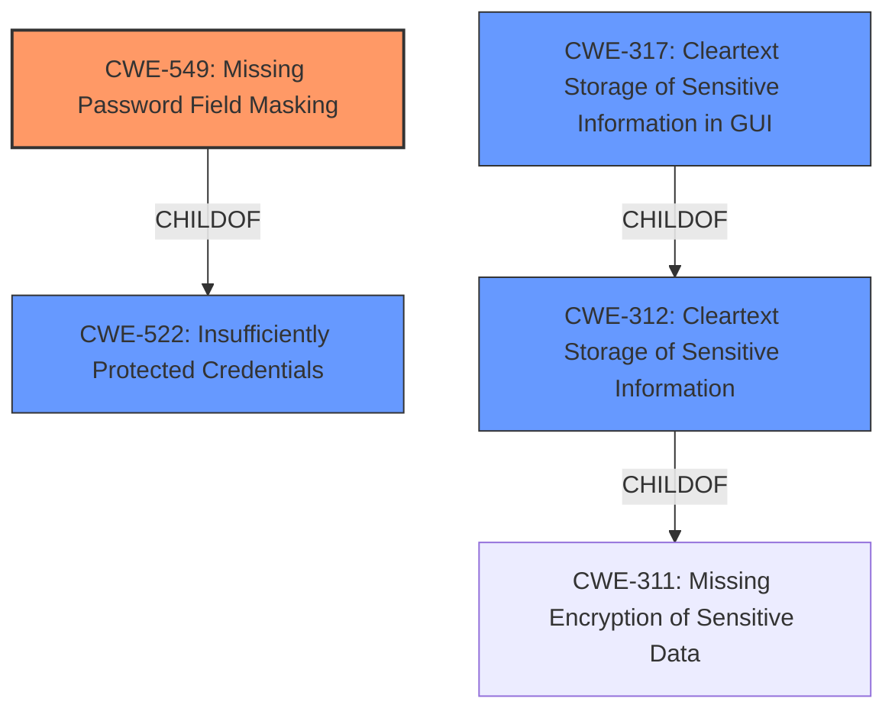

# Raw Analyzer Response for CVE-2022-1342

# Summary
| CWE ID | CWE Name | Confidence | CWE Abstraction Level | CWE Vulnerability Mapping Label | CWE-Vulnerability Mapping Notes |
|---|---|---|---|---|---|
| CWE-549 | Missing Password Field Masking | 1.0 | Base | Allowed | Primary CWE |
| CWE-317 | Cleartext Storage of Sensitive Information in GUI | 0.7 | Variant | Allowed | Secondary Candidate |
| CWE-312 | Cleartext Storage of Sensitive Information | 0.6 | Base | Allowed | Secondary Candidate |
| CWE-522 | Insufficiently Protected Credentials | 0.5 | Class | Allowed-with-Review | Secondary Candidate |

## Evidence and Confidence

*   **Confidence Score:** 0.9
*   **Evidence Strength:** HIGH

## Relationship Analysis
The primary CWE is CWE-549, which is a base-level weakness describing the **lack of password masking**. It's a child of CWE-522, which is a class-level weakness for insufficiently protected credentials. CWE-317 is a variant of CWE-312, which is a base-level weakness related to storing sensitive information in cleartext. The hierarchical relationships helped refine the selection toward the most specific base-level weakness, but the caching issue made the selection more difficult.

## Vulnerability Chain
The chain of events is as follows:
1.  **Root Cause:** **Lack of Password Masking** (CWE-549) and a caching issue.
2.  Sensitive fields are revealed when closing and reopening a panel.
3.  **Impact:** Physically proximate attackers can observe sensitive data.

## Summary of Analysis
The analysis indicates a **lack of password masking** (CWE-549) combined with a caching issue, leading to sensitive information being displayed in cleartext. The primary evidence supporting this is: "A **lack of password masking** in Devolutions Remote Desktop Manager allows physically proximate attackers to observe sensitive data. A caching issue can cause sensitive fields to sometimes stay revealed when closing and reopening a panel, which could lead to involuntarily disclosing sensitive information."

CWE-549 is the most specific and appropriate choice because it directly addresses the core issue of missing password masking. The caching issue increases the likelihood of sensitive information exposure, which is also why CWE-317 and CWE-312 were also considered.

Other CWEs considered:

*   CWE-256 (Plaintext Storage of a Password): While related, this is less accurate as the issue is not primarily about storage but rather the display of the password.
*   CWE-522 (Insufficiently Protected Credentials): This is a higher-level class, and CWE-549 provides a more specific description of the **weakness**.
*   CWE-311 (Missing Encryption of Sensitive Data): This CWE is not the best fit, as the vulnerability is about masking rather than encryption.

The selected CWEs are at the optimal level of specificity because they directly address the root cause and contributing factors to the vulnerability, based on the provided evidence.