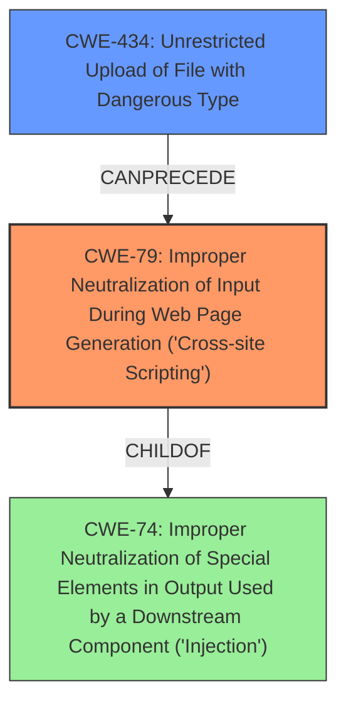

# Analysis for CVE-2022-1345

# Summary
| CWE ID | CWE Name | Confidence | CWE Abstraction Level | CWE Vulnerability Mapping Label | CWE-Vulnerability Mapping Notes |
|---|---|---|---|---|---|
| CWE-79 | Improper Neutralization of Input During Web Page Generation ('Cross-site Scripting') | 1.0 | Base | Allowed | Primary CWE. The application **does not neutralize or incorrectly neutralizes** user-controllable input before it is placed in output that is used as a web page. |
| CWE-434 | Unrestricted Upload of File with Dangerous Type | 0.7 | Base | Allowed | Secondary CWE. The application allows the upload of a dangerous file type (.svg) without proper restrictions. |

## Evidence and Confidence

*   **Confidence Score:** 0.85
*   **Evidence Strength:** HIGH

## Relationship Analysis
The primary weakness is CWE-79 [Improper Neutralization of Input During Web Page Generation ('Cross-site Scripting')], which is a Base level CWE. CWE-79 has a child relationship to CWE-74 [Improper Neutralization of Special Elements in Output Used by a Downstream Component ('Injection')], but CWE-79 is more specific and thus a better fit. CWE-434 [Unrestricted Upload of File with Dangerous Type] is included because the vulnerability involves uploading an SVG file, which is then processed without proper sanitization, leading to XSS. CWE-434 can precede CWE-79, as allowing the upload of the file is a prerequisite to the XSS vulnerability.

## Vulnerability Chain
The vulnerability chain starts with allowing the unrestricted upload of a file with a dangerous type (CWE-434). This leads to the improper neutralization of input during web page generation (CWE-79), resulting in stored XSS.

## Summary of Analysis
The analysis is based on the provided vulnerability description and the CVE Reference Links Content Summary. The description explicitly mentions "**Stored XSS** via .svg file upload," which is a strong indicator for CWE-79. The CVE Reference Links Content Summary confirms the **root_cause** as "Improper sanitization of user-provided strings leading to potential cross-site scripting (XSS)." It also states that unsanitized strings were being used for various fields, further supporting CWE-79. The fact that the attack vector is ".svg file upload" also supports the inclusion of CWE-434.

The retriever results also support CWE-79 as the primary candidate, with a high similarity score. The MITRE mapping guidance allows for the use of Base level CWEs such as CWE-79 and CWE-434.

CWE-22 [Improper Limitation of a Pathname to a Restricted Directory ('Path Traversal')] and related path traversal CWEs were considered, but not used as the vulnerability is not directly related to path manipulation. CWE-352 [Cross-Site Request Forgery (CSRF)] was also considered, but the provided information does not indicate that CSRF is a component of this vulnerability.