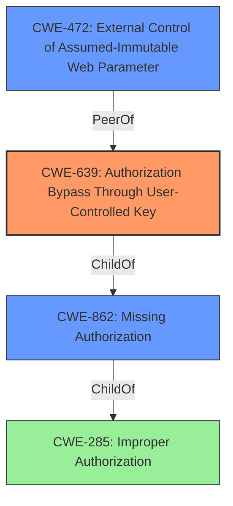

# Analysis Report for CVE-2022-1349

# Vulnerability Analysis Report: CVE-2022-1349

## Description


## Analysis (with Relationship Data)

# Summary
| CWE ID  | CWE Name                                                                                                                                            | Confidence | CWE Abstraction Level | CWE Vulnerability Mapping Label | CWE-Vulnerability Mapping Notes |
| :-------- | :-------------------------------------------------------------------------------------------------------------------------------------------------- | :--------- | :---------------------- | :-------------------------------- | :-------------------------------- |
| CWE-639   | Authorization Bypass Through User-Controlled Key                                                                                                   | 0.9        | Base                    | Primary                           | Allowed                           |
| CWE-862   | Missing Authorization                                                                                                                               | 0.7        | Class                   | Secondary                         | Allowed-with-Review             |
| CWE-472   | External Control of Assumed-Immutable Web Parameter                                                                                               | 0.6        | Base                    | Secondary                         | Allowed                           |

## Evidence and Confidence

*   **Confidence Score:** 0.8
*   **Evidence Strength:** HIGH

## Relationship Analysis
The primary CWE is CWE-639, which indicates that the authorization process relies on a key controlled by the user, which is then modified to bypass authorization. CWE-862 is a parent Class of CWE-639 which indicates **Missing Authorization**. CWE-472 is a peer weakness where the **external control** of the **immutable parameters** leads to authorization bypass. All are Base or Class level, providing a clear root cause.



## Vulnerability Chain
The chain of events involves a user manipulating the `image_id` parameter (External Control of Assumed-Immutable Web Parameter), which the system **fails to validate** against the requesting user (Missing Authorization), leading to the ability to delete other users' profile pictures (Authorization Bypass Through User-Controlled Key).

## Summary of Analysis
The analysis indicates that the primary weakness is CWE-639, **Authorization Bypass Through User-Controlled Key**, with high confidence due to the clear evidence in the vulnerability description: "does not validate that the value passed to the image_id parameter of the ajax action wpqa_remove_image belongs to the requesting user." This directly aligns with the CWE's description of a system where authorization can be bypassed by modifying a user-controlled key.

The supporting evidence includes:

*   **Vulnerability Description Key Phrases:** Specifically mentions the **lack of validation** for the `image_id` parameter.
*   **CVE Reference Links Content Summary:** Confirms the root cause as the plugin's **failure to validate** the `image_id` parameter against the requesting user.

The retriever results also support this, with CWE-639 showing up as a strong candidate. CWE-862, **Missing Authorization**, is a related Class-level CWE which accurately reflects the **missing validation** in the code. CWE-472, **External Control of Assumed-Immutable Web Parameter**, is relevant as the `image_id` is externally controlled and should be immutable from the perspective of another user's profile.

The decision is based on the evidence and the relationships between the CWEs, leading to the selection of CWE-639 as the primary, and CWE-862 and CWE-472 as secondary issues. All CWEs are chosen for their specificity and relevance to the vulnerability's root cause.

Relevant CWE Information:

# Enhanced Context (25 CWEs)

## CWE-807: Reliance on Untrusted Inputs in a Security Decision
**Abstraction Level**: Base
**Similarity Score**: 0.78
**Source**: dense

**Description**:
The product uses a protection mechanism that relies on the existence or values of an input, but the input can be modified by an untrusted actor in a way that bypasses the protection mechanism.

**Why Not Used**: The core issue isn't about relying on the input for a security decision in general, but specifically about **failing to validate** an identifier (`image_id`) against the requesting user.

## CWE-472: External Control of Assumed-Immutable Web Parameter
**Abstraction Level**: Base
**Similarity Score**: 0.78
**Source**: dense

**Description**:
The web application does not sufficiently verify inputs that are assumed to be immutable but are actually externally controllable, such as hidden form fields.

**Why Not Used**: Considered as a secondary issue, but the primary problem is the **authorization bypass** due to the **lack of validation**. This is more about the external `image_id`, which is used in the `wpqa_remove_image` AJAX action, being controlled by the user and not properly validated.

## CWE-693: Protection Mechanism Failure
**Abstraction Level**: Pillar
**Similarity Score**: 0.77
**Source**: dense

**Description**:
The product does not use or incorrectly uses a protection mechanism that provides sufficient defense against directed attacks against the product.

**Why Not Used**: This is a very high-level CWE (Pillar) and doesn't provide enough specificity.

## CWE-184: Incomplete List of Disallowed Inputs
**Abstraction Level**: Base
**Similarity Score**: 0.77
**Source**: dense

**Description**:
The product implements a protection mechanism that relies on a list of inputs (or properties of inputs) that are not allowed by policy or otherwise require other action to neutralize before additional processing takes place, but the list is incomplete.

**Why Not Used**: The issue isn't about a list of disallowed inputs, but rather the **lack of validation** on the `image_id` parameter.

## CWE-639: Authorization Bypass Through User-Controlled Key
**Abstraction Level**: Base
**Similarity Score**: 0.77
**Source**: dense

**Description**:
The system's authorization functionality does not prevent one user from gaining access to another user's data or record by modifying the key value identifying the data.

**Why Used**: This is the **primary CWE** because it specifically describes how an attacker can bypass authorization by modifying the `image_id` parameter.

## CWE-303: Incorrect Implementation of Authentication Algorithm
**Abstraction Level**: Base
**Similarity Score**: 0.76
**Source**: dense

**Description**:
The requirements for the product dictate the use of an established authentication algorithm, but the implementation of the algorithm is incorrect.

**Why Not Used**: The issue is not related to an incorrect implementation of an authentication algorithm, but rather a **missing authorization check**.

## CWE-1289: Improper Validation of Unsafe Equivalence in Input
**Abstraction Level**: Base
**Similarity Score**: 0.76
**Source**: dense

**Description**:
The product receives an input value that is used as a resource identifier or other type of reference, but it does not validate or incorrectly validates that the input is equivalent to a potentially-unsafe value.

**Why Not Used**: The primary issue is the **lack of authorization**, rather than improper validation of an equivalence in the input.

## CWE-1390: Weak Authentication
**Abstraction Level**: Class
**Similarity Score**: 0.76
**Source**: dense

**Description**:
The product uses an authentication mechanism to restrict access to specific users or identities, but the mechanism does not sufficiently prove that the claimed identity is correct.

**Why Not Used**: The vulnerability is related to authorization, not authentication. Authentication might be working correctly, but the authorization is flawed.

## CWE-74: Improper Neutralization of Special Elements in Output Used by a Downstream Component ('Injection')
**Abstraction Level**: Class
**Similarity Score**: 0.75
**Source**: dense

**Description**:
The product constructs all or part of a command, data structure, or record using externally-influenced input from an upstream component, but it does not neutralize or incorrectly neutralizes special elements that could modify how it is parsed or interpreted when it is sent to a downstream component.

**Why Not Used**: This vulnerability isn't related to injection.

## CWE-274: Improper Handling of Insufficient Privileges
**Abstraction Level**: Base
**Similarity Score**: 0.75
**Source**: dense

**Description**:
The product does not handle or incorrectly handles when it has insufficient privileges to perform an operation, leading to resultant weaknesses.

**Why Not Used**: Not relevant, as the issue is about **authorization bypass**, not about handling insufficient privileges.

## CWE-184: Incomplete List of Disallowed Inputs
**Abstraction Level**: Base
**Similarity Score**: 5241.10
**Source**:


## CWE Relationship Analysis

Current CWEs represent these abstraction levels: .


### Vulnerability Chain Analysis

**Chain starting from CWE-862:**
- 862 (Missing Authorization) - ROOT


**Chain starting from CWE-472:**
- 472 (External Control of Assumed-Immutable Web Parameter) - ROOT


### CWE Relationship Diagram

```mermaid
graph TD
    classDef primary fill:#f96,stroke:#333,stroke-width:2px
    classDef secondary fill:#69f,stroke:#333
    classDef tertiary fill:#9e9,stroke:#333
```


*Report generated on 2025-03-30 20:36:25*
