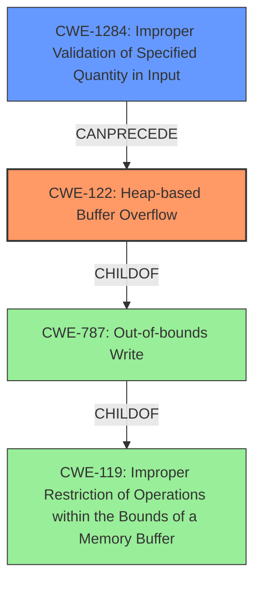

# Analysis Report for CVE-2022-1354

# Vulnerability Analysis Report: CVE-2022-1354

## Description


## Analysis (with Relationship Data)

# Summary
| CWE ID | CWE Name | Confidence | CWE Abstraction Level | CWE Vulnerability Mapping Label | CWE-Vulnerability Mapping Notes |
|---|---|---|---|---|---|
| CWE-122 | Heap-based Buffer Overflow | 1.0 | Variant | Allowed | Primary CWE |
| CWE-1284 | Improper Validation of Specified Quantity in Input | 0.7 | Base | Allowed | Secondary Candidate |

## Evidence and Confidence

*   **Confidence Score:** 0.9
*   **Evidence Strength:** HIGH

## Relationship Analysis
The primary CWE is CWE-122, which is a variant of CWE-787 (Out-of-bounds Write) and CWE-119 (Improper Restriction of Operations within the Bounds of a Memory Buffer). The vulnerability description clearly states a heap buffer overflow, making CWE-122 the most specific and appropriate choice. CWE-1284 (Improper Validation of Specified Quantity in Input) is considered as a secondary CWE, as the vulnerability likely involves improper validation of input size, leading to the overflow.



## Vulnerability Chain
The vulnerability chain starts with a crafted TIFF file, which leads to the **heap buffer overflow** in the `TIFFReadRawDataStriped()` function due to insufficient input validation (potentially CWE-1284). This results in a crash and denial of service.

## Summary of Analysis
The initial analysis identified a **heap buffer overflow** in Libtiffs tiffinfo.c in TIFFReadRawDataStriped() function. The CVE reference links content summary further solidifies this by explicitly mentioning the **heap buffer overflow** in the `TIFFReadRawDataStriped()` function. The primary CWE, CWE-122, aligns directly with this evidence. Additionally, the potential involvement of improper input validation suggests CWE-1284 as a secondary factor. The graph relationships and chain analysis support this selection, with CWE-122 being the most specific representation of the overflow and CWE-1284 potentially contributing to the root cause.

Relevant CWE Information:

*   **CWE-122 (Heap-based Buffer Overflow):** This is the most direct match for the vulnerability description, which explicitly states a **heap buffer overflow** in the `TIFFReadRawDataStriped()` function. The CWE description aligns perfectly with the vulnerability's characteristics, and it is a variant-level CWE, providing sufficient specificity.

*   **CWE-1284 (Improper Validation of Specified Quantity in Input):** This CWE is considered because the vulnerability arises due to insufficient validation of data extracted from the TIFF file before it is processed. The lack of proper validation likely contributes to the **heap buffer overflow** by allowing an attacker to control the size or length of the data being written to the heap.

CWEs considered but not used:

*   **CWE-119 (Improper Restriction of Operations within the Bounds of a Memory Buffer):** While this is a parent of CWE-122, it is too general and discouraged when more specific CWEs are available.
*   **CWE-190 (Integer Overflow or Wraparound):** While integer overflows can sometimes lead to buffer overflows, there is no direct evidence of an integer overflow in the provided description.
*   **CWE-193 (Off-by-one Error):** There's no specific evidence suggesting an off-by-one error.
*   **CWE-125 (Out-of-bounds Read):** The vulnerability description focuses on writing past the end of the buffer (overflow), not reading.
*   **CWE-126 (Buffer Over-read):** Similar to CWE-125, the focus is on writing, not reading.
*   **CWE-128 (Wrap-around Error):** No specific evidence for wrap-around.
*   **CWE-130 (Improper Handling of Length Parameter Inconsistency):** Although length inconsistency might be a factor, CWE-1284 more directly addresses the lack of validation that likely leads to this inconsistency.
*   **CWE-121 (Stack-based Buffer Overflow):** The vulnerability is specifically a heap-based overflow, not stack-based.


## CWE Relationship Analysis

Current CWEs represent these abstraction levels: .


### Vulnerability Chain Analysis

**Chain starting from CWE-190:**
- 190 (Integer Overflow or Wraparound) - ROOT


**Chain starting from CWE-130:**
- 130 (Improper Handling of Length Parameter Inconsistency) - ROOT


### CWE Relationship Diagram

```mermaid
graph TD
    classDef primary fill:#f96,stroke:#333,stroke-width:2px
    classDef secondary fill:#69f,stroke:#333
    classDef tertiary fill:#9e9,stroke:#333
```


*Report generated on 2025-03-31 09:15:20*
