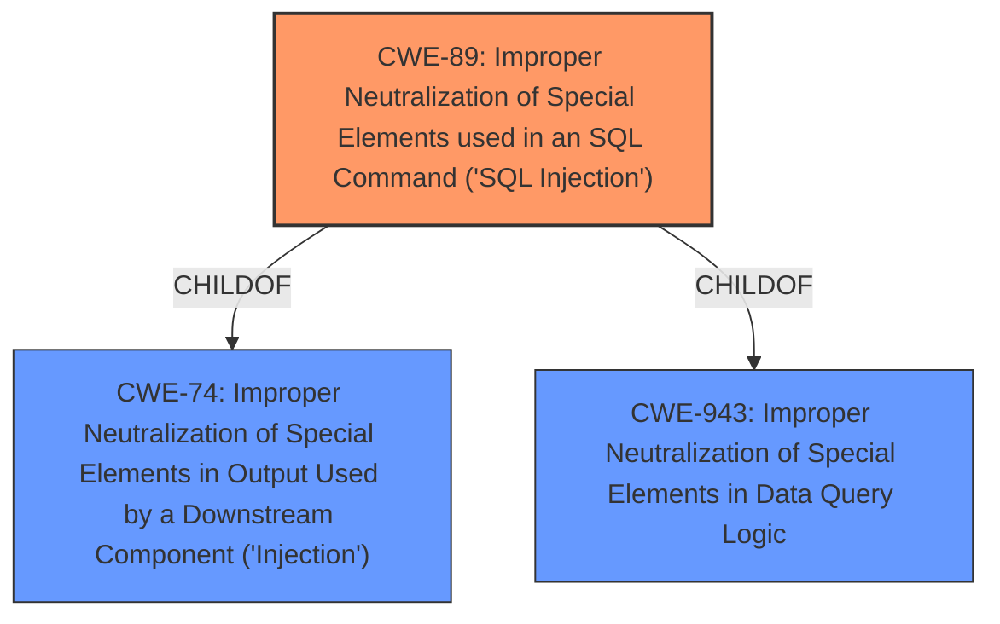

# Raw Analyzer Response for CVE-2022-1361

# Summary
| CWE ID | CWE Name | Confidence | CWE Abstraction Level | CWE Vulnerability Mapping Label | CWE-Vulnerability Mapping Notes |
|---|---|---|---|---|---|
| CWE-89 | Improper Neutralization of Special Elements used in an SQL Command ('SQL Injection') | 1.0 | Base | Allowed | Primary CWE |

## Evidence and Confidence

*   **Confidence Score:** 1.0
*   **Evidence Strength:** HIGH

## Relationship Analysis
The primary relationship influencing the CWE selection is the ChildOf relationship between CWE-89 and CWE-74 and CWE-943. CWE-89 is a base-level CWE, providing a more specific classification for the **improper neutralization of special elements** in an SQL command, which aligns directly with the vulnerability description. The graph shows that CWE-89 is a child of both CWE-74 (Improper Neutralization of Special Elements in Output Used by a Downstream Component ('Injection')) and CWE-943 (Improper Neutralization of Special Elements in Data Query Logic). This indicates that SQL injection is a specific type of injection that occurs within the context of data query logic.

## Vulnerability Chain
The vulnerability chain starts with the **improper neutralization of special elements** in an SQL command (CWE-89), leading to the **data exfiltration** of user accounts and devices.

## Summary of Analysis
The initial analysis, based on the vulnerability description and the "CVE Reference Links Content Summary", strongly indicates an SQL Injection vulnerability. The description explicitly mentions **"improper neutralization of special elements used in an SQL command"** as the root cause. This directly aligns with the definition of CWE-89.

The Retriever Results further support this assessment, with CWE-89 being the top combined result. The mapping guidance for CWE-89 states that it is at the Base level of abstraction, which is preferred, and that it is ALLOWED for use.

The evidence from the vulnerability description is compelling: "The affected On-Premise cnMaestro is vulnerable to a pre-auth data exfiltration through **improper neutralization of special elements** used in an SQL command." This statement clearly points to CWE-89 as the root cause.

The selection of CWE-89 is at the optimal level of specificity because it directly addresses the **improper neutralization** within the context of SQL commands. Higher-level CWEs like CWE-74 (Improper Neutralization of Special Elements in Output Used by a Downstream Component ('Injection')) are too general, while more specific variants are not applicable based on the provided information.

Relevant CWE Information:

# Enhanced Context (25 CWEs)

## CWE-74: Improper Neutralization of Special Elements in Output Used by a Downstream Component ('Injection')
**Abstraction Level**: Class
**Similarity Score**: 0.78

**Description**:
The product constructs all or part of a command, data structure, or record using externally-influenced input from an upstream component, but it does not neutralize or incorrectly neutralizes special elements that could modify how it is parsed or interpreted when it is sent to a downstream component.

**Mapping Guidance**:
- Usage: Discouraged
- Rationale: CWE-74 is high-level and often misused when lower-level weaknesses are more appropriate.

## CWE-89: Improper Neutralization of Special Elements used in an SQL Command ('SQL Injection')
**Abstraction Level**: base
**Similarity Score**: 4.33

**Description**:
CWE-89: Improper Neutralization of Special Elements used in an SQL Command ('SQL Injection')

**Mapping Guidance**:
- Usage: Allowed
- Rationale: This CWE entry is at the Base level of abstraction, which is a preferred level of abstraction for mapping to the root causes of vulnerabilities.

**Relationships**:
- CHILDOF -> CWE-74
- CHILDOF -> CWE-943

## CWE-943: Improper Neutralization of Special Elements in Data Query Logic
**Abstraction Level**: Class
**Similarity Score**: 7217.92

**Description**:
The product generates a query intended to access or manipulate data in a data store such as a database, but it does not neutralize or incorrectly neutralizes special elements that can modify the intended logic of the query.

**Mapping Guidance**:
- Usage: Allowed-with-Review
- Rationale: This CWE entry is a Class and might have Base-level children that would be more appropriate