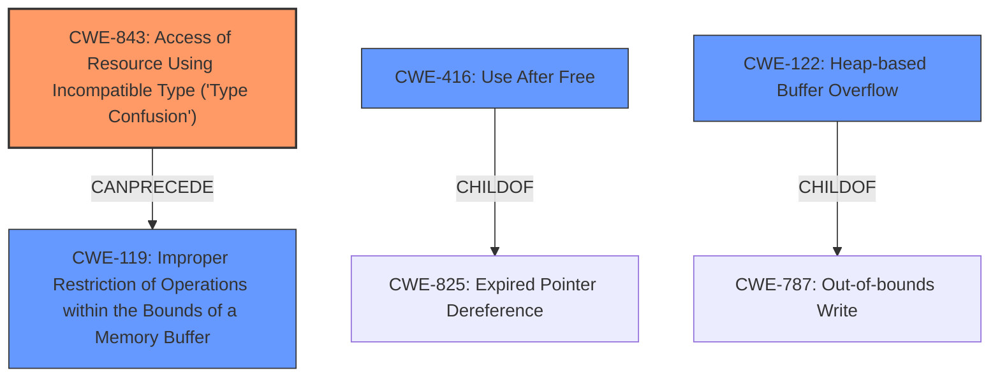

# Analysis Report for CVE-2022-1364

# Vulnerability Analysis Report: CVE-2022-1364

## Description


## Analysis (with Relationship Data)

# Summary
| CWE ID | CWE Name | Confidence | CWE Abstraction Level | CWE Vulnerability Mapping Label | CWE-Vulnerability Mapping Notes |
|---|---|---|---|---|---|
| CWE-843 | Access of Resource Using Incompatible Type ('Type Confusion') | 1 | Base | Allowed | Primary CWE |
| CWE-416 | Use After Free | 0.5 | Variant | Allowed | Secondary Candidate |
| CWE-122 | Heap-based Buffer Overflow | 0.4 | Variant | Allowed | Secondary Candidate |

## Evidence and Confidence

*   **Confidence Score:** 0.8
*   **Evidence Strength:** HIGH

## Relationship Analysis
The primary CWE selected is CWE-843, "Access of Resource Using Incompatible Type ('Type Confusion')".
CWE-843 can precede CWE-119, "Improper Restriction of Operations within the Bounds of a Memory Buffer" as type confusion can lead to out-of-bounds memory access.
CWE-416 "Use After Free" and CWE-122 "Heap-based Buffer Overflow" were considered, but the description focuses on the **type confusion** itself as the root cause, making CWE-843 the most relevant.



## Vulnerability Chain
The vulnerability chain starts with **type confusion** (CWE-843), which can lead to heap corruption. The final impact is potential remote code execution.

## Summary of Analysis
The analysis is based on the provided vulnerability description, which explicitly mentions "**type confusion**" as the **rootcause** in V8 Turbofan. The CVE Reference Links Content Summary reinforces this by stating "Root cause of vulnerability: Type Confusion in V8" and the impact as "Remote code execution".

CWE-843, "Access of Resource Using Incompatible Type ('Type Confusion')", is the most appropriate CWE because it directly addresses the **root cause** of the vulnerability. The description of CWE-843 states: "The product allocates or initializes a resource such as a pointer, object, or variable using one type, but it later accesses that resource using a type that is incompatible with the original type."

The abstraction level for CWE-843 is Base, which is the preferred level. The usage is Allowed, and the rationale states: "This CWE entry is at the Base level of abstraction, which is a preferred level of abstraction for mapping to the root causes of vulnerabilities."

CWE-416, "Use After Free", and CWE-122, "Heap-based Buffer Overflow," were considered because **type confusion** can lead to these conditions. However, they are consequences of the **type confusion** rather than the root cause itself. Therefore, CWE-843 is the most accurate and specific representation of the vulnerability.

Relevant CWE Information:

# Enhanced Context (25 CWEs)
## CWE-415: Double Free
CWE-415 was not selected because the vulnerability description doesn't indicate a double free condition.

## CWE-404: Improper Resource Shutdown or Release
CWE-404 was not selected because the vulnerability description doesn't indicate a resource not being released or incorrectly released.

## CWE-226: Sensitive Information in Resource Not Removed Before Reuse
CWE-226 was not selected because the vulnerability description doesn't indicate that sensitive information is being left in resources before reuse.

## CWE-843: Access of Resource Using Incompatible Type ('Type Confusion')
CWE-843 is the primary CWE and is fully described above.

## CWE-667: Improper Locking
CWE-667 was not selected because the vulnerability description doesn't indicate any locking issues.

## CWE-366: Race Condition within a Thread
CWE-366 was not selected as primary because, while possible, the provided information does not emphasize a race condition as the primary **root cause**. The report focuses on **type confusion** as the main issue. It is added as secondary candidate since race condition can lead to type confusion.

## CWE-41: Improper Resolution of Path Equivalence
CWE-41 was not selected because the vulnerability description doesn't involve path equivalence issues.

## CWE-125: Out-of-bounds Read
CWE-125 was not selected because the vulnerability description doesn't focus on reading out-of-bounds.

## CWE-131: Incorrect Calculation of Buffer Size
CWE-131 was not selected because the vulnerability description doesn't focus on buffer size calculation issues.

## CWE-416: Use After Free
CWE-416 was considered because **type confusion** could potentially lead to a use-after-free scenario. However, the description emphasizes the **type confusion** itself, not the use of freed memory. Therefore it is added as secondary candidate.

## CWE-451: User Interface (UI) Misrepresentation of Critical Information
CWE-451 was not selected because the vulnerability doesn't involve UI misrepresentation.

## CWE-190: Integer Overflow or Wraparound
CWE-190 was not selected because the vulnerability description doesn't focus on integer overflow.

## CWE-123: Write-what-where Condition
CWE-123 was not selected because, while heap corruption can lead to write-what-where, the primary issue is the **type confusion**.

## CWE-120: Buffer Copy without Checking Size of Input ('Classic Buffer Overflow')
CWE-120 was not selected because the description doesn't specifically involve buffer copy operations.

## CWE-787: Out-of-bounds Write
CWE-787 was not selected because the description doesn't directly point to an out-of-bounds write as the primary cause, although heap corruption might involve it.

## CWE-823: Use of Out-of-range Pointer Offset
CWE-823 was not selected because the vulnerability description doesn't focus on pointer offset issues.

## CWE-825: Expired Pointer Dereference
CWE-825 was not selected because the vulnerability description doesn't focus on expired pointer dereference issues.

## CWE-170: Improper Null Termination
CWE-170 was not selected because the vulnerability description doesn't involve null termination issues.

## CWE-1284: Improper Validation of Specified Quantity in Input
CWE-1284 was not selected because the vulnerability description doesn't involve input quantity validation issues.

## CWE-1341: Multiple Releases of Same Resource or Handle
CWE-1341 was not selected because the vulnerability description doesn't indicate multiple releases of the same resource.

## CWE-195: Signed to Unsigned Conversion Error
CWE-195 was not selected because the vulnerability description doesn't involve signed to unsigned conversion errors.


## CWE Relationship Analysis

Current CWEs represent these abstraction levels: .


### Vulnerability Chain Analysis

**Chain starting from CWE-41:**
- 41 (Improper Resolution of Path Equivalence) - ROOT


**Chain starting from CWE-823:**
- 823 (Use of Out-of-range Pointer Offset) - ROOT


### CWE Relationship Diagram

```mermaid
graph TD
    classDef primary fill:#f96,stroke:#333,stroke-width:2px
    classDef secondary fill:#69f,stroke:#333
    classDef tertiary fill:#9e9,stroke:#333
```


*Report generated on 2025-03-30 23:03:00*
