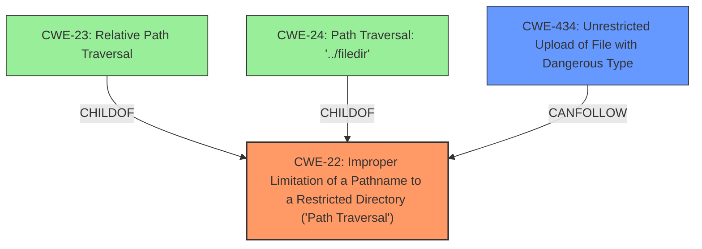

# Raw Analyzer Response for CVE-2022-1373

# Summary
| CWE ID | CWE Name | Confidence | CWE Abstraction Level | CWE Vulnerability Mapping Label | CWE-Vulnerability Mapping Notes |
|---|---|---|---|---|---|
| CWE-22 | Improper Limitation of a Pathname to a Restricted Directory ('Path Traversal') | 1.0 | Base | Allowed | Primary CWE. The vulnerability description clearly states a directory traversal vulnerability when processing zip files. |
| CWE-434 | Unrestricted Upload of File with Dangerous Type | 0.75 | Base | Allowed | Secondary CWE. The vulnerability involves uploading a zip file, which can contain dangerous file types (DLL) that are then executed. |

## Evidence and Confidence

*   **Confidence Score:** 0.9
*   **Evidence Strength:** HIGH

## Relationship Analysis
The primary CWE is CWE-22 **(Improper Limitation of a Pathname to a Restricted Directory ('Path Traversal'))**, which is a base-level CWE. CWE-23 **(Relative Path Traversal)** and CWE-24 **(Path Traversal: '../filedir')** are child CWEs of CWE-22, representing more specific cases of path traversal. However, given the general description of the vulnerability, CWE-22 is the most appropriate choice.

CWE-434 **(Unrestricted Upload of File with Dangerous Type)** is a related CWE, as the vulnerability involves uploading a zip file containing a DLL, which is then executed. This highlights a potential chain where a path traversal vulnerability is exploited through the unrestricted upload of a dangerous file type.

## Vulnerability Chain
The vulnerability chain starts with the **improper input sanitization** leading to **directory traversal**, which allows an attacker to upload a crafted zip file containing an arbitrary DLL. This DLL is then executed, leading to code execution. The chain is:

1.  **Improper Input Sanitization**
2.  CWE-22 **(Improper Limitation of a Pathname to a Restricted Directory ('Path Traversal'))**
3.  CWE-434 **(Unrestricted Upload of File with Dangerous Type)**
4.  Arbitrary Code Execution

## Summary of Analysis
The initial analysis focused on the **directory traversal** vulnerability described in the vulnerability description. The retriever results strongly suggested CWE-22 **(Improper Limitation of a Pathname to a Restricted Directory ('Path Traversal'))**, which aligns with the description. The vulnerability description key phrases also highlighted the **improper input sanitization** as a root cause.

The analysis was then expanded to include CWE-434 **(Unrestricted Upload of File with Dangerous Type)**, as the vulnerability involves uploading a zip file containing a DLL, which is then executed. This CWE highlights another aspect of the vulnerability, where dangerous file types are allowed to be uploaded and processed.

The final decision was to classify the vulnerability as CWE-22 as the primary CWE, with CWE-434 as a secondary CWE. This classification is based on the evidence provided in the vulnerability description and the retriever results.

The selected CWEs are at the optimal level of specificity, as they accurately represent the weaknesses described in the vulnerability description. CWE-22 is a base-level CWE that describes the general directory traversal vulnerability, while CWE-434 describes the unrestricted upload of dangerous file types.

Relevant CWE Information:
- The vulnerability description states: "The restore configuration feature of Softing Secure Integration Server V1.22 is vulnerable to a **directory traversal** vulnerability when processing zip files."
- The CVE Reference Links Content Summary states: "The 'restore configuration' feature of Softing Secure Integration Server is vulnerable to a directory traversal when processing zip files." and "An attacker can craft a zip file to load an arbitrary dll and execute code on the server."

CWEs considered but not used:
- CWE-23 **(Relative Path Traversal)**, CWE-24 **(Path Traversal: '../filedir')**, CWE-28 **(Path Traversal: '..\filedir')**, and CWE-29 **(Path Traversal: '\..\filename')**: These are all more specific variants of CWE-22. Without more specific evidence that these variants are the root cause, it is safer to choose CWE-22.
- CWE-59 **(Improper Link Resolution Before File Access ('Link Following'))** and CWE-363 **(Race Condition Enabling Link Following)**: These CWEs are not directly related to the vulnerability, as the vulnerability does not involve link following or race conditions.
- CWE-427 **(Uncontrolled Search Path Element)**: Although this CWE has a high similarity score, it is not directly related to the vulnerability, as the vulnerability does not involve an uncontrolled search path.
- CWE-138 **(Improper Neutralization of Special Elements)** and CWE-20 **(Improper Input Validation)**: These are class-level CWEs that are too general for this vulnerability. It is better to choose more specific CWEs that accurately represent the weaknesses described in the vulnerability description.