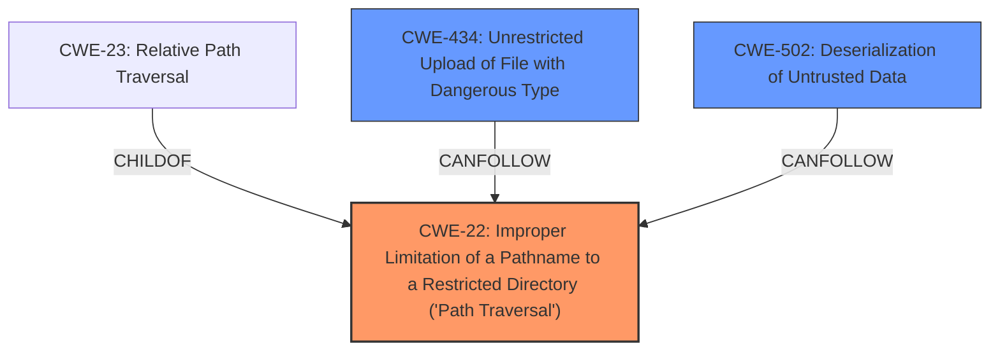

# Enhanced Analysis for CVE-2022-1390

# Summary
| CWE ID | CWE Name | Confidence | CWE Abstraction Level | CWE Vulnerability Mapping Label | CWE-Vulnerability Mapping Notes |
|---|---|---|---|---|---|
| CWE-22 | Improper Limitation of a Pathname to a Restricted Directory ('Path Traversal') | 1.0 | Base | Allowed | Primary CWE |
| CWE-434 | Unrestricted Upload of File with Dangerous Type | 0.5 | Base | Allowed | Secondary Candidate |
| CWE-502 | Deserialization of Untrusted Data | 0.7 | Base | Allowed | Secondary Candidate |

## Evidence and Confidence

*   **Confidence Score:** 0.9
*   **Evidence Strength:** HIGH

## Relationship Analysis
The primary CWE is CWE-22 **[CWE-22: Improper Limitation of a Pathname to a Restricted Directory ('Path Traversal')]**, which has child CWEs like CWE-23 **[CWE-23: Relative Path Traversal]**. The vulnerability description and CVE details clearly point to a **lack of validation of the path parameter** leading to arbitrary file read, indicating a path traversal issue. CWE-434 **[CWE-434: Unrestricted Upload of File with Dangerous Type]** and CWE-502 **[CWE-502: Deserialization of Untrusted Data]** are secondary considerations due to the potential for RCE via Phar Deserialization, but the root cause remains the path traversal vulnerability.



## Vulnerability Chain
The vulnerability chain starts with **lack of validation of path parameter**, leading to path traversal and arbitrary file read. If the server runs an old version of PHP, it can lead to RCE via Phar Deserialization.
  - **Root Cause:** **Lack of validation of path parameter** (CWE-22)
  - **Weakness:** Path Traversal leading to Arbitrary File Read
  - **Impact:** Potential RCE via Phar Deserialization

## Summary of Analysis
The analysis is based on the provided vulnerability description and CVE reference content, which clearly states the **lack of validation of the path parameter** as the root cause.
> "The plugin **does not validate the path parameter** given to `readfile()`. This allows an attacker to control the file being read."

The primary CWE mapping is CWE-22 **[CWE-22: Improper Limitation of a Pathname to a Restricted Directory ('Path Traversal')]** because the core issue is the **lack of proper restriction of the pathname**, allowing traversal outside the intended directory. The retriever results also list CWE-22 **[CWE-22: Improper Limitation of a Pathname to a Restricted Directory ('Path Traversal')]** as the top candidate.

CWE-434 **[CWE-434: Unrestricted Upload of File with Dangerous Type]** is considered a secondary candidate since the vulnerability description mentions potential RCE via Phar Deserialization. However, this is contingent on the server running an old PHP version, making it a conditional impact rather than a direct root cause. CWE-502 **[CWE-502: Deserialization of Untrusted Data]** could be related to Phar Deserialization, but there is no evidence of untrusted data being deserialized. The chain relationship shows that a file can be uploaded and then deserialized.

The selected CWEs are at the optimal level of specificity because CWE-22 **[CWE-22: Improper Limitation of a Pathname to a Restricted Directory ('Path Traversal')]** directly addresses the root cause, and the related CWEs highlight possible consequences contingent on specific server configurations.

Relevant CWE Information:

# Enhanced Context (25 CWEs)

## CWE-472: External Control of Assumed-Immutable Web Parameter
**Abstraction Level**: Base
**Similarity Score**: 0.80
**Source**: dense

**Description**:
The web application does not sufficiently verify inputs that are assumed to be immutable but are actually externally controllable, such as hidden form fields.

**Mapping Guidance**:
- Usage: Allowed
- Rationale: This CWE entry is at the Base level of abstraction, which is a preferred level of abstraction for mapping to the root causes of vulnerabilities.

**Why Not Selected**: While there's external control, the core issue is the path handling, not immutability.

## CWE-807: Reliance on Untrusted Inputs in a Security Decision
**Abstraction Level**: Base
**Similarity Score**: 0.79
**Source**: dense

**Description**:
The product uses a protection mechanism that relies on the existence or values of an input, but the input can be modified by an untrusted actor in a way that bypasses the protection mechanism.

**Mapping Guidance**:
- Usage: Allowed
- Rationale: This CWE entry is at the Base level of abstraction, which is a preferred level of abstraction for mapping to the root causes of vulnerabilities.

**Why Not Selected**: The protection mechanism isn't broken, the parameter isn't validated in the first place.

## CWE-23: Relative Path Traversal
**Abstraction Level**: Base
**Similarity Score**: 0.78
**Source**: dense

**Description**:
The product uses external input to construct a pathname that should be within a restricted directory, but it does not properly neutralize sequences such as ".." that can resolve to a location that is outside of that directory.

**Mapping Guidance**:
- Usage: Allowed
- Rationale: This CWE entry is at the Base level of abstraction, which is a preferred level of abstraction for mapping to the root causes of vulnerabilities.

**Why Not Selected**: CWE-22 **[CWE-22: Improper Limitation of a Pathname to a Restricted Directory ('Path Traversal')]** is a more general case of this.

## CWE-74: Improper Neutralization of Special Elements in Output Used by a Downstream Component ('Injection')
**Abstraction Level**: Class
**Similarity Score**: 0.78
**Source**: dense

**Description**:
The product constructs all or part of a command, data structure, or record using externally-influenced input from an upstream component, but it does not neutralize or incorrectly neutralizes special elements that could modify how it is parsed or interpreted when it is sent to a downstream component.

**Mapping Guidance**:
- Usage: Discouraged
- Rationale: CWE-74 is high-level and often misused when lower-level weaknesses are more appropriate.

**Why Not Selected**: The issue is lack of validation, not neutralization of special elements.

## CWE-41: Improper Resolution of Path Equivalence
**Abstraction Level**: Base
**Similarity Score**: 0.78
**Source**: dense

**Description**:
The product is vulnerable to file system contents disclosure through path equivalence. Path equivalence involves the use of special characters in file and directory names. The associated manipulations are intended to generate multiple names for the same object.

**Mapping Guidance**:
- Usage: Allowed
- Rationale: This CWE entry is at the Base level of abstraction, which is a preferred level of abstraction for mapping to the root causes of vulnerabilities.

**Why Not Selected**: The issue is not path equivalence, but direct traversal due to lack of validation.

## CWE-184: Incomplete List of Disallowed Inputs
**Abstraction Level**: Base
**Similarity Score**: 0.78
**Source**: dense

**Description**:
The product implements a protection mechanism that relies on a list of inputs (or properties of inputs) that are not allowed by policy or otherwise require other action to neutralize before additional processing takes place, but the list is incomplete.

**Mapping Guidance**:
- Usage: Allowed
- Rationale: This CWE entry is at the Base level of abstraction, which is a preferred level of abstraction for mapping to the root causes of vulnerabilities.

**Why Not Selected**: There is no evidence of a list of disallowed inputs, but the root cause is the path not being validated.

## CWE-639: Authorization Bypass Through User-Controlled Key
**Abstraction Level**: Base
**Similarity Score**: 0.77
**Source**: dense

**Description**:
The system's authorization functionality does not prevent one user from gaining access to another user's data or record by modifying the key value identifying the data.

**Mapping Guidance**:
- Usage: Allowed
- Rationale: This CWE entry is at the Base level of abstraction, which is a preferred level of abstraction for mapping to the root causes of vulnerabilities.

**Why Not Selected**: The issue


## CWE Relationship Analysis

Current CWEs represent these abstraction levels: .


### Vulnerability Chain Analysis

**Chain starting from CWE-472:**
- 472 (External Control of Assumed-Immutable Web Parameter) - ROOT


**Chain starting from CWE-434:**
- 434 (Unrestricted Upload of File with Dangerous Type) - ROOT


### CWE Relationship Diagram

```mermaid
graph TD
    classDef primary fill:#f96,stroke:#333,stroke-width:2px
    classDef secondary fill:#69f,stroke:#333
    classDef tertiary fill:#9e9,stroke:#333
```