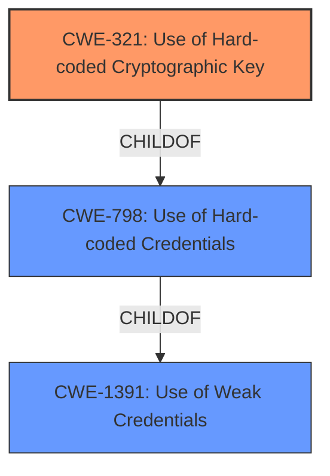

# Analysis for CVE-2022-1400

# Summary
| CWE ID  | CWE Name                                                        | Confidence | CWE Abstraction Level | CWE Vulnerability Mapping Label | CWE-Vulnerability Mapping Notes |
| :-------- | :-------------------------------------------------------------- | :--------- | :-------------------- | :------------------------------ | :------------------------------ |
| CWE-321   | Use of Hard-coded Cryptographic Key                            | 1          | Variant               | Primary                         | Allowed                       |
| CWE-798   | Use of Hard-coded Credentials                                   | 0.8        | Base                  | Secondary                       | Allowed                       |
| CWE-1391  | Use of Weak Credentials                                         | 0.6        | Class                 | Secondary                       | Allowed-with-Review           |

## Evidence and Confidence

*   **Confidence Score:** 0.8
*   **Evidence Strength:** HIGH

## Relationship Analysis
The primary CWE selected is CWE-321, "Use of Hard-coded Cryptographic Key," which is a Variant of CWE-798, "Use of Hard-coded Credentials." CWE-798 is, in turn, a child of CWE-1391, "Use of Weak Credentials." This hierarchical relationship indicates that CWE-321 is the most specific and accurate representation of the vulnerability, as it directly addresses the use of a hard-coded cryptographic key, a specific type of weak credential.

## Vulnerability Chain
The vulnerability chain starts with the **ROOT CAUSE** of a **hard-coded cryptographic key** (CWE-321). This leads to the ability for an attacker to **leak session IDs** and **elevate privileges**. The reference links content summary also points out the LFI vulnerability in Exago reports which allows bypassing authentication and impersonating users.

## Summary of Analysis
The initial analysis strongly suggests CWE-321, "Use of Hard-coded Cryptographic Key," as the primary weakness. This is supported by the **Vulnerability Description Key Phrases**, which explicitly mention "**hard-coded cryptographic key**". The "CVE Reference Links Content Summary" confirms the presence of multiple vulnerabilities, including one involving the use of a hard-coded cryptographic key and the LFI vulnerability that can be used to leak session IDs and elevate privileges.

The hierarchical relationships between CWE-321, CWE-798, and CWE-1391 further solidify this choice. CWE-321 is a Variant of CWE-798, which is a child of CWE-1391. This indicates that CWE-321 is the most specific and accurate representation of the vulnerability.

The retriever results also support this assessment, with CWE-321 being the top-ranked CWE.

The selection of CWE-321 is at the optimal level of specificity because it directly addresses the **ROOT CAUSE** of the vulnerability: the use of a **hard-coded cryptographic key**. While CWE-798 ("Use of Hard-coded Credentials") and CWE-1391 ("Use of Weak Credentials") are also relevant, they are more general and do not capture the specific nature of the weakness as accurately as CWE-321.

Relevant CWE Information:

## Enhanced Context (25 CWEs)
The following CWEs were identified as potentially relevant to this vulnerability:

## CWE-321: Use of Hard-coded Cryptographic Key
**Abstraction:** Variant
**Status:** Draft

### Description
The use of a **hard-coded cryptographic key** significantly increases the possibility that encrypted data may be recovered.

### Extended Description
Not provided

### Alternative Terms
None

### Relationships
ChildOf -> CWE-798
ChildOf -> CWE-798
ChildOf -> CWE-798

### Mapping Guidance
**Usage:** Allowed
**Rationale:** This CWE entry is at the Variant level of abstraction, which is a preferred level of abstraction for mapping to the root causes of vulnerabilities.
**Comments:** Carefully read both the name and description to ensure that this mapping is an appropriate fit. Do not try to 'force' a mapping to a lower-level Base/Variant simply to comply with this preferred level of abstraction.
**Reasons:**
- Acceptable-Use