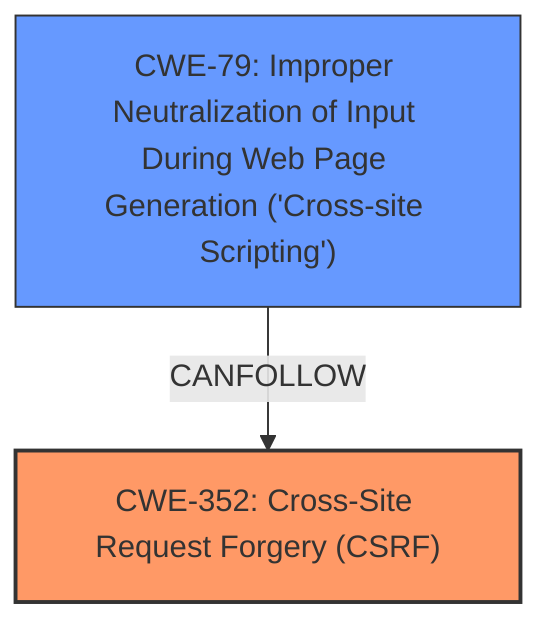

# Analysis for CVE-2022-1407

# Summary
| CWE ID | CWE Name | Confidence | CWE Abstraction Level | CWE Vulnerability Mapping Label | CWE-Vulnerability Mapping Notes |
|---|---|---|---|---|---|
| CWE-352 | Cross-Site Request Forgery (CSRF) | 1.0 | Compound | Primary | Allowed |
| CWE-79 | Improper Neutralization of Input During Web Page Generation ('Cross-site Scripting') | 1.0 | Base | Secondary | Allowed |

## Evidence and Confidence

*   **Confidence Score:** 1.0
*   **Evidence Strength:** HIGH

## Relationship Analysis
The primary weakness is the **lack of CSRF protection**, which allows an attacker to induce a logged-in user to perform actions without their knowledge or consent. This can then be combined with **improper output escaping** to inject XSS payloads. CWE-352 [Cross-Site Request Forgery (CSRF)] is a Compound CWE, while CWE-79 [Improper Neutralization of Input During Web Page Generation ('Cross-site Scripting')] is a Base CWE. They are related in that a missing CSRF check can allow XSS to be more easily exploited.

## Vulnerability Chain
The vulnerability chain starts with the **missing CSRF check** (CWE-352), followed by the **improper output escaping** (CWE-79). The **lack of CSRF** allows an attacker to inject malicious code via a crafted request, and the **improper output escaping** allows that code to be rendered in the user's browser, resulting in Cross-Site Scripting.

## Summary of Analysis
The vulnerability description clearly states the **lack of CSRF check** and **improper escaping of the campaign fields**, which leads to XSS.
The primary weakness is the **missing CSRF check**, as indicated by the phrase "does not have CSRF check in place." This allows an attacker to craft a request that, when executed by a logged-in user, can add a tracking campaign with XSS payloads. The secondary weakness is the **improper escaping**, as indicated by the phrase "does not escape the campaign fields when outputting them In attributes." This allows the XSS payloads to be rendered in the user's browser.
I am confident in this assessment as the description clearly points to both weaknesses.
The selected CWEs are at the optimal level of specificity because CWE-352 is a Compound that accurately represents the missing CSRF protection and CWE-79 is a Base that accurately represents the improper output escaping that leads to XSS.

Relevant CWE Information:

# Enhanced Context (25 CWEs)
The following CWEs were identified as potentially relevant to this vulnerability:

## CWE-80: Improper Neutralization of Script-Related HTML Tags in a Web Page (Basic XSS)
**Abstraction Level**: Variant
**Similarity Score**: 0.73
**Source**: dense

**Description**:
The product receives input from an upstream component, but it does not neutralize or incorrectly neutralizes special characters such as "<", ">", and "&" that could be interpreted as web-scripting elements when they are sent to a downstream component that processes web pages.

**Mapping Guidance**:
- Usage: Allowed
- Rationale: This CWE entry is at the Variant level of abstraction, which is a preferred level of abstraction for mapping to the root causes of vulnerabilities.

## CWE-472: External Control of Assumed-Immutable Web Parameter
**Abstraction Level**: Base
**Similarity Score**: 0.72
**Source**: dense

**Description**:
The web application does not sufficiently verify inputs that are assumed to be immutable but are actually externally controllable, such as hidden form fields.

**Mapping Guidance**:
- Usage: Allowed
- Rationale: This CWE entry is at the Base level of abstraction, which is a preferred level of abstraction for mapping to the root causes of vulnerabilities.

## CWE-352: Cross-Site Request Forgery (CSRF)
**Abstraction Level**: Compound
**Similarity Score**: 0.72
**Source**: dense

**Description**:
The web application does not, or can not, sufficiently verify whether a well-formed, valid, consistent request was intentionally provided by the user who submitted the request.

**Mapping Guidance**:
- Usage: Allowed
- Rationale: This is a well-known Composite of multiple weaknesses that must all occur simultaneously, although it is attack-oriented in nature.

## CWE-425: Direct Request ('Forced Browsing')
**Abstraction Level**: Base
**Similarity Score**: 0.72
**Source**: dense

**Description**:
The web application does not adequately enforce appropriate authorization on all restricted URLs, scripts, or files.

**Mapping Guidance**:
- Usage: Allowed
- Rationale: This CWE entry is at the Base level of abstraction, which is a preferred level of abstraction for mapping to the root causes of vulnerabilities.

## CWE-74: Improper Neutralization of Special Elements in Output Used by a Downstream Component ('Injection')
**Abstraction Level**: Class
**Similarity Score**: 0.71
**Source**: dense

**Description**:
The product constructs all or part of a command, data structure, or record using externally-influenced input from an upstream component, but it does not neutralize or incorrectly neutralizes special elements that could modify how it is parsed or interpreted when it is sent to a downstream component.

**Mapping Guidance**:
- Usage: Discouraged
- Rationale: CWE-74 is high-level and often misused when lower-level weaknesses are more appropriate.

## CWE-116: Improper Encoding or Escaping of Output
**Abstraction Level**: Class
**Similarity Score**: 0.71
**Source**: dense

**Description**:
The product prepares a structured message for communication with another component, but encoding or escaping of the data is either missing or done incorrectly. As a result, the intended structure of the message is not preserved.

**Mapping Guidance**:
- Usage: Allowed-with-Review
- Rationale: This CWE entry is a Class and might have Base-level children that would be more appropriate

## CWE-138: Improper Neutralization of Special Elements
**Abstraction Level**: Class
**Similarity Score**: 0.70
**Source**: dense

**Description**:
The product receives input from an upstream component, but it does not neutralize or incorrectly neutralizes special elements that could be interpreted as control elements or syntactic markers when they are sent to a downstream component.

**Mapping Guidance**:
- Usage: Discouraged
- Rationale: This CWE entry is a level-1 Class (i.e., a child of a Pillar). It might have lower-level children that would be more appropriate

## CWE-1391: Use of Weak Credentials
**Abstraction Level**: Class
**Similarity Score**: 0.69
**Source**: dense

**Description**:
The product uses weak credentials (such as a default key or hard-coded password) that can be calculated, derived, reused, or guessed by an attacker.

**Mapping Guidance**:
- Usage: Allowed-with-Review
- Rationale: This CWE entry is a Class and might have Base-level children that would be more appropriate

## CWE-178: Improper Handling of Case Sensitivity
**Abstraction Level**: Base
**Similarity Score**: 0.69
**Source**: dense

**Description**:
The product does not properly account for differences in case sensitivity when accessing or determining the properties of a resource, leading to inconsistent results.

**Mapping Guidance**:
- Usage: Allowed
- Rationale: This CWE entry is at the Base level of abstraction, which is a preferred level of abstraction for mapping to the root causes of vulnerabilities.

## CWE-434: Unrestricted Upload of File with Dangerous Type
**Abstraction Level**: Base
**Similarity Score**: 0.69
**Source**: dense

**Description**:
The product allows the upload or transfer of dangerous file types that are automatically processed within its environment.

**Mapping Guidance**:
- Usage: Allowed
- Rationale: This CWE entry is at the Base level of abstraction, which is a preferred level of abstraction for mapping to the root causes of vulnerabilities.

## CWE-116: Improper Encoding or Escaping of Output
**Abstraction Level**: Class
**Similarity Score**: 3127.81
**Source**: sparse

**Description**:
The product prepares a structured message for communication with another component, but encoding or escaping of the data is either missing or done incorrectly. As a result, the intended structure of the message is not preserved.

**Mapping Guidance**:
- Usage: Allowed-with-Review
- Rationale: This CWE entry is a Class and might have Base-level children that would be more appropriate

## CWE-352: Cross-Site Request Forgery (CSRF)
**Abstraction Level**: Compound
**Similarity Score**: 2941.31

# Enhanced Query for CVE-2022-1407

# Vulnerability Description

    The VikBooking Hotel Booking Engine & PMS WordPress plugin before 1.5.8 does not have CSRF check in place when adding a tracking campaign, and **does not escape the campaign fields** when outputting them In attributes. As a result, attackers could make a logged in admin add tracking campaign with XSS payloads in them via a CSRF attack

    # Keyphrase-Specific CWE Analysis
    This vulnerability contains multiple keyphrases that may map to different CWEs. 
    Please analyze each keyphrase separately and determine the most appropriate CWE(s) for each.

    ## ROOTCAUSE: 'lack of CSRF check'

Relevant CWEs for this ROOTCAUSE:

### 1. CWE-116: Improper Encoding or Escaping of Output (Score: 616.25)

The product prepares a structured message for communication with another component, but encoding or escaping of the data is either missing or done incorrectly. As a result, the intended structure of the message is not preserved....

### 2. CWE-352: Cross-Site Request Forgery (CSRF) (Score: 597.27)

The web application does not, or can not, sufficiently verify whether a well-formed, valid, consistent request was intentionally provided by the user who submitted the request....

### 3. CWE-862: Missing Authorization (Score: 432.56)

The product does not perform an authorization check when an actor attempts to access a resource or perform an action....

### 4. CWE-434: Unrestricted Upload of File with Dangerous Type (Score: 423.56)

The product allows the upload or transfer of dangerous file types that are automatically processed within its environment....

### 5. CWE-79: Improper Neutralization of Input During Web Page Generation ('Cross-site Scripting') (Score: 365.34)

The product does not neutralize or incorrectly neutralizes user-controllable input before it is placed in output that is used as a web page that is served to other users....

## ROOTCAUSE: 'does not escape the campaign fields'

Relevant CWEs for this ROOTCAUSE:

### 1. CWE-116: Improper Encoding or Escaping of Output (Score: 616.25)

The product prepares a structured message for communication with another component, but encoding or escaping of the data is either missing or done incorrectly. As a result, the intended structure of the message is not preserved....

### 2. CWE-352: Cross-Site Request Forgery (CSRF) (Score: 597.27)

The web application does not, or can not, sufficiently verify whether a well-formed, valid, consistent request was intentionally provided by the user who submitted the request....

### 3. CWE-862: Missing Authorization (Score: 432.56)

The product does not perform an authorization check when an actor attempts to access a resource or perform an action....

### 4. CWE-434: Unrestricted Upload of File with Dangerous Type (Score: 423.56)

The product allows the upload or transfer of dangerous file types that are automatically processed within its environment....

### 5. CWE-89: Improper Neutralization of Special Elements used in an SQL Command ('SQL Injection') (Score: 389.60)

The product constructs all or part of an SQL command using externally-influenced input from an upstream component, but it does not neutralize or incorrectly neutralizes special elements that could modify the intended SQL command when it is sent to a downstream component. Without sufficient removal o...

## WEAKNESS: 'cross-site scripting'

Relevant CWEs for this WEAKNESS:

### 1. CWE-116: Improper Encoding or Escaping of Output (Score: 616.25)

The product prepares a structured message for communication with another component, but encoding or escaping of the data is either missing or done incorrectly. As a result, the intended structure of the message is not preserved....

### 2. CWE-352: Cross-Site Request Forgery (CSRF) (Score: 597.27)

The web application does not, or can not, sufficiently verify whether a well-formed, valid, consistent request was intentionally provided by the user who submitted the request....

### 3. CWE-862: Missing Authorization (Score: 432.56)

The product does not perform an authorization check when an actor attempts to access a resource or perform an action....

### 4. CWE-434: Unrestricted Upload of File with Dangerous Type (Score: 423.56)

The product allows the upload or transfer of dangerous file types that are automatically processed within its environment....

### 5. CWE-79: Improper Neutralization of Input During Web Page Generation ('Cross-site Scripting') (Score: 365.34)

The product does not neutralize or incorrectly neutralizes user-controllable input before it is placed in output that is used as a web page that is served to other users....

## ATTACKER: 'attackers'

Relevant CWEs for this ATTACKER:

### 1. CWE-116: Improper Encoding or Escaping of Output (Score: 616.25)

The product prepares a structured message for communication with another component, but encoding or escaping of the data is either missing or done incorrectly. As a result, the intended structure of the message is not preserved....

### 2. CWE-352: Cross-Site Request Forgery (CSRF) (Score: 597.27)

The web application does not, or can not, sufficiently verify whether a well-formed, valid, consistent request was intentionally provided by the user who submitted the request....

### 3. CWE-862: Missing Authorization (Score: 432.56)

The product does not perform an authorization check when an actor attempts to access a resource or perform an action....

### 4. CWE-434: Unrestricted Upload of File with Dangerous Type (Score: 423.56)

The product allows the upload or transfer of dangerous file types that are automatically processed within its environment....

### 5. CWE-79: Improper Neutralization of Input During Web Page Generation ('Cross-site Scripting') (Score: 365.34)

The product does not neutralize or incorrectly neutralizes user-controllable input before it is placed in output that is used as a web page that is served to other users....

## PRODUCT: 'VikBooking Hotel Booking Engine & PMS WordPress plugin'

Relevant CWEs for this PRODUCT:

### 1. CWE-116: Improper Encoding or Escaping of Output (Score: 616.25)

The product prepares a structured message for communication with another component, but encoding or escaping of the data is either missing or done incorrectly. As a result, the intended structure of the message is not preserved....

### 2. CWE-352: Cross-Site Request Forgery (CSRF) (Score: 597.27)

The web application does not, or can not, sufficiently verify whether a well-formed, valid, consistent request was intentionally provided by the user who submitted the request....

### 3. CWE-862: Missing Authorization (Score: 432.56)

The product does not perform an authorization check when an actor attempts to access a resource or perform an action....

### 4. CWE-434: Unrestricted Upload of File with Dangerous Type (Score: 423.56)

The product allows the upload or transfer of dangerous file types that are automatically processed within its environment....

### 5. CWE-863: Incorrect Authorization (Score: 124.97)

The product performs an authorization check when an actor attempts to access a resource or perform an action, but it does not correctly perform the check....

## VERSION: 'before 1.5.8'

Relevant CWEs for this VERSION:

### 1. CWE-116: Improper Encoding or Escaping of Output (Score: 616.25)

The product prepares a structured message for communication with another component, but encoding or escaping of the data is either missing or done incorrectly. As a result, the intended structure of the message is not preserved....

### 2. CWE-352: Cross-Site Request Forgery (CSRF) (Score: 597.27)

The web application does not, or can not, sufficiently verify whether a well-formed, valid, consistent request was intentionally provided by the user who submitted the request....

### 3. CWE-862: Missing Authorization (Score: 432.56)

The product does not perform an authorization check when an actor attempts to access a resource or perform an action....

### 4. CWE-434: Unrestricted Upload of File with Dangerous Type (Score: 423.56)

The product allows the upload or transfer of dangerous file types that are automatically processed within its environment....

### 5. CWE-79: Improper Neutralization of Input During Web Page Generation ('Cross-site Scripting') (Score: 365.34)

The product does not neutralize or incorrectly neutralizes user-controllable input before it is placed in output that is used as a web page that is served to other users....

## COMPONENT: 'adding tracking campaign'

Relevant CWEs for this COMPONENT:

### 1. CWE-116: Improper Encoding or Escaping of Output (Score: 616.25)

The product prepares a structured message for communication with another component, but encoding or escaping of the data is either missing or done incorrectly. As a result, the intended structure of the message is not preserved....

### 2. CWE-352: Cross-Site Request Forgery (CSRF) (Score: 597.27)

The web application does not, or can not, sufficiently verify whether a well-formed, valid, consistent request was intentionally provided by the user who submitted the request....

### 3. CWE-862: Missing Authorization (Score: 432.56)

The product does not perform an authorization check when an actor attempts to access a resource or perform an action....

### 4. CWE-434: Unrestricted Upload of File with Dangerous Type (Score: 423.56)

The product allows the upload or transfer of dangerous file types that are automatically processed within its environment....

### 5. CWE-79: Improper Neutralization of Input During Web Page Generation ('Cross-site Scripting') (Score: 365.34)

The product does not neutralize or incorrectly neutralizes user-controllable input before it is placed in output that is used as a web page that is served to other users....

    # Analysis Instructions
    1. For each keyphrase, identify the most appropriate CWE(s) that represent the weakness.
    2. Consider how the different keyphrases might relate to each other in the vulnerability chain.
    3. Provide a final determination of primary CWE(s) and any secondary CWEs.
    4. Format your response using the standard analysis template.

    Please analyze how these different weaknesses interact and provide a comprehensive CWE classification.
    