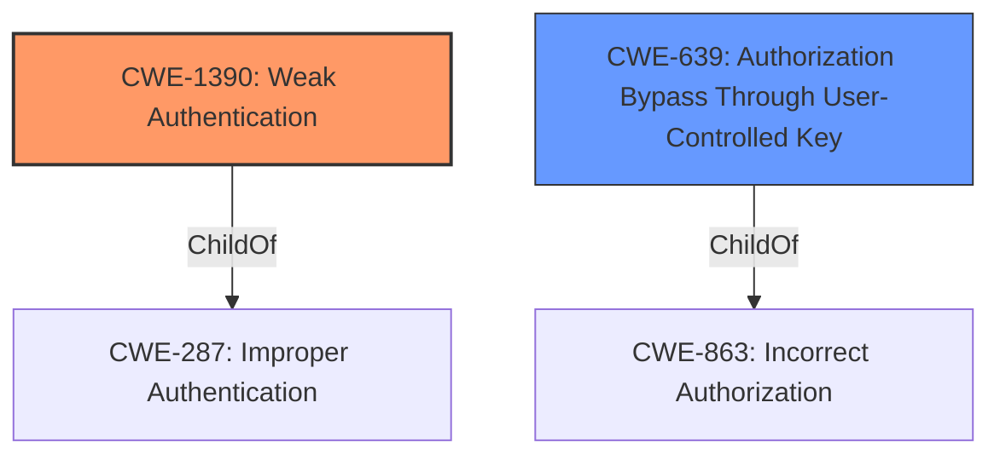

# Enhanced Analysis for CVE-2022-1426

# Summary
| CWE ID  | CWE Name                        | Confidence | CWE Abstraction Level | CWE Vulnerability Mapping Label | CWE-Vulnerability Mapping Notes |
|---------|---------------------------------|------------|-----------------------|---------------------------------|-----------------------------------|
| CWE-1390 | Weak Authentication             | 0.9        | Class                 | Allowed-with-Review           | Primary CWE                       |
| CWE-639  | Authorization Bypass Through User-Controlled Key | 0.7        | Base                  | Allowed                         | Secondary Candidate             |

## Evidence and Confidence

*   **Confidence Score:** 0.8
*   **Evidence Strength:** HIGH

## Relationship Analysis
The primary CWE selected is CWE-1390 (Weak Authentication), which is a Class-level CWE. It has a parent, CWE-287 (Improper Authentication), but the provided information is specific enough to warrant the use of CWE-1390. CWE-639 (Authorization Bypass Through User-Controlled Key) is considered as a related Base-level weakness because the authentication bypass is achieved via manipulation of what is essentially a key (PAT ID). CWE-639 is a child of CWE-863 (Incorrect Authorization).



## Vulnerability Chain
The vulnerability chain starts with **GitLab not correctly authenticating a user that had some certain amount of information**. This leads to the impact of being able to **authenticate without a personal access token**. The root cause is the **improper authentication mechanism** where the PAT ID is used instead of the actual token value. This leads to the possibility of crafting a malicious JWT using the server's secret, user ID, and PAT ID. This crafted JWT is then used to bypass authentication.

## Summary of Analysis
The initial analysis focused on the **rootcause** which is that "**GitLab was not correctly authenticating a user that had some certain amount of information**" that leads to "**authenticate without a personal access token**". The CVE reference link content summary indicates "**Improper authentication mechanism**" and "**Use of a less secure identifier (PAT ID) instead of the token itself.**".

The Retriever Results list several CWEs.

CWE-1390 (Weak Authentication) is the best fit as the primary CWE because the core issue is that the authentication mechanism is flawed. The "**Vulnerability Description Key Phrases**" section contains the phrase "**GitLab was not correctly authenticating a user**" which directly supports this.

CWE-639 (Authorization Bypass Through User-Controlled Key) is a good secondary candidate because the **weakness** involves bypassing authentication by manipulating the PAT ID, which acts as a key. The description of CWE-639 mentions "The system's authorization functionality does not prevent one user from gaining access to another user's data or record by modifying the key value identifying the data."

Other CWEs considered but not selected:

*   CWE-863 (Incorrect Authorization): While related, it is less specific than CWE-1390 and CWE-639.
*   CWE-285 (Improper Authorization): Similar to CWE-863, but too high-level.
*   CWE-116 (Improper Encoding or Escaping of Output): Not applicable as the vulnerability does not involve encoding or escaping issues.
*   CWE-1286 (Improper Validation of Syntactic Correctness of Input): Not applicable as the vulnerability is about the authentication logic, not syntactic validation.

The final selection of CWE-1390 as the primary and CWE-639 as secondary is based on the evidence provided and the specific details of the authentication bypass. The chosen CWEs are at an appropriate level of specificity, accurately representing the **weakness**.
The confidence level is high (0.8) due to the clear match between the vulnerability description and the selected CWEs.

Relevant CWE Information:

# Enhanced Context (25 CWEs)
The following CWEs were identified as potentially relevant to this vulnerability:

## CWE-668: Exposure of Resource to Wrong Sphere
**Abstraction Level**: Class
**Similarity Score**: 0.76
**Source**: dense

**Description**:
The product exposes a resource to the wrong control sphere, providing unintended actors with inappropriate access to the resource.

**Mapping Guidance**:
- Usage: Discouraged
- Rationale: CWE-668 is high-level and is often misused as a catch-all when lower-level CWE IDs might be applicable. It is sometimes used for low-information vulnerability reports [REF-1287]. It is a level-1 Class (i.e., a child of a Pillar). It is not useful for trend analysis.


## CWE-267: Privilege Defined With Unsafe Actions
**Abstraction Level**: Base
**Similarity Score**: 0.75
**Source**: dense

**Description**:
A particular privilege, role, capability, or right can be used to perform unsafe actions that were not intended, even when it is assigned to the correct entity.

**Mapping Guidance**:
- Usage: Allowed
- Rationale: This CWE entry is at the Base level of abstraction, which is a preferred level of abstraction for mapping to the root causes of vulnerabilities.


## CWE-274: Improper Handling of Insufficient Privileges
**Abstraction Level**: Base
**Similarity Score**: 0.75
**Source**: dense

**Description**:
The product does not handle or incorrectly handles when it has insufficient privileges to perform an operation, leading to resultant weaknesses.

**Mapping Guidance**:
- Usage: Discouraged
- Rationale: This CWE entry could be deprecated in a future version of CWE.


## CWE-639: Authorization Bypass Through User-Controlled Key
**Abstraction Level**: Base
**Similarity Score**: 0.75
**Source**: dense

**Description**:
The system's authorization functionality does not prevent one user from gaining access to another user's data or record by modifying the key value identifying the data.

**Mapping Guidance**:
- Usage: Allowed
- Rationale: This CWE entry is at the Base level of abstraction, which is a preferred level of abstraction for mapping to the root causes of vulnerabilities.


## CWE-807: Reliance on Untrusted Inputs in a Security Decision
**Abstraction Level**: Base
**Similarity Score**: 0.74
**Source**: dense

**Description**:
The product uses a protection mechanism that relies on the existence or values of an input, but the input can be modified by an untrusted actor in a way that bypasses the protection mechanism.

**Mapping Guidance**:
- Usage: Allowed
- Rationale: This CWE entry is at the Base level of abstraction, which is a preferred level of abstraction for mapping to the root causes of vulnerabilities.


## CWE-266: Incorrect Privilege Assignment
**Abstraction Level**: Base
**Similarity Score**: 0.74
**Source**: dense

**Description**:
A product incorrectly assigns a privilege to a particular actor, creating an unintended sphere of control for that actor.

**Mapping Guidance**:
- Usage: Allowed
- Rationale: This CWE entry is at the Base level of abstraction, which is a preferred level of abstraction for mapping to the root causes of vulnerabilities.


## CWE-280: Improper Handling of Insufficient Permissions or Privileges 
**Abstraction Level**: Base
**Similarity Score**: 0.74
**Source**: dense

**Description**:
The product does not handle or incorrectly handles when it has insufficient privileges to access resources or functionality as specified by their permissions. This may cause it to follow unexpected code paths that may leave the product in an invalid state.

**Mapping Guidance**:
- Usage: Allowed
- Rationale: This CWE entry is at the Base level of abstraction, which is a preferred level of abstraction for mapping to the root causes of vulnerabilities.


## CWE-41: Improper Resolution of Path Equivalence
**Abstraction Level**: Base
**Similarity Score**: 0.74
**Source**: dense

**Description**:
The product is vulnerable to file system contents disclosure through path equivalence. Path equivalence involves the use of special characters in file and directory names. The associated manipulations are intended to generate multiple names for the same object.

**Mapping Guidance**:
- Usage: Allowed
- Rationale: This CWE entry is at the Base level of abstraction, which is a preferred level of abstraction for mapping to the root causes of vulnerabilities.


## CWE-404: Improper Resource Shutdown or Release
**Abstraction Level**: Class
**Similarity Score**: 0.74
**Source**: dense

**Description**:
The product does not release or incorrectly releases a resource before it is made available for re-use.

**Mapping Guidance**:
- Usage:


## CWE Relationship Analysis

Current CWEs represent these abstraction levels: .


### Vulnerability Chain Analysis

**Chain starting from CWE-266:**
- 266 (Incorrect Privilege Assignment) - ROOT


**Chain starting from CWE-280:**
- 280 (Improper Handling of Insufficient Permissions or Privileges ) - ROOT


### CWE Relationship Diagram

```mermaid
graph TD
    classDef primary fill:#f96,stroke:#333,stroke-width:2px
    classDef secondary fill:#69f,stroke:#333
    classDef tertiary fill:#9e9,stroke:#333
```