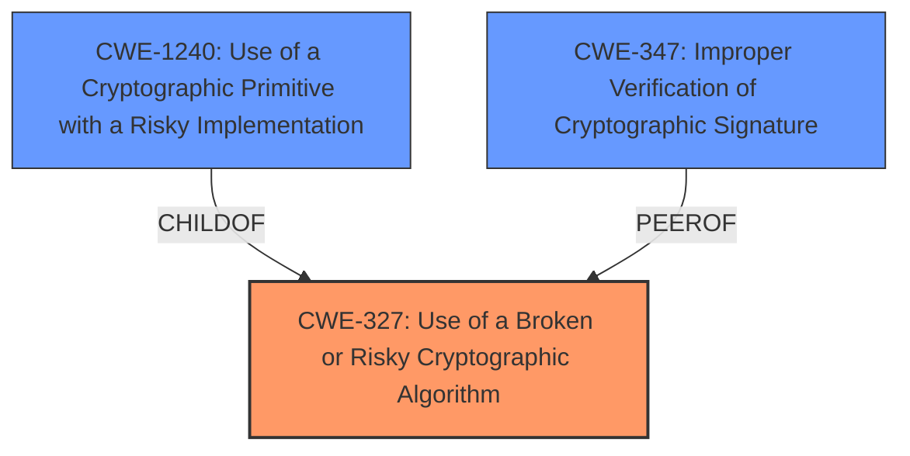

# Raw Analyzer Response for CVE-2022-1434

# Summary
| CWE ID | CWE Name | Confidence | CWE Abstraction Level | CWE Vulnerability Mapping Label | CWE-Vulnerability Mapping Notes |
|---|---|---|---|---|---|
| CWE-327 | Use of a Broken or Risky Cryptographic Algorithm | 0.9 | Class | Primary | Allowed-with-Review |
| CWE-1240 | Use of a Cryptographic Primitive with a Risky Implementation | 0.8 | Base | Secondary | Allowed |
| CWE-347 | Improper Verification of Cryptographic Signature | 0.6 | Base | Secondary | Allowed |

## Evidence and Confidence

*   **Confidence Score:** 0.8
*   **Evidence Strength:** HIGH

## Relationship Analysis
The primary CWE is CWE-327 (Use of a Broken or Risky Cryptographic Algorithm), which is a Class-level CWE. CWE-1240 (Use of a Cryptographic Primitive with a Risky Implementation) is a more specific Base CWE and a child of CWE-327. CWE-347 (Improper Verification of Cryptographic Signature) is related to cryptographic issues but focuses on signature verification, while the core issue is using AAD data as the MAC key in RC4-MD5. This makes CWE-1240 a more appropriate secondary CWE than CWE-347.

## Vulnerability Chain
The vulnerability chain starts with the **incorrect use of AAD data as the MAC key** in the OpenSSL 3.0 implementation of the RC4-MD5 ciphersuite. This leads to a trivially predictable MAC key, which then allows an attacker to modify data in a man-in-the-middle attack.

## Summary of Analysis
Initially, CWE-327 (Use of a Broken or Risky Cryptographic Algorithm) seemed like a suitable primary mapping, especially given the "Use of a Broken or Risky Cryptographic Algorithm" present in the CVE Reference Links Content Summary. However, the **root cause** is more specifically related to the **incorrect implementation**, i.e., **OpenSSL uses AAD data as MAC key**, which makes the MAC key trivially predictable. This is better captured by CWE-1240 (Use of a Cryptographic Primitive with a Risky Implementation). However, since the RC4-MD5 ciphersuite itself is considered weak, CWE-327 is selected as the primary CWE as it is a broader category that encompasses the overall risk associated with using such an algorithm. CWE-1240 is added as a secondary CWE to provide more specific details on the implementation **weakness**.

The decision is based on the evidence from the Vulnerability Description Key Phrases, specifically the **rootcause** entry: "**OpenSSL uses AAD data as MAC key**." The CVE Reference Links Content Summary further supports this by mentioning "The implementation incorrectly uses the Additional Authenticated Data (AAD) as the Message Authentication Code (MAC) key."

CWE-327 is at the Class level, and CWE-1240 is at the Base level. Since CWE-1240 is a child of CWE-327, it offers a more specific description of the vulnerability. However, considering the broader context of using a weak ciphersuite like RC4-MD5, CWE-327 is deemed more suitable as the primary CWE.

The retriever results also support this decision, with CWE-327 being the top combined result.

Relevant CWE Information:

# Enhanced Context (25 CWEs)
The following CWEs were identified as potentially relevant to this vulnerability:

## CWE-327: Use of a Broken or Risky Cryptographic Algorithm
**Abstraction Level**: Class
**Similarity Score**: 9324.54
**Source**: sparse

**Description**:
The product uses a broken or risky cryptographic algorithm or protocol.

**Mapping Guidance**:
- Usage: Allowed-with-Review
- Rationale: This CWE entry is a Class and might have Base-level children that would be more appropriate

### Technical Explanation for Selected CWEs:

*   **CWE-327: Use of a Broken or Risky Cryptographic Algorithm**
    *   **How the vulnerability's details match the CWE's characteristics:** The vulnerability description states that OpenSSL 3.0's implementation uses the RC4-MD5 ciphersuite, which is considered weak. Using such a ciphersuite introduces risk due to its known vulnerabilities.
    *   **The security implications and potential impact:** Attackers can exploit weaknesses in the RC4-MD5 ciphersuite to compromise the confidentiality and integrity of data. In this case, it allows for data modification via a man-in-the-middle attack.
    *   **Any parent-child relationships or chain patterns that influenced your mapping:** CWE-327 is a Class-level CWE. Its child CWEs offer more specific details, such as CWE-1240.
    *   **Whether the weakness is primary or secondary in the vulnerability:** Primary.
    *   **How the official MITRE mapping guidance influenced your decision:** The mapping guidance suggests that this Class-level CWE might have more appropriate Base-level children. While CWE-1240 is considered, CWE-327 encompasses the general use of a weak algorithm.

*   **CWE-1240: Use of a Cryptographic Primitive with a Risky Implementation**
    *   **How the vulnerability's details match the CWE's characteristics:** The vulnerability lies in the incorrect implementation of the RC4-MD5 ciphersuite, specifically the use of AAD data as the MAC key.
    *   **The security implications and potential impact:** This improper implementation makes the MAC key trivially predictable, allowing attackers to modify data.
    *   **Any parent-child relationships or chain patterns that influenced your mapping:** CWE-1240 is a Base-level CWE and a child of CWE-327.
    *   **Whether the weakness is primary or secondary in the vulnerability:** Secondary. It provides more detail to the **rootcause** which is that **OpenSSL uses AAD data as MAC key**
    *   **How the official MITRE mapping guidance influenced your decision:** The mapping guidance allows this CWE because it is at the Base level of abstraction, which is a preferred level of abstraction for mapping to the root causes of vulnerabilities.

*   **CWE-347: Improper Verification of Cryptographic Signature**
    *   **How the vulnerability's details match the CWE's characteristics:** While data modification is possible, the **rootcause** isn't directly related to signature verification. It's due to the incorrect use of AAD data as the MAC key. This makes the MAC key predictable, and the attack is successful because the MAC itself is flawed.
    *   **The security implications and potential impact:** The improper verification can lead to accepting spoofed data.
    *   **Any parent-child relationships or chain patterns that influenced your mapping:** Not directly related in a parent-child relationship but a peer of other cryptographic CWEs
    *   **Whether the weakness is primary or secondary in the vulnerability:** Secondary. This is present because the MAC is considered to be a type of signature.
    *   **How the official MITRE mapping guidance influenced your decision:** The mapping guidance allows this CWE because it is at the Base level of abstraction, which is a preferred level of abstraction for mapping to the root causes of vulnerabilities.

### Other CWEs Considered but Not Used:

*   **CWE-295: Improper Certificate Validation:** This CWE focuses on certificate validation issues, which are not directly related to the vulnerability. The issue is with the RC4-MD5 ciphersuite implementation.
*   **CWE-201: Insertion of Sensitive Information Into Sent Data:** This CWE is about including sensitive data in transmissions, which is not the primary issue here. The vulnerability allows for data modification, but it is not about inserting sensitive information.
*   **CWE-427: Uncontrolled Search Path Element:** This CWE is related to using untrusted search paths to find resources, which is not relevant to this vulnerability.
*   **CWE-863: Incorrect Authorization:** This CWE focuses on authorization issues, which are not the primary **rootcause** of the vulnerability. The **rootcause** is that **OpenSSL uses AAD data as MAC key**
*   **CWE-476: NULL Pointer Dereference:** This CWE is about dereferencing NULL pointers, which is not related to this vulnerability.
*   **CWE-923: Improper Restriction of Communication