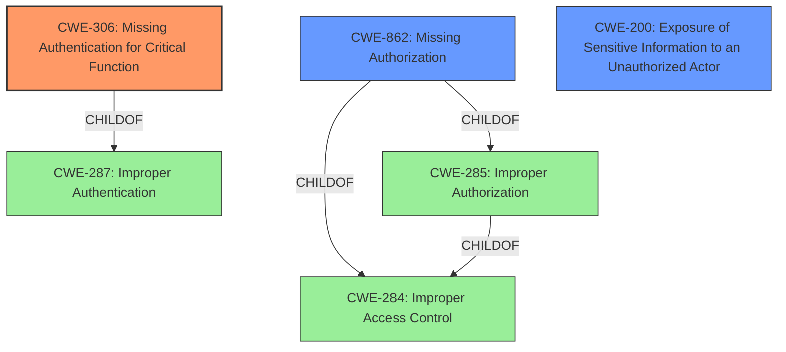

# Enhanced Analysis for CVE-2022-1442

# Summary
| CWE ID | CWE Name | Confidence | CWE Abstraction Level | CWE Vulnerability Mapping Label | CWE-Vulnerability Mapping Notes |
|---|---|---|---|---|---|
| CWE-306 | Missing Authentication for Critical Function | 1 | Base | Allowed | Primary CWE |
| CWE-200 | Exposure of Sensitive Information to an Unauthorized Actor | 0.7 | Class | Discouraged | Secondary Candidate |
| CWE-862 | Missing Authorization | 0.6 | Class | Allowed-with-Review | Secondary Candidate |

## Evidence and Confidence

*   **Confidence Score:** 0.8
*   **Evidence Strength:** HIGH

## Relationship Analysis
The primary weakness identified is **CWE-306 (Missing Authentication for Critical Function)**, which is a Base level CWE and a child of **CWE-287 (Improper Authentication)**. The application **fails to require authentication** for a critical function, allowing unauthorized access. **CWE-862 (Missing Authorization)** is a Class level CWE and is a child of **CWE-285 (Improper Authorization)** and **CWE-284 (Improper Access Control)**, which are higher-level classifications. While **CWE-862** is relevant, **CWE-306** is more precise as it specifically addresses the absence of authentication, a prerequisite for authorization. **CWE-200 (Exposure of Sensitive Information to an Unauthorized Actor)** is a Class level CWE describing the impact.



## Vulnerability Chain
The vulnerability chain starts with **CWE-306 (Missing Authentication for Critical Function)**, leading to **CWE-200 (Exposure of Sensitive Information to an Unauthorized Actor)**. The absence of authentication allows unauthorized access to sensitive data, resulting in its disclosure.

## Summary of Analysis
Initially, the key phrase "**improper access control**" suggested a broader range of CWEs related to authorization issues. However, the CVE Reference Links Content Summary made it clear that the root cause was "**Missing Authentication**" for a critical function: `get_all_data`.
> **Root Cause of Vulnerability:** Improper access control in the `get_all_data` function within the `~/core/forms/action.php` file of the Metform WordPress plugin.
> **Missing Authorization:** The `get_all_data` function, responsible for retrieving form data including sensitive API keys and secrets, lacked proper authorization checks. This allowed unauthenticated users to access this function.

The provided evidence strongly supports **CWE-306** as the primary weakness. The code lacked any authentication checks, allowing unauthenticated users to access sensitive API keys. The patch added a capability check (`current_user_can('manage_options')`), which confirms that the original code had no authentication mechanism in place.
**CWE-200** is a secondary concern, representing the impact of the missing authentication. It highlights the exposure of sensitive information but is not the root cause.
**CWE-862** is also considered but deemed less specific than **CWE-306**, as the absence of authentication is the primary issue, making authorization checks irrelevant in the vulnerable code.
The selection of **CWE-306** is at the optimal level of specificity (Base) and is directly supported by the evidence and mapping guidance.

Relevant CWE Information:

# Enhanced Context (25 CWEs)
## CWE-915: Improperly Controlled Modification of Dynamically-Determined Object Attributes
**Abstraction Level**: Base
**Similarity Score**: 0.75
**Source**: dense
**Description**:
The product receives input from an upstream component that specifies multiple attributes, properties, or fields that are to be initialized or updated in an object, but it does not properly control which attributes can be modified.
**Mapping Guidance**:
- Usage: Allowed
- Rationale: This CWE entry is at the Base level of abstraction, which is a preferred level of abstraction for mapping to the root causes of vulnerabilities.
*Not Selected:* This CWE is not relevant because the vulnerability is not related to the modification of object attributes, but rather to the missing authentication for a critical function.

## CWE-639: Authorization Bypass Through User-Controlled Key
**Abstraction Level**: Base
**Similarity Score**: 0.74
**Source**: dense
**Description**:
The system's authorization functionality does not prevent one user from gaining access to another user's data or record by modifying the key value identifying the data.
**Mapping Guidance**:
- Usage: Allowed
- Rationale: This CWE entry is at the Base level of abstraction, which is a preferred level of abstraction for mapping to the root causes of vulnerabilities.
*Not Selected:* While authorization is a factor, the root cause is the complete absence of authentication, not the bypass through a user-controlled key.

## CWE-807: Reliance on Untrusted Inputs in a Security Decision
**Abstraction Level**: Base
**Similarity Score**: 0.74
**Source**: dense
**Description**:
The product uses a protection mechanism that relies on the existence or values of an input, but the input can be modified by an untrusted actor in a way that bypasses the protection mechanism.
**Mapping Guidance**:
- Usage: Allowed
- Rationale: This CWE entry is at the Base level of abstraction, which is a preferred level of abstraction for mapping to the root causes of vulnerabilities.
*Not Selected:* The vulnerability doesn't involve reliance on untrusted inputs for security decisions. It's about the absence of any authentication mechanism.

## CWE-668: Exposure of Resource to Wrong Sphere
**Abstraction Level**: Class
**Similarity Score**: 0.74
**Source**: dense
**Description**:
The product exposes a resource to the wrong control sphere, providing unintended actors with inappropriate access to the resource.
**Mapping Guidance**:
- Usage: Discouraged
- Rationale: CWE-668 is high-level and is often misused as a catch-all when lower-level CWE IDs might be applicable. It is sometimes used for low-information vulnerability reports [REF-1287]. It is a level-1 Class (i.e., a child of a Pillar). It is not useful for trend analysis.
*Not Selected:* This is a high-level CWE, and **CWE-306** provides a more specific description of the vulnerability.

## CWE-538: Insertion of Sensitive Information into Externally-Accessible File or Directory
**Abstraction Level**: Base
**Similarity Score**: 0.73
**Source**: dense
**Description**:
The product places sensitive information into files or directories that are accessible to actors who are allowed to have access to the files, but not to the sensitive information.
**Mapping Guidance**:
- Usage: Allowed
- Rationale: This CWE entry is at the Base level of abstraction, which is a preferred level of abstraction for mapping to the root causes of vulnerabilities.
*Not Selected:* The vulnerability is not about inserting sensitive information into files or directories. It's about the exposure of sensitive information due to missing authentication.

## CWE-552: Files or Directories Accessible to External Parties
**Abstraction Level**: Base
**Similarity Score**: 0.73
**Source**: dense
**Description**:
The product makes files or directories accessible to unauthorized actors, even though they should not be.
**Mapping Guidance**:
- Usage: Allowed
- Rationale: This CWE entry is at the Base level of abstraction, which is a preferred level of abstraction for mapping to the root causes of vulnerabilities.
*Not Selected:* The vulnerability is not about making files or directories accessible to external parties. It's about the exposure of sensitive information due to missing authentication.

## CWE-74: Improper Neutralization of Special Elements in Output Used by a Downstream Component ('Injection')
**Abstraction Level**: Class
**Similarity Score**: 0.73
**Source**: dense
**Description**:
The product constructs all or part of a command, data structure, or record using externally-influenced input from an upstream component, but it does not neutralize or incorrectly neutralizes special elements that could modify


## CWE Relationship Analysis

Current CWEs represent these abstraction levels: .


### Vulnerability Chain Analysis

**Chain starting from CWE-862:**
- 862 (Missing Authorization) - ROOT


**Chain starting from CWE-552:**
- 552 (Files or Directories Accessible to External Parties) - ROOT


### CWE Relationship Diagram

```mermaid
graph TD
    classDef primary fill:#f96,stroke:#333,stroke-width:2px
    classDef secondary fill:#69f,stroke:#333
    classDef tertiary fill:#9e9,stroke:#333
```