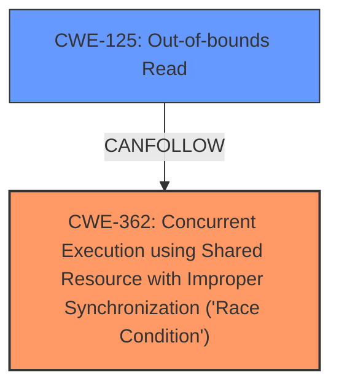

# Analysis for CVE-2022-1462

# Summary
| CWE ID  | CWE Name                                                                                                         | Confidence | CWE Abstraction Level | CWE Vulnerability Mapping Label | CWE-Vulnerability Mapping Notes |
| :-------- | :----------------------------------------------------------------------------------------------------------------- | :---------- | :----------------------- | :------------------------------ | :------------------------------ |
| CWE-362   | Concurrent Execution using Shared Resource with Improper Synchronization ('Race Condition')                        | 1          | Class                   | Primary                       | Allowed-with-Review            |
| CWE-125   | Out-of-bounds Read                                                                                               | 1          | Base                    | Secondary                      | Allowed                      |

## Evidence and Confidence

*   **Confidence Score:** 1
*   **Evidence Strength:** HIGH

## Relationship Analysis
The primary weakness is a **race condition** (CWE-362), where multiple threads access a shared resource without proper synchronization. This leads to an **out-of-bounds read** (CWE-125) when calculating the `count` variable within the `flush_to_ldisc` function. CWE-362 is a Class-level CWE, and while more specific Base-level children might exist, the provided information doesn't pinpoint a specific synchronization issue beyond the general "improper synchronization." CWE-125 is a direct result of the race condition, representing the consequence of the unsynchronized access. The relationship is a clear chain: CWE-362 leads to CWE-125.

## Vulnerability Chain
The vulnerability chain starts with a **race condition** (CWE-362) in the `tty_flip_buffer_push` function due to **lack of proper locking**. This results in the `buf->tail->commit` value becoming inconsistent. Subsequently, the inconsistent value is used in the `flush_to_ldisc` function to calculate `count`, leading to an **out-of-bounds read** (CWE-125). The final impact is a system crash or unauthorized data leakage.

## Summary of Analysis
The initial assessment identifies CWE-362 as the primary cause, stemming from the **race condition** described in both the vulnerability description and the CVE Reference Links Content Summary. The **out-of-bounds read** (CWE-125) is a direct consequence of this race condition.

Evidence from the vulnerability description: "An **out-of-bounds read** flaw was found in the Linux kernels TeleTYpe subsystem...The issue occurs in how a user triggers a **race condition** using ioctls TIOCSPTLCK and TIOCGPTPEER and TIOCSTI and TCXONC with leakage of memory in the flush_to_ldisc function."

Evidence from the CVE Reference Links Content Summary: "A **race condition** exists in the `tty_flip_buffer_push` function...leading to a **race condition** where its value may become less than expected. This can lead to an **out-of-bounds read** in the `flush_to_ldisc` function when calculating the `count` variable."

The graph relationship highlights the chain from the race condition to the out-of-bounds read. Selecting CWE-362 and CWE-125 provides the optimal level of specificity, accurately representing the vulnerability's root cause and its direct consequence.

Relevant CWE Information:

# Enhanced Context (25 CWEs)
The following CWEs were identified as potentially relevant to this vulnerability:

## CWE-667: Improper Locking
**Abstraction Level**: Class
**Similarity Score**: 0.79
**Source**: dense

**Description**:
The product does not properly acquire or release a lock on a resource, leading to unexpected resource state changes and behaviors.

**Mapping Guidance**:
- Usage: Allowed-with-Review
- Rationale: This CWE entry is a Class and might have Base-level children that would be more appropriate

## CWE-362: Concurrent Execution using Shared Resource with Improper Synchronization ('Race Condition')
**Abstraction Level**: Class
**Similarity Score**: 0.78
**Source**: dense

**Description**:
The product contains a concurrent code sequence that requires temporary, exclusive access to a shared resource, but a timing window exists in which the shared resource can be modified by another code sequence operating concurrently.

**Mapping Guidance**:
- Usage: Allowed-with-Review
- Rationale: This CWE entry is a Class and might have Base-level children that would be more appropriate

## CWE-125: Out-of-bounds Read
**Abstraction Level**: Base
**Similarity Score**: 0.77
**Source**: dense

**Description**:
The product reads data past the end, or before the beginning, of the intended buffer.

**Mapping Guidance**:
- Usage: Allowed
- Rationale: This CWE entry is at the Base level of abstraction, which is a preferred level of abstraction for mapping to the root causes of vulnerabilities.

## CWE-367: Time-of-check Time-of-use (TOCTOU) Race Condition
**Abstraction Level**: Base
**Similarity Score**: 0.77
**Source**: dense

**Description**:
The product checks the state of a resource before using that resource, but the resource's state can change between the check and the use in a way that invalidates the results of the check. This can cause the product to perform invalid actions when the resource is in an unexpected state.

**Mapping Guidance**:
- Usage: Allowed
- Rationale: This CWE entry is at the Base level of abstraction, which is a preferred level of abstraction for mapping to the root causes of vulnerabilities.

## CWE-787: Out-of-bounds Write
**Abstraction Level**: Base
**Similarity Score**: 4.33
**Source**: graph

**Description**:
CWE-787: Out-of-bounds Write

**Mapping Guidance**:
- Usage: Allowed
- Rationale: This CWE entry is at the Base level of abstraction, which is a preferred level of abstraction for mapping to the root causes of vulnerabilities.

CWEs considered but not used:

*   **CWE-667 Improper Locking**: While **lack of proper locking** is mentioned as a contributing factor in the CVE Reference Links Content Summary, the core issue is the **race condition** itself. The description doesn't provide enough specific detail to pinpoint the locking mechanism, making CWE-362 a better fit.
*   **CWE-367 Time-of-check Time-of-use (TOCTOU) Race Condition**: Although a **race condition** is present, it's not explicitly a TOCTOU issue. The vulnerability stems from unsynchronized access rather than a check-then-use scenario, making CWE-362 more appropriate.
*   **CWE-787 Out-of-bounds Write**: The vulnerability specifically describes an **out-of-bounds read**, not a write, making CWE-125 the correct choice.
*   **CWE-823 Use of Out-of-range Pointer Offset:** This is not about using an out-of-range pointer offset. The problem stems from a race condition leading to an incorrect calculation that results in the out-of-bounds read.
*   **CWE-476 NULL Pointer Dereference:** The vulnerability description does not indicate anything about null pointer dereference, it is about a **race condition** leading to **out-of-bounds read**.
*   **CWE-908 Use of Uninitialized Resource:** The description does not mention using uninitialized resources, it is about a **race condition** leading to **out-of-bounds read**.