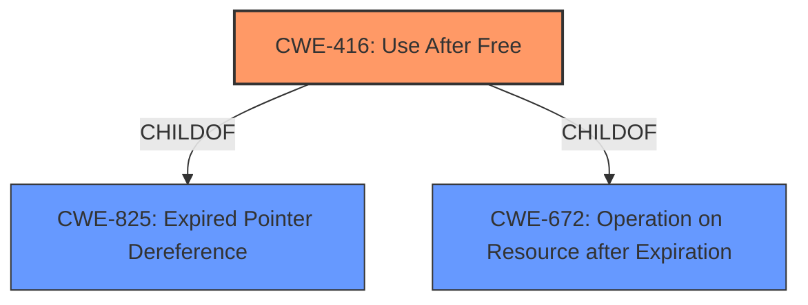

# Raw Analyzer Response for CVE-2022-1477

# Summary
| CWE ID | CWE Name | Confidence | CWE Abstraction Level | CWE Vulnerability Mapping Label | CWE-Vulnerability Mapping Notes |
|---|---|---|---|---|---|
| CWE-416 | Use After Free | 1.0 | Variant | Allowed | Primary CWE |

## Evidence and Confidence

*   **Confidence Score:** 1.0
*   **Evidence Strength:** HIGH

## Relationship Analysis
The primary identified CWE is CWE-416 (**Use After Free**). This is a variant-level CWE, providing a specific description of the vulnerability. CWE-416 is a child of CWE-825 (**Expired Pointer Dereference**) and CWE-672 (**Operation on Resource after Expiration**). The relationships highlight that the vulnerability involves using a resource (memory) after it has been freed.

## Vulnerability Chain
The vulnerability chain starts with the **use after free** condition, which allows a remote attacker to potentially exploit heap corruption. The sequence is:

1.  Memory is allocated and used.
2.  Memory is freed.
3.  The same memory is accessed again, leading to a **use after free** (CWE-416).
4.  This can lead to heap corruption and potentially remote code execution.

## Summary of Analysis
The analysis is based on the vulnerability description, key phrases, and CVE reference links content summary. The **root cause** of the vulnerability is explicitly stated as **"use after free."** The CVE reference links content summary confirms this, stating "Root cause of vulnerability: Use-after-free vulnerability." The primary CWE match from similar CVE descriptions is CWE-416, further supporting this classification.

The "Retriever Results" also lists CWE-416 as the top combined result.

The selection of CWE-416 is at the optimal level of specificity because it directly describes the **weakness**. Other CWEs were considered but deemed less specific:

*   CWE-366 (**Race Condition within a Thread**): While race conditions can lead to use-after-free vulnerabilities, there is no direct evidence of a race condition in the provided description.
*   CWE-843 (**Access of Resource Using Incompatible Type ('Type Confusion')**): This CWE is not directly related to the **use after free** condition.
*   CWE-122 (**Heap-based Buffer Overflow**): While heap corruption is a potential impact of the vulnerability, the root cause is the **use after free**.
*   CWE-415 (**Double Free**): This CWE describes a different memory management error.
*   CWE-908 (**Use of Uninitialized Resource**): This describes usage of resources before initialization, which is different from **use after free**.

The evidence clearly points to CWE-416 as the most accurate and specific classification.