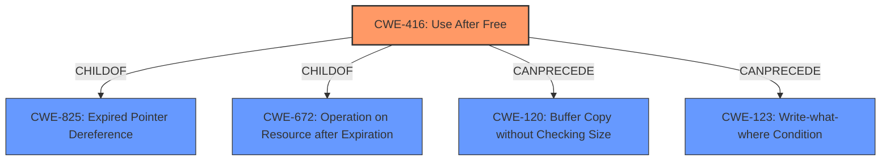

# Analysis for CVE-2022-1478

# Summary

| CWE ID  | CWE Name                                                                            | Confidence | CWE Abstraction Level | CWE Vulnerability Mapping Label | CWE-Vulnerability Mapping Notes |
| ------- | ----------------------------------------------------------------------------------- | ---------- | --------------------- | ------------------------------- | ------------------------------- |
| CWE-416 | Use After Free                                                                      | 1          | Variant               | Primary                         | Allowed                         |

## Evidence and Confidence

*   **Confidence Score:** 1
*   **Evidence Strength:** HIGH

## Relationship Analysis

The primary relationship influencing the decision is the direct match of the vulnerability description to CWE-416, supported by its prevalence in similar CVE descriptions. While other CWEs like CWE-366 (Race Condition) and CWE-787 (Out-of-bounds Write) were considered due to their presence in the Retriever Results, CWE-416's explicit mention in the vulnerability description and its classification as a Variant (preferred abstraction level) made it the most suitable choice. Other relationships like parent-child (CWE-416 is a child of CWE-825, Expired Pointer Dereference) provide context but do not alter the direct mapping to CWE-416.

## Vulnerability Chain

The vulnerability chain is relatively simple:

1.  **Root Cause:** Use after free (**CWE-416**) due to **improper** memory management in SwiftShader.
2.  **Impact:** Potential heap corruption, exploitable by a remote attacker.

## Summary of Analysis

The assessment is primarily based on the direct evidence of "**Use after free**" in the vulnerability description and the "CVE Reference Links Content Summary", which explicitly states "**Root cause of vulnerability: Use after free in SwiftShader**" and "**Weaknesses/vulnerabilities present: Use-after-free vulnerability.**" This direct match overrides the need to consider more complex chains or alternative CWEs. The graph relationships confirm that CWE-416 is a suitable variant-level weakness with well-defined relationships to other memory management issues. The selection of CWE-416 is at the optimal level of specificity, as it precisely describes the root cause identified in the vulnerability.

Relevant CWE Information:
- **CWE-416: Use After Free**: The product reuses or references memory after it has been freed. This aligns directly with the vulnerability description.
- **CWE-366: Race Condition within a Thread**: Considered but rejected because there is no explicit mention of race conditions in the provided vulnerability description.
- **CWE-787: Out-of-bounds Write**: Considered but rejected because the vulnerability is specifically a use-after-free, not a buffer overflow.
- **CWE-123: Write-what-where Condition**: Considered but rejected because the vulnerability is specifically a use-after-free, not an arbitrary write.