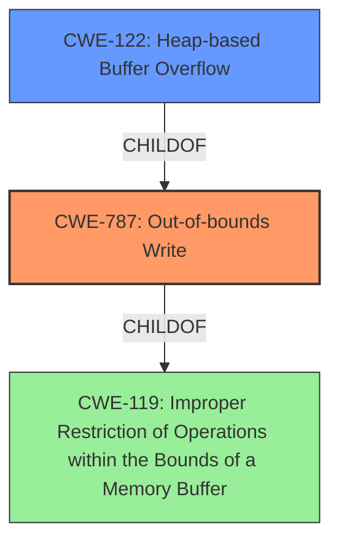

# Raw Analyzer Response for CVE-2022-1483

# Summary
| CWE ID  | CWE Name | Confidence | CWE Abstraction Level | CWE Vulnerability Mapping Label | CWE-Vulnerability Mapping Notes |
|-----------------|-------------------------------------------------------------------------------------|-------------------|--------------------------|------------------------------------|-----------------------------------|
| CWE-787 | Out-of-bounds Write | 1.0 | Base |  Primary | Allowed |
| CWE-122 | Heap-based Buffer Overflow | 0.8 | Variant | Secondary | Allowed |
| CWE-119 | Improper Restriction of Operations within the Bounds of a Memory Buffer | 0.6 | Class | Secondary | Discouraged |

## Evidence and Confidence

*   **Confidence Score:** 0.9
*   **Evidence Strength:** HIGH

## Relationship Analysis
The primary CWE is CWE-787, which is a base-level CWE describing an out-of-bounds write. CWE-122, Heap-based Buffer Overflow, is a variant of CWE-787. The vulnerability description specifically mentions a "heap **buffer overflow**," making CWE-122 a relevant secondary CWE. CWE-119 is a class-level CWE that is a parent of both CWE-787 and CWE-122. The relationships influenced the selection by narrowing down the broad CWE-119 to the more specific CWE-787 and CWE-122.

## Vulnerability Chain
The vulnerability chain starts with the **buffer overflow** in WebGPU, leading to heap corruption. This is a direct cause-and-effect relationship.
  - **Root Cause:** Heap **buffer overflow** (CWE-787, CWE-122)
  - **Impact:** Heap corruption

## Summary of Analysis
The initial analysis strongly points towards a **buffer overflow** vulnerability, specifically on the heap. The vulnerability description explicitly mentions "heap **buffer overflow**," which aligns perfectly with CWE-787 (Out-of-bounds Write) and CWE-122 (Heap-based Buffer Overflow). The CVE Reference Links Content Summary also confirms the root cause as a heap **buffer overflow**, further solidifying this assessment.

The graph relationships show that CWE-787 is a child of CWE-119, and CWE-122 is a child of CWE-787. This hierarchy helps in selecting the most specific CWE.

The selection of CWE-787 and CWE-122 is based on the direct evidence from the vulnerability description and the CVE Reference Links Content Summary. CWE-787 is the primary CWE because it represents the core issue of writing outside the intended buffer bounds. CWE-122 is a more specific variant as the buffer is heap-based.

CWE-119 was considered due to its relationship to both CWE-787 and CWE-122. However, CWE-119 is a class-level CWE and is discouraged when more specific CWEs are available. Therefore, it was not chosen as the primary CWE but is included as secondary.

Relevant CWE Information:

# Enhanced Context (25 CWEs)

## CWE-124: Buffer Underwrite ('Buffer Underflow')
**Abstraction Level**: Base
**Similarity Score**: 0.79
**Source**: dense

**Description**:
The product writes to a buffer using an index or pointer that references a memory location prior to the beginning of the buffer.
*This CWE was not chosen because the vulnerability involves writing past the end of the buffer (overflow), not before the beginning (underflow).*

## CWE-131: Incorrect Calculation of Buffer Size
**Abstraction Level**: Base
**Similarity Score**: 0.78
**Source**: dense

**Description**:
The product does not correctly calculate the size to be used when allocating a buffer, which could lead to a buffer overflow.
*This CWE was not chosen because the provided information doesn't indicate an incorrect calculation of buffer size, just a general overflow.*

## CWE-191: Integer Underflow (Wrap or Wraparound)
**Abstraction Level**: Base
**Similarity Score**: 0.78
**Source**: dense

**Description**:
The product subtracts one value from another, such that the result is less than the minimum allowable integer value, which produces a value that is not equal to the correct result.
*This CWE was not chosen because the vulnerability is not related to integer underflow.*

## CWE-193: Off-by-one Error
**Abstraction Level**: Base
**Similarity Score**: 0.77
**Source**: dense

**Description**:
A product calculates or uses an incorrect maximum or minimum value that is 1 more, or 1 less, than the correct value.
*This CWE was not chosen because the vulnerability description doesn't specifically point to an off-by-one error, but rather a general buffer overflow.*

## CWE-805: Buffer Access with Incorrect Length Value
**Abstraction Level**: Base
**Similarity Score**: 0.77
**Source**: dense

**Description**:
The product uses a sequential operation to read or write a buffer, but it uses an incorrect length value that causes it to access memory that is outside of the bounds of the buffer.
*This CWE was not chosen because while it's related to buffer access, the core issue is the overflow itself rather than just incorrect length value.*

## CWE-786: Access of Memory Location Before Start of Buffer
**Abstraction Level**: Base
**Similarity Score**: 0.76
**Source**: dense

**Description**:
The product reads or writes to a buffer using an index or pointer that references a memory location prior to the beginning of the buffer.
*This CWE was not chosen because the vulnerability is about writing *past* the buffer, not accessing memory *before* it.*

## CWE-127: Buffer Under-read
**Abstraction Level**: Variant
**Similarity Score**: 0.76
**Source**: dense

**Description**:
The product reads from a buffer using buffer access mechanisms such as indexes or pointers that reference memory locations prior to the targeted buffer.
*This CWE was not chosen because the vulnerability is about writing past the buffer (overflow), not reading before it (under-read).*

## CWE-197: Numeric Truncation Error
**Abstraction Level**: Base
**Similarity Score**: 0.76
**Source**: dense

**Description**:
Truncation errors occur when a primitive is cast to a primitive of a smaller size and data is lost in the conversion.
*This CWE was not chosen because the vulnerability is not related to numeric truncation.*

## CWE-366: Race Condition within a Thread
**Abstraction Level**: Base
**Similarity Score**: 0.76
**Source**: dense

**Description**:
If two threads of execution use a resource simultaneously, there exists the possibility that resources may be used while invalid, in turn making the state of execution undefined.
*This CWE was not chosen because the vulnerability is not explicitly described as involving a race condition between threads.*

## CWE-126: Buffer Over-read
**Abstraction Level**: Variant
**Similarity Score**: 0.76
**Source**: dense

**Description**:
The product reads from a buffer using buffer access mechanisms such as indexes or pointers that reference memory locations after the targeted buffer.
*This CWE was not chosen because the vulnerability is about writing past the buffer (overflow), not reading past the buffer (over-read).*

## CWE-190: Integer Overflow or Wraparound
**Abstraction Level**: Base
**Similarity Score**: 7037.01
**Source**: sparse

**Description**:
The product performs a calculation that can produce an integer overflow or wraparound when the logic assumes that the resulting value will always be larger than the original value. This occurs when an integer value is incremented to a value that is too large to store in the associated representation. When this occurs, the value may become a very small or negative number.
*This CWE was not chosen because there is no mention of an integer overflow in the description.*

## CWE-125: Out-of-bounds Read
**Abstraction Level**: Base
**Similarity Score**: 6585.97
**Source**: sparse

**Description**:
The product reads data past the end, or before the beginning, of the intended buffer.
*This CWE was not chosen because the vulnerability is about writing past the end of a buffer (overflow), not reading.*

## CWE-193: Off-by-one Error
**Abstraction Level**: Base
**Similarity Score**: 6552.12
**Source