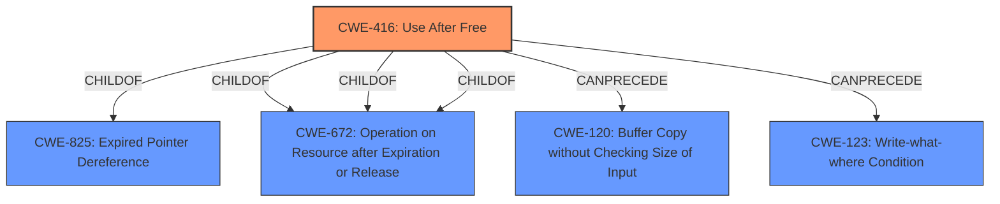

# Analysis for CVE-2022-1491

# Summary
| CWE ID | CWE Name | Confidence | CWE Abstraction Level | CWE Vulnerability Mapping Label | CWE-Vulnerability Mapping Notes |
|---|---|---|---|---|---|
| CWE-416 | Use After Free | 1.0 | Variant | Allowed | Primary CWE |

## Evidence and Confidence

*   **Confidence Score:** 1.0
*   **Evidence Strength:** HIGH

## Relationship Analysis
The primary CWE is CWE-416 **Use After Free**, which is a variant-level CWE. It relates to other CWEs through hierarchical and chain relationships. It is a child of CWE-825 **Expired Pointer Dereference** and CWE-672 **Operation on Resource after Expiration or Release**. It can be preceded by CWE-120 **Buffer Copy without Checking Size of Input** and CWE-123 **Write-what-where Condition**.

## Vulnerability Chain
The vulnerability chain starts with a **Use After Free** (CWE-416), which leads to **heap corruption**. The vulnerability is triggered via specific and direct user interaction.

## Summary of Analysis
The analysis is based on the provided evidence. The vulnerability description explicitly states "Use after free in Bookmarks... allowed a remote attacker to potentially exploit **heap corruption**". The key phrase also highlights the **rootcause** as **use after free**. The CVE Reference Links Content Summary confirms the **root_cause** is "Use after free in Bookmarks" and the **weakness** is "Use after free".

The primary CWE match from the "CWE for similar CVE Descriptions" section is CWE-416.

The Retriever Results also lists CWE-416 as the top combined result, and the "Usage" is "Allowed" at the Variant level of abstraction, which is a preferred level.

Therefore, CWE-416 **Use After Free** is the most appropriate CWE for this vulnerability. It is at the optimal level of specificity (Variant) and aligns with the vulnerability description and supporting evidence.

Other CWEs Considered but Not Used:

*   CWE-366 **Race Condition within a Thread**: While concurrency issues can sometimes lead to use-after-free vulnerabilities, there's no explicit mention of threads or concurrent execution in this vulnerability description. Therefore, CWE-366 is not a direct fit.
*   CWE-122 **Heap-based Buffer Overflow**: The vulnerability description mentions **heap corruption**, but the root cause is **use after free**, not a buffer overflow. Therefore, CWE-122 is not the primary weakness.
*   CWE-843 **Access of Resource Using Incompatible Type ('Type Confusion')**: There is no evidence of type confusion.
*   CWE-415 **Double Free**: There is no evidence of a double free.
*   CWE-451 **User Interface (UI) Misrepresentation of Critical Information**: This is related to UI issues, but the vulnerability stems from a memory management problem (use-after-free) rather than a UI misrepresentation.
*   CWE-123 **Write-what-where Condition**: While heap corruption can lead to write-what-where, the **rootcause** is still **use after free**.
*   CWE-911 **Improper Update of Reference Count**: There is no mention of a reference count.
*   CWE-665 **Improper Initialization**: The **rootcause** is **use after free**, not an initialization problem.