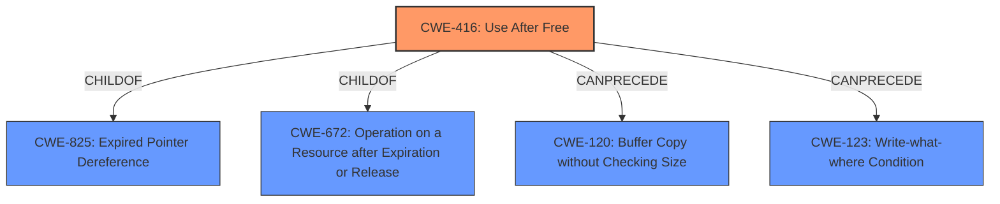

# Analysis Report for CVE-2022-1493

# Vulnerability Analysis Report: CVE-2022-1493

## Description


## Analysis (with Relationship Data)

# Summary
| CWE ID | CWE Name | Confidence | CWE Abstraction Level | CWE Vulnerability Mapping Label | CWE-Vulnerability Mapping Notes |
|---|---|---|---|---|---|
| CWE-416 | Use After Free | 1.0 | Variant | Primary | Allowed |

## Evidence and Confidence

*   **Confidence Score:** 1.0
*   **Evidence Strength:** HIGH

## Relationship Analysis
The primary relationship impacting the decision is that CWE-416 is a variant, which is a preferred level of abstraction. There are also `ChildOf` relationships to CWE-825, CWE-672, and CWE-672, and `CanPrecede` relationships to CWE-120 and CWE-123, but these are less relevant for direct classification.



## Vulnerability Chain
The vulnerability chain starts with a **use after free** condition, which leads to **heap corruption**. The impact is that a remote attacker can potentially exploit the **heap corruption** via specific and direct user interaction.

## Summary of Analysis
The analysis is based on direct evidence from the vulnerability description, specifically the key phrase "**rootcause: use after free**" and "**weakness: heap corruption**". The "CVE Reference Links Content Summary" also mentions "**Use after free**" as the root cause.
The selection of CWE-416 is further supported by the "CWE for similar CVE Descriptions" section, which lists CWE-416 as the "Primary CWE Match" and the top CWE.
The `Retriever Results` also lists CWE-416 as the top combined result.
CWE-416 is a Variant level CWE, which is the preferred level of abstraction.
I considered CWE-787 as a possible match, but CWE-416 is a better fit because the description mentions a "use after free" condition directly.
I considered CWE-123 as a possible match, but it is a more generic CWE than CWE-416 and doesn't describe the root cause accurately.
I considered CWE-415 as a possible match, but it describes a double free condition, which is different from a use after free condition.
Therefore, CWE-416 is the most appropriate CWE for this vulnerability.

Relevant CWE Information:
```
## CWE-416: Use After Free
**Abstraction:** Variant
**Status:** Stable

### Description
The product reuses or references memory after it has been freed. At some point afterward, the memory may be allocated again and saved in another pointer, while the original pointer references a location somewhere within the new allocation. Any operations using the original pointer are no longer valid because the memory "belongs" to the code that operates on the new pointer.

### Extended Description
Not provided

### Alternative Terms
Dangling pointer: a pointer that no longer points to valid memory, often after it has been freed
UAF: commonly used acronym for Use After Free
Use-After-Free

### Relationships
ChildOf -> CWE-825
ChildOf -> CWE-672
ChildOf -> CWE-672
ChildOf -> CWE-672
CanPrecede -> CWE-120
CanPrecede -> CWE-123

### Mapping Guidance
**Usage:** Allowed
**Rationale:** This CWE entry is at the Variant level of abstraction, which is a preferred level of abstraction for mapping to the root causes of vulnerabilities.
**Comments:** Carefully read both the name and description to ensure that this mapping is an appropriate fit. Do not try to 'force' a mapping to a lower-level Base/Variant simply to comply with this preferred level of abstraction.
**Reasons:**
- Acceptable-Use
```


## CWE Relationship Analysis

Current CWEs represent these abstraction levels: .


### Vulnerability Chain Analysis

**Chain starting from CWE-825:**
- 825 (Expired Pointer Dereference) - ROOT


**Chain starting from CWE-672:**
- 672 (Operation on a Resource after Expiration or Release) - ROOT


### CWE Relationship Diagram

```mermaid
graph TD
    classDef primary fill:#f96,stroke:#333,stroke-width:2px
    classDef secondary fill:#69f,stroke:#333
    classDef tertiary fill:#9e9,stroke:#333
```


*Report generated on 2025-03-30 14:35:19*
