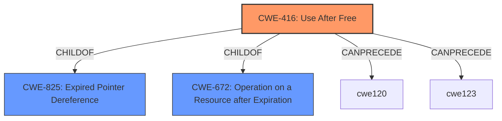

# Analysis Report for CVE-2022-1496

# Vulnerability Analysis Report: CVE-2022-1496

## Description


## Analysis (with Relationship Data)

# Summary
| CWE ID | CWE Name | Confidence | CWE Abstraction Level | CWE Vulnerability Mapping Label | CWE-Vulnerability Mapping Notes |
|---|---|---|---|---|---|
| CWE-416 | Use After Free | 1.0 | Variant | Primary | Allowed |

## Evidence and Confidence

*   **Confidence Score:** 1.0
*   **Evidence Strength:** HIGH

## Relationship Analysis
The primary relationship influencing the selection was the direct match of the **root cause**, **"use after free"**, to the CWE-416 description. The retriever results also strongly suggested CWE-416 as the most appropriate mapping. The relationship to other CWEs, such as its membership in a broader class (CWE-825), provides context but did not alter the selection of this specific variant.



## Vulnerability Chain
The vulnerability chain is straightforward:
  1. **Root Cause:** Use After Free (CWE-416)
  2. **Impact:** Heap corruption, potentially leading to remote code execution

## Summary of Analysis
The analysis is primarily based on the explicit evidence from the vulnerability description, which states "**use after free** in File Manager". This directly aligns with CWE-416: Use After Free. The CVE Reference Links Content Summary reinforces this by listing "Use after free in File Manager" as the root cause.
The graph relationships show that CWE-416 is a variant of CWE-825 (Expired Pointer Dereference) and CWE-672 (Operation on a Resource after Expiration), but the provided information is specific enough to select the variant.

Relevant CWE Information:

# Enhanced Context (25 CWEs)

## CWE-416: Use After Free
**Abstraction:** Variant
**Status:** Stable

### Description
The product reuses or references memory after it has been freed. At some point afterward, the memory may be allocated again and saved in another pointer, while the original pointer references a location somewhere within the new allocation. Any operations using the original pointer are no longer valid because the memory "belongs" to the code that operates on the new pointer.

### Mapping Guidance
**Usage:** Allowed
**Rationale:** This CWE entry is at the Variant level of abstraction, which is a preferred level of abstraction for mapping to the root causes of vulnerabilities.

**CWEs Considered But Not Used:**

*   **CWE-366: Race Condition within a Thread:** While concurrency issues can sometimes lead to use-after-free vulnerabilities, there's no explicit mention of a race condition in the description. Therefore, this CWE is not selected.
*   **CWE-122: Heap-based Buffer Overflow:** The description mentions "heap corruption" but specifically identifies "use after free" as the root cause, making CWE-122 less relevant.
*   **CWE-843: Access of Resource Using Incompatible Type ('Type Confusion'):** There is no evidence of type confusion in the description.
*   **CWE-415: Double Free:** There is no evidence of a double free in the description.
*   **CWE-356: Product UI does not Warn User of Unsafe Actions:** This CWE is not related to the described vulnerability.
*   **CWE-123: Write-what-where Condition:** This CWE is a potential impact of the vulnerability, but not the root cause.
*   **CWE-362: Concurrent Execution using Shared Resource with Improper Synchronization ('Race Condition'):** Similar to CWE-366, there's no explicit mention of a race condition.
*   **CWE-911: Improper Update of Reference Count:** This CWE is not related to the described vulnerability.
*   **CWE-665: Improper Initialization:** This CWE is not related to the described vulnerability.
*   **CWE-226: Sensitive Information in Resource Not Removed Before Reuse:** Not related to the root cause.
*   **CWE-404: Improper Resource Shutdown or Release:** Not a precise fit compared to CWE-416.
*   **CWE-665: Improper Initialization:** Not relevant to the provided description.
*   **CWE-667: Improper Locking:** No locking issues mentioned.
*   **CWE-662: Improper Synchronization:** Related to concurrency, but no evidence of it in the description.
*   **CWE-664: Improper Control of a Resource Through its Lifetime:** Too abstract; CWE-416 is more specific.
*   **CWE-754: Improper Check for Unusual or Exceptional Conditions:** Not directly related to the UAF.
*   **CWE-364: Signal Handler Race Condition:** No mention of signal handlers.
*   **CWE-120: Buffer Copy without Checking Size of Input ('Classic Buffer Overflow'):** Not a buffer overflow vulnerability.
*   **CWE-825: Expired Pointer Dereference:** This is a parent of CWE-416, but CWE-416 is a more specific fit.
*   **CWE-476: NULL Pointer Dereference:** Not a null pointer dereference.
*   **CWE-787: Out-of-bounds Write:** A potential consequence, but not the direct cause.
*   **CWE-170: Improper Null Termination:** Not relevant to the described vulnerability.
*   **CWE-1341: Multiple Releases of Same Resource or Handle:** Not a double free scenario.

The selection of CWE-416 is justified by its direct match to the **root cause** of the vulnerability as described in the vulnerability description and CVE reference. The confidence level is high due to the clear and explicit evidence.


## CWE Relationship Analysis

Current CWEs represent these abstraction levels: .


### Vulnerability Chain Analysis

**Chain starting from CWE-356:**
- 356 (Product UI does not Warn User of Unsafe Actions) - ROOT


**Chain starting from CWE-366:**
- 366 (Race Condition within a Thread) - ROOT


### CWE Relationship Diagram

```mermaid
graph TD
    classDef primary fill:#f96,stroke:#333,stroke-width:2px
    classDef secondary fill:#69f,stroke:#333
    classDef tertiary fill:#9e9,stroke:#333
```


*Report generated on 2025-03-31 04:00:07*
