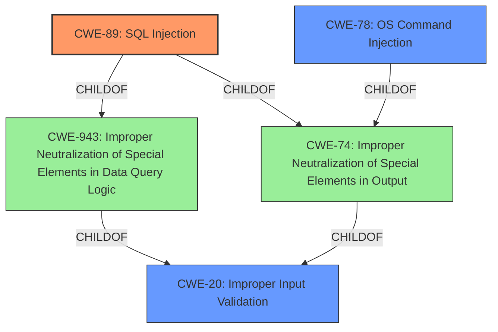

# Enhanced Analysis for CVE-2022-1509

# Summary
| CWE ID | CWE Name | Confidence | CWE Abstraction Level | CWE Vulnerability Mapping Label | CWE-Vulnerability Mapping Notes |
|---|---|---|---|---|---|
| CWE-89 | Improper Neutralization of Special Elements used in an SQL Command ('SQL Injection') | 0.9 | Base | Allowed | Primary CWE |
| CWE-78 | Improper Neutralization of Special Elements used in an OS Command ('OS Command Injection') | 0.7 | Base | Allowed | Secondary Candidate |
| CWE-20 | Improper Input Validation | 0.5 | Class | Discouraged | Secondary Candidate |

## Evidence and Confidence

*   **Confidence Score:** 0.8
*   **Evidence Strength:** HIGH

## Relationship Analysis
The primary identified weakness is CWE-89 (SQL Injection), which is a base-level CWE and a child of CWE-943 (Improper Neutralization of Special Elements in Data Query Logic) and CWE-74 (Improper Neutralization of Special Elements in Output Used by a Downstream Component ('Injection')). CWE-78 (OS Command Injection) is also considered since the description mentions execution of arbitrary code, but SQL injection is the more prominent weakness according to the **Vulnerability Description Key Phrases** and CVE reference links. CWE-20 (Improper Input Validation) is a parent Class of CWE-89 and CWE-78, but it is too high-level and discouraged.



## Vulnerability Chain
The vulnerability chain starts with **improper input sanitization**, leading to **SQL injection**, which allows an authenticated remote attacker to execute arbitrary code under root context.
  - **Root Cause:** **Improper Input Sanitization**
  - **Weakness:** **SQL Injection** (CWE-89)
  - **Impact:** Remote Code Execution

## Summary of Analysis
The initial assessment strongly points towards CWE-89 (SQL Injection) as the primary weakness, supported by the "Vulnerability Description Key Phrases" and the CVE reference links content which explicitly mentions **SQL injection** and **improper input sanitization** which is often the root cause for injection vulnerabilities. The commit focuses on adding missing checks and validations to prevent command injection vulnerabilities, further validating the choice of CWE-89. While OS Command Injection (CWE-78) is a possibility due to the ability to execute arbitrary code, the explicit mention of SQL injection makes CWE-89 the more appropriate primary classification.

The evidence from the "CVE Reference Links Content Summary" section supports this analysis:

*   "The root cause of the vulnerabilities is the lack of proper input validation and sanitization in various HestiaCP scripts."
*   "This allows attackers to inject malicious commands or data through script arguments, potentially leading to command injection vulnerabilities."

CWE-89 is chosen because it is a base-level CWE that accurately describes the vulnerability. Although CWE-20 (Improper Input Validation) is related and is often a contributing factor, it is a class-level CWE and is too general. The selection is based on the provided evidence, graph relationships, and the desire to be as specific as possible.

Relevant CWE Information:

# Enhanced Context (25 CWEs)

## CWE-1236: Improper Neutralization of Formula Elements in a CSV File
**Abstraction Level**: Base
**Similarity Score**: 0.79
This CWE was considered, but the vulnerability does not involve CSV files.

## CWE-74: Improper Neutralization of Special Elements in Output Used by a Downstream Component ('Injection')
**Abstraction Level**: Class
**Similarity Score**: 0.77
This CWE is a class-level CWE and is too general. CWE-89 is a child of this CWE and more specific.

## CWE-138: Improper Neutralization of Special Elements
**Abstraction Level**: Class
**Similarity Score**: 0.74
This CWE is a class-level CWE and is too general. CWE-89 is more specific.

## CWE-184: Incomplete List of Disallowed Inputs
**Abstraction Level**: Base
**Similarity Score**: 0.73
While relevant to input validation, it doesn't specifically address the injection aspect.

## CWE-917: Improper Neutralization of Special Elements used in an Expression Language Statement ('Expression Language Injection')
**Abstraction Level**: Base
**Similarity Score**: 0.73
The vulnerability does not involve expression language injection.

## CWE-88: Improper Neutralization of Argument Delimiters in a Command ('Argument Injection')
**Abstraction Level**: Base
**Similarity Score**: 0.73
This CWE is relevant for command-line argument injection, but SQL injection is the primary issue.

## CWE-1289: Improper Validation of Unsafe Equivalence in Input
**Abstraction Level**: Base
**Similarity Score**: 0.73
This CWE is not directly related to the SQL injection vulnerability.

## CWE-943: Improper Neutralization of Special Elements in Data Query Logic
**Abstraction Level**: Class
**Similarity Score**: 0.72
CWE-89 is a child of this CWE and more specific.

## CWE-116: Improper Encoding or Escaping of Output
**Abstraction Level**: Class
**Similarity Score**: 0.72
This CWE is relevant for output encoding issues, but the primary issue is SQL injection.

## CWE-80: Improper Neutralization of Script-Related HTML Tags in a Web Page (Basic XSS)
**Abstraction Level**: Variant
**Similarity Score**: 0.72
This CWE is not relevant as the vulnerability is not related to XSS.

## CWE-78: Improper Neutralization of Special Elements used in an OS Command ('OS Command Injection')
**Abstraction Level**: base
**Similarity Score**: 5.03
Could be a secondary weakness, but SQL injection is more clearly indicated.

## CWE-22: Improper Limitation of a Pathname to a Restricted Directory ('Path Traversal')
**Abstraction Level**: base
**Similarity Score**: 4.33
Not relevant to the described vulnerability.

## CWE-190: Integer Overflow or Wraparound
**Abstraction Level**: base
**Similarity Score**: 4.33
Not relevant to the described vulnerability.

## CWE-843: Access of Resource Using Incompatible Type ('Type Confusion')
**Abstraction Level**: base
**Similarity Score**: 3.44
Not relevant to the described vulnerability.

## CWE-1284: Improper Validation of Specified Quantity in Input
**Abstraction Level**: base
**Similarity Score**: 3.42
Not relevant to the described vulnerability.

## CWE-41: Improper Resolution of Path Equivalence
**Abstraction Level**: Base
**Similarity Score**: 3.30
Not relevant to the described vulnerability.

## CWE-98: Improper Control of Filename for Include/Require Statement in PHP Program ('PHP Remote File Inclusion')
**Abstraction Level**: variant
**Similarity Score**: 3.20
Not relevant to the described vulnerability.

## CWE-20: Improper Input Validation
**Abstraction Level**: class
**Similarity Score**: 2.98
A contributing factor but too general; a parent of CWE-89.

## CWE-770: Allocation of Resources Without Limits or Throttling
**Abstraction Level**: base
**Similarity Score**: 4.33
Not relevant to the described vulnerability.


## CWE Relationship Analysis

Current CWEs represent these abstraction levels: .


### Vulnerability Chain Analysis

**Chain starting from CWE-89:**
- 89 (Improper Neutralization of Special Elements used in an SQL Command ('SQL Injection')) - ROOT


**Chain starting from CWE-41:**
- 41 (Improper Resolution of Path Equivalence) - ROOT


### CWE Relationship Diagram

```mermaid
graph TD
    classDef primary fill:#f96,stroke:#333,stroke-width:2px
    classDef secondary fill:#69f,stroke:#333
    classDef tertiary fill:#9e9,stroke:#333
```