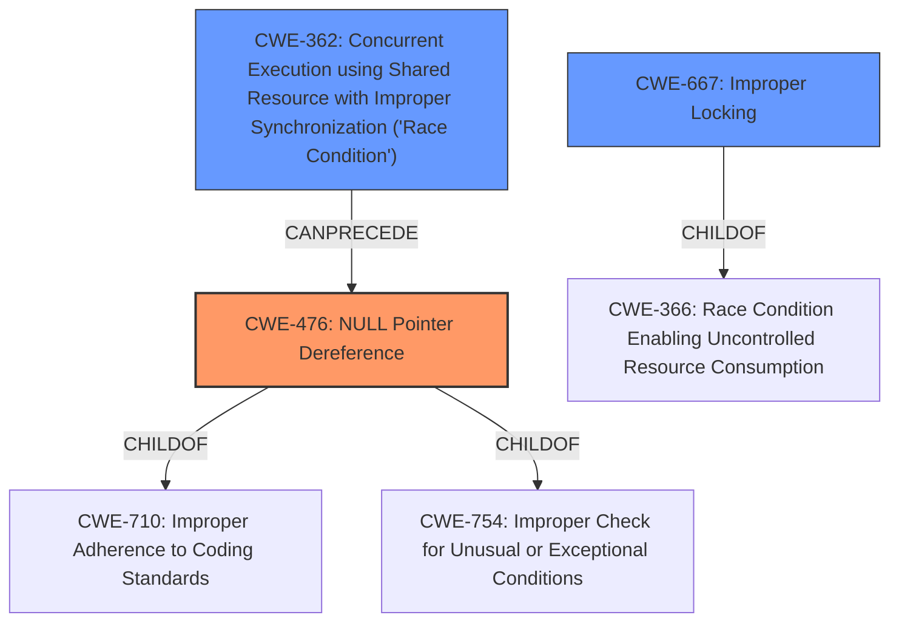

# Raw Analyzer Response for CVE-2022-1516

# Summary
| CWE ID | CWE Name | Confidence | CWE Abstraction Level | CWE Vulnerability Mapping Label | CWE-Vulnerability Mapping Notes |
|---|---|---|---|---|---|
| CWE-476 | NULL Pointer Dereference | 1.0 | Base | Primary | Allowed |
| CWE-667 | Improper Locking | 0.6 | Class | Secondary | Allowed-with-Review |
| CWE-362 | Concurrent Execution using Shared Resource with Improper Synchronization ('Race Condition') | 0.6 | Base | Secondary | Allowed |

## Evidence and Confidence

*   **Confidence Score:** 0.8
*   **Evidence Strength:** HIGH

## Relationship Analysis
The primary weakness is a **NULL pointer dereference** (CWE-476). The analysis of the vulnerability description and the reference link summary indicate that a race condition might exist where concurrent access to the `x25->neighbour` pointer occurs after it has been set to `NULL`, indicating potential issues with synchronization (CWE-667 and CWE-362).

## Vulnerability Chain
The vulnerability chain starts with a race condition and a lack of synchronization, leading to a **NULL pointer dereference**, which ultimately results in a system crash (Denial of Service).

Race Condition/Lack of Synchronization -> **NULL Pointer Dereference** -> Denial of Service

## Summary of Analysis
The primary root cause of the vulnerability is a **NULL pointer dereference** (CWE-476). The vulnerability description and the CVE reference link summary strongly support this. The summary explicitly mentions that the `x25->neighbour` pointer can be set to `NULL` and subsequently dereferenced by another thread.

The reference links content summary states: "A **NULL pointer dereference** vulnerability exists in the Linux kernel's implementation of the X.25 network protocol. Specifically, when a link layer is being terminated, the `x25->neighbour` pointer is set to `NULL` within the `x25_disconnect()` function. Concurrent access to this NULL pointer in other functions like `x25_sendmsg()`, `x25_recvmsg()`, or `x25_connect()` leads to the dereference."

The suggested fix involves adding `lock_sock()` to synchronize access to the `x25->neighbour` pointer, further suggesting a concurrency issue.

The presence of a potential race condition and a lack of synchronization suggests that CWE-667 (Improper Locking) and CWE-362 (Concurrent Execution using Shared Resource with Improper Synchronization ('Race Condition')) are also relevant.

CWE-476 is the most specific and accurate representation of the vulnerability's root cause, and it is at the Base level of abstraction.

Relevant CWE Information:

# Enhanced Context (25 CWEs)
The following CWEs were identified as potentially relevant to this vulnerability:

## CWE-824: Access of Uninitialized Pointer
**Abstraction Level**: Base
**Similarity Score**: 0.79
**Source**: dense

**Description**:
The product accesses or uses a pointer that has not been initialized.

**Mapping Guidance**:
- Usage: Allowed
- Rationale: This CWE entry is at the Base level of abstraction, which is a preferred level of abstraction for mapping to the root causes of vulnerabilities.

*   **Not Used:** The vulnerability is not due to an uninitialized pointer being accessed, but a pointer being set to NULL and then accessed.

## CWE-909: Missing Initialization of Resource
**Abstraction Level**: Class
**Similarity Score**: 0.79
**Source**: dense

**Description**:
The product does not initialize a critical resource.

**Mapping Guidance**:
- Usage: Allowed-with-Review
- Rationale: This CWE entry is a Class and might have Base-level children that would be more appropriate

*   **Not Used:** The vulnerability is not due to a resource not being initialized.

## CWE-404: Improper Resource Shutdown or Release
**Abstraction Level**: Class
**Similarity Score**: 0.79
**Source**: dense

**Description**:
The product does not release or incorrectly releases a resource before it is made available for re-use.

**Mapping Guidance**:
- Usage: Allowed-with-Review
- Rationale: This CWE entry is a Class and might have Base-level children that would be more appropriate

*   **Not Used:** The vulnerability is not directly related to improper shutdown or release, but rather a **NULL pointer dereference** during disconnection.

## CWE-665: Improper Initialization
**Abstraction Level**: Class
**Similarity Score**: 0.79
**Source**: dense

**Description**:
The product does not initialize or incorrectly initializes a resource, which might leave the resource in an unexpected state when it is accessed or used.

**Mapping Guidance**:
- Usage: Discouraged
- Rationale: This CWE entry is a level-1 Class (i.e., a child of a Pillar). It might have lower-level children that would be more appropriate

*   **Not Used:** The issue is not directly related to initialization.

## CWE-226: Sensitive Information in Resource Not Removed Before Reuse
**Abstraction Level**: Base
**Similarity Score**: 0.78
**Source**: dense

**Description**:
The product releases a resource such as memory or a file so that it can be made available for reuse, but it does not clear or "zeroize" the information contained in the resource before the product performs a critical state transition or makes the resource available for reuse by other entities.

**Mapping Guidance**:
- Usage: Allowed
- Rationale: This CWE entry is at the Base level of abstraction, which is a preferred level of abstraction for mapping to the root causes of vulnerabilities.

*   **Not Used:** The issue is not related to sensitive information.

## CWE-476: NULL Pointer Dereference
**Abstraction Level**: Base
**Similarity Score**: 0.78
**Source**: dense

**Description**:
The product dereferences a pointer that it expects to be valid but is NULL.

**Mapping Guidance**:
- Usage: Allowed
- Rationale: This CWE entry is at the Base level of abstraction, which is a preferred level of abstraction for mapping to the root causes of vulnerabilities.

*   **Used:** This is the primary CWE because the root cause is a **NULL pointer dereference**.

## CWE-667: Improper Locking
**Abstraction Level**: Class
**Similarity Score**: 0.78
**Source**: dense

**Description**:
The product does not properly acquire or release a lock on a resource, leading to unexpected resource state changes and behaviors.

**Mapping Guidance**:
- Usage: Allowed-with-Review
- Rationale: This CWE entry is a Class and might have Base-level children that would be more appropriate

*   **Used:** The suggested fix indicates a concurrency issue.

## CWE-170: Improper Null Termination
**Abstraction Level**: Base
**Similarity Score**: 0.78
**Source**: dense

**Description**:
The product does not terminate or incorrectly terminates a string or array with a null character or equivalent terminator.

**Mapping Guidance**:
- Usage: Allowed
- Rationale: This CWE entry is at the Base level of abstraction, which is a preferred level of abstraction for mapping to the root causes of vulnerabilities.

*   **Not Used:** The issue is not related to string termination.

## CWE-252: Unchecked Return Value
**Abstraction Level**: Base
**Similarity Score**: 0.78
**Source**: dense

**Description**:
The product does not check the return value from a method or function, which can prevent it from detecting unexpected states and conditions.

**Mapping Guidance**:
- Usage: Allowed
- Rationale: This CWE entry is at the Base level of abstraction, which is a preferred level of abstraction for mapping to the root causes of vulnerabilities.

*   **Not Used:** The description does not suggest that an unchecked return value is the root cause.

## CWE-754: Improper Check for Unusual or Exceptional Conditions
**Abstraction Level**: Class
**Similarity Score**: 0.77
**Source**: dense

**Description**:
The product does not check or incorrectly checks for unusual or exceptional conditions