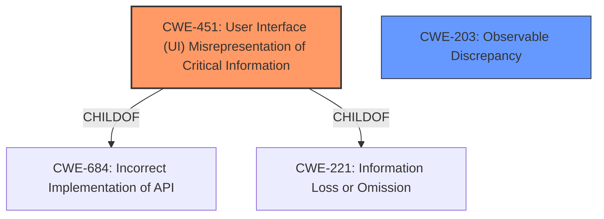

# Raw Analyzer Response for CVE-2022-1520

# Summary
| CWE ID  | CWE Name                                                        | Confidence | CWE Abstraction Level | CWE Vulnerability Mapping Label | CWE-Vulnerability Mapping Notes |
|---------|-----------------------------------------------------------------|------------|-----------------------|---------------------------------|------------------------------------|
| CWE-451 | User Interface (UI) Misrepresentation of Critical Information | 0.9        | Class                 | Allowed-with-Review             | Primary CWE                       |
| CWE-203 | Observable Discrepancy                                          | 0.7        | Base                  | Allowed                         | Secondary Candidate              |

## Evidence and Confidence

*   **Confidence Score:** 0.8
*   **Evidence Strength:** HIGH

## Relationship Analysis
The primary relationship that influenced the CWE selection was the direct match between the vulnerability's **impact** (showing incorrect encryption or signature status) and the description of CWE-451, which focuses on UI misrepresentation of critical information. The relationship between CWE-451 and its parent CWEs, such as CWE-684 (Incorrect Implementation of API) and CWE-221 (Information Loss or Omission), was considered but deemed less specific than CWE-451 itself. CWE-203 (Observable Discrepancy) was considered as a secondary CWE due to the observable difference in security status, but CWE-451 was chosen as primary due to its direct focus on UI misrepresentation.

## Vulnerability Chain
The chain of events in this vulnerability is relatively straightforward:

1.  An email message (A) with an attached encrypted/signed message (B) is received.
2.  The user views message B.
3.  When the user returns to viewing message A, Thunderbird **incorrectly** displays the security status of message B for message A.

This represents a **root cause** of **incorrect** state management in the UI leading to the **impact** of **misrepresenting** security-critical information.

## Summary of Analysis
The primary CWE assigned is CWE-451 (User Interface (UI) Misrepresentation of Critical Information) because the core issue is the **incorrect** display of security status in the Thunderbird UI. The vulnerability description clearly states that "Thunderbird may show an **incorrect** encryption or signature status" after viewing an attached message. This aligns directly with CWE-451's description: "The user interface (UI) does not properly represent critical information to the user, allowing the information - or its source - to be obscured or spoofed." The "CVE Reference Links Content Summary" also supports this by stating: "**Weaknesses/vulnerabilities present:** Incorrect security status display."

CWE-203 (Observable Discrepancy) was considered due to the observable difference in security status. However, it is a more general weakness, and CWE-451 more directly addresses the UI-specific nature of the vulnerability.

The final selection is based on the evidence that the vulnerability manifests as a UI problem, where the user is presented with **incorrect** information about the security status of an email message. This is best represented by CWE-451.

Relevant CWE Information:

# Enhanced Context (25 CWEs)
The following CWEs were identified as potentially relevant to this vulnerability:

## CWE-451: User Interface (UI) Misrepresentation of Critical Information
**Abstraction Level**: Class
**Similarity Score**: 0.78
**Source**: dense

**Description**:
The user interface (UI) does not properly represent critical information to the user, allowing the information - or its source - to be obscured or spoofed. This is often a component in phishing attacks.

**Mapping Guidance**:
- Usage: Allowed-with-Review
- Rationale: This CWE entry is a Class and might have Base-level children that would be more appropriate

## CWE-203: Observable Discrepancy
**Abstraction Level**: Base
**Similarity Score**: 0.76
**Source**: dense

**Description**:
The product behaves differently or sends different responses under different circumstances in a way that is observable to an unauthorized actor, which exposes security-relevant information about the state of the product, such as whether a particular operation was successful or not.

**Mapping Guidance**:
- Usage: Allowed
- Rationale: This CWE entry is at the Base level of abstraction, which is a preferred level of abstraction for mapping to the root causes of vulnerabilities.

## CWE-347: Improper Verification of Cryptographic Signature
**Abstraction Level:** Base
**Status:** Draft

### Description
The product does not verify, or incorrectly verifies, the cryptographic signature for data.

### Extended Description
Not provided

### Alternative Terms
None

### Relationships
ChildOf -> CWE-345
ChildOf -> CWE-345

### Mapping Guidance
**Usage:** Allowed
**Rationale:** This CWE entry is at the Base level of abstraction, which is a preferred level of abstraction for mapping to the root causes of vulnerabilities.
**Comments:** Carefully read both the name and description to ensure that this mapping is an appropriate fit. Do not try to 'force' a mapping to a lower-level Base/Variant simply to comply with this preferred level of abstraction.
**Reasons:**
- Acceptable-Use

CWE-347 was not chosen as there is no evidence provided that the application does not verify signatures, but rather misrepresents them.