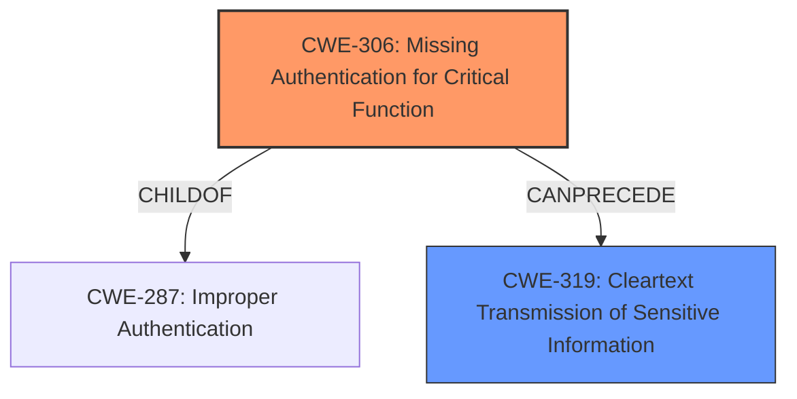

# Analysis for CVE-2022-1521

# Summary
| CWE ID | CWE Name | Confidence | CWE Abstraction Level | CWE Vulnerability Mapping Label | CWE-Vulnerability Mapping Notes |
|---|---|---|---|---|---|
| CWE-306 | Missing Authentication for Critical Function | 0.9 | Base | Primary | Allowed |
| CWE-319 | Cleartext Transmission of Sensitive Information | 0.6 | Base | Secondary | Allowed |

## Evidence and Confidence

*   **Confidence Score:** 0.75
*   **Evidence Strength:** MEDIUM

## Relationship Analysis
The primary CWE is CWE-306, which is a base-level weakness indicating **missing authentication**. It's a child of CWE-287, which represents improper authentication. CWE-319, a secondary consideration, addresses the **transmission of sensitive information in cleartext**, also a base-level weakness. The relationship between these CWEs could be seen as sequential: first, the **lack of authentication** (CWE-306) allows for **unprotected data transmission** (CWE-319).

## Vulnerability Chain
The vulnerability chain starts with the **lack of authentication** (CWE-306) for critical functions in the LRM, which leads to the **potential transmission of sensitive data in cleartext** (CWE-319) and the ability for a malicious actor to inject, replay, modify, and intercept sensitive data. This results in **improper access control** and potential unauthorized system control.

## Summary of Analysis
Based on the provided evidence, the primary weakness is the **lack of authentication** (CWE-306) in the LRM. The vulnerability description explicitly states the "**rootcause: lack of authentication and authorization**". The CVE Reference Links Content Summary reinforces this by mentioning that "LRM does not implement authentication or authorization by default." This clearly aligns with CWE-306's description: "The product does not perform any authentication for functionality that requires a provable user identity or consumes a significant amount of resources."

The secondary consideration is the potential for "**Cleartext Transmission of Sensitive Information**" (CWE-319). The vulnerability description states that a malicious actor can "inject, replay, modify, and/or intercept sensitive data," which implies that sensitive data is being transmitted without proper encryption. While not as directly stated as the **missing authentication**, it is a logical consequence of the missing authentication.

The graph relationships influenced the selection by showing that CWE-306 is a child of CWE-287 (Improper Authentication), providing a broader context, but CWE-306 is more specific to the **missing authentication**.

Both CWEs are at the base level of abstraction, providing the most specific representation of the weaknesses given the available information.

Relevant CWE Information:

# Enhanced Context (25 CWEs)
The following CWEs were identified as potentially relevant to this vulnerability:

## CWE-300: Channel Accessible by Non-Endpoint
**Abstraction Level**: Class
**Similarity Score**: 0.80
**Source**: dense

**Description**:
The product does not adequately verify the identity of actors at both ends of a communication channel, or does not adequately ensure the integrity of the channel, in a way that allows the channel to be accessed or influenced by an actor that is not an endpoint.

**Mapping Guidance**:
- Usage: Discouraged
- Rationale: CWE-300 is commonly misused for vulnerabilities in which the prerequisites for exploitation require the adversary to be in a privileged "in-the-middle" position.

*This CWE was considered but deemed less relevant because the primary issue isn't about an adversary positioning themselves in the middle of a communication channel, but rather the **lack of initial authentication**.*

## CWE-1289: Improper Validation of Unsafe Equivalence in Input
**Abstraction Level**: Base
**Similarity Score**: 0.77
**Source**: dense

**Description**:
The product receives an input value that is used as a resource identifier or other type of reference, but it does not validate or incorrectly validates that the input is equivalent to a potentially-unsafe value.

**Mapping Guidance**:
- Usage: Allowed
- Rationale: This CWE entry is at the Base level of abstraction, which is a preferred level of abstraction for mapping to the root causes of vulnerabilities.

*This CWE was considered but deemed less relevant because the vulnerability's root cause is more about the **lack of authentication** and access control, rather than specific issues with input validation.*

## CWE-807: Reliance on Untrusted Inputs in a Security Decision
**Abstraction Level**: Base
**Similarity Score**: 0.76
**Source**: dense

**Description**:
The product uses a protection mechanism that relies on the existence or values of an input, but the input can be modified by an untrusted actor in a way that bypasses the protection mechanism.

**Mapping Guidance**:
- Usage: Allowed
- Rationale: This CWE entry is at the Base level of abstraction, which is a preferred level of abstraction for mapping to the root causes of vulnerabilities.

*This CWE was considered but deemed less relevant because the primary issue is the **absence of authentication**, not necessarily the reliance on untrusted inputs for a security decision.*

## CWE-345: Insufficient Verification of Data Authenticity
**Abstraction Level**: Class
**Similarity Score**: 0.76
**Source**: dense

**Description**:
The product does not sufficiently verify the origin or authenticity of data, in a way that causes it to accept invalid data.

**Mapping Guidance**:
- Usage: Discouraged
- Rationale: This CWE entry is a level-1 Class (i.e., a child of a Pillar). It might have lower-level children that would be more appropriate

*This CWE was considered but deemed less relevant because the **lack of authentication** is a more direct root cause than the insufficient verification of data authenticity.*

## CWE-297: Improper Validation of Certificate with Host Mismatch
**Abstraction Level**: Variant
**Similarity Score**: 0.76
**Source**: dense

**Description**:
The product communicates with a host that provides a certificate, but the product does not properly ensure that the certificate is actually associated with that host.

**Mapping Guidance**:
- Usage: Allowed
- Rationale: This CWE entry is at the Variant level of abstraction, which is a preferred level of abstraction for mapping to the root causes of vulnerabilities.

*This CWE was considered but deemed irrelevant because the vulnerability does not involve certificate validation or host mismatches.*

## CWE-295: Improper Certificate Validation
**Abstraction Level**: Base
**Similarity Score**: 0.76
**Source**: dense

**Description**:
The product does not validate, or incorrectly validates, a certificate.

**Mapping Guidance**:
- Usage: Allowed
- Rationale: This CWE entry is at the Base level of abstraction, which is a preferred level of abstraction for mapping to the root causes of vulnerabilities.

*This CWE was considered but deemed irrelevant because the vulnerability does not involve certificate validation.*

## CWE-41: Improper Resolution of Path Equivalence
**Abstraction Level**: Base
**Similarity Score**: 0.75
**Source**: dense

**Description**:
The product is vulnerable to file system contents disclosure through path equivalence. Path equivalence involves the use of special characters in file and directory names. The associated manipulations are intended to generate multiple names for the same object.

**Mapping Guidance**:
- Usage: Allowed
- Rationale: This CWE entry is at the Base level of abstraction, which is a preferred level of abstraction for mapping to the root causes of vulnerabilities.

*This CWE was considered but deemed irrelevant because the vulnerability does not involve path equivalence issues.*

## CWE-668: Exposure of Resource to Wrong Sphere
**Abstraction Level**: Class
**Similarity Score**: 0.75
**Source**: dense

**Description**:
The product exposes a resource to the wrong control sphere, providing unintended actors with inappropriate access to the resource.

**Mapping Guidance**:
- Usage: Discouraged
- Rationale: CWE-668 is high-level and is often misused as a catch-all when lower-level CWE IDs might be applicable. It is sometimes used for low-information vulnerability reports [REF-1287]. It is a level-1 Class (i.e., a child of a Pillar). It is not useful for trend analysis.

*This CWE was considered but deemed too high-level. The **lack of authentication** is a more specific root cause.*

## CWE-799: Improper Control of Interaction Frequency
**Abstraction Level**: Class
**Similarity Score**: 0.75
**Source**: dense

**Description**:
The product does not properly limit the number or frequency of interactions that it has with an actor, such as the number