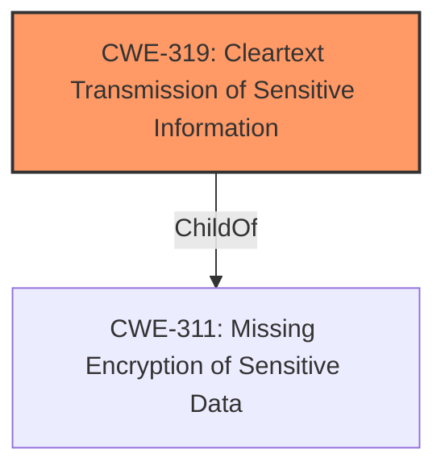

# Analysis Report for CVE-2022-1524

# Vulnerability Analysis Report: CVE-2022-1524

## Description


## Analysis (with Relationship Data)

# Summary
| CWE ID | CWE Name | Confidence | CWE Abstraction Level | CWE Vulnerability Mapping Label | CWE-Vulnerability Mapping Notes |
|---|---|---|---|---|---|
| CWE-319 | Cleartext Transmission of Sensitive Information | 1.0 | Base | Allowed | Primary CWE |

## Evidence and Confidence

*   **Confidence Score:** 1.0
*   **Evidence Strength:** HIGH

## Relationship Analysis
The primary relationship influencing the selection was the direct match of the vulnerability description to CWE-319's definition. While other CWEs were considered based on the retriever results, none provided as accurate and direct a fit as CWE-319. The lack of TLS encryption directly leads to sensitive information being transmitted in cleartext, which aligns perfectly with the description of CWE-319.



## Vulnerability Chain
The vulnerability chain is straightforward: The **root cause** is the **lack of TLS encryption**, which directly leads to the **weakness** of **cleartext transmission of sensitive information**. The final impact is the potential for a MITM attack to intercept sensitive credentials.

## Summary of Analysis
The initial analysis identified CWE-319 as the most appropriate mapping due to the cleartext transmission of sensitive information. The evidence from the vulnerability description and CVE reference links content summary strongly supports this classification. The key phrase "**does not implement TLS encryption**" from the Vulnerability Description and "Sensitive data, including credentials, is transmitted without encryption" from the CVE Reference Links Content Summary directly align with the CWE-319 definition.

The retriever results also listed CWE-319 as the top combined result, further supporting this choice. The other CWEs considered, such as CWE-295 and CWE-327, were related to cryptographic issues but did not directly address the core problem of transmitting sensitive information without encryption. Therefore, CWE-319 is the most specific and accurate representation of the vulnerability. The relationship analysis shows that CWE-319 is a child of CWE-311 (Missing Encryption of Sensitive Data), which is a more general category. However, CWE-319 is more precise because it specifically addresses the transmission aspect.

Relevant CWE Information:

# Enhanced Context (25 CWEs)

## CWE-319: Cleartext Transmission of Sensitive Information
**Abstraction:** Base
**Status:** Draft

### Description
The product transmits sensitive or security-critical data in cleartext in a communication channel that can be sniffed by unauthorized actors.


## CWE Relationship Analysis

Current CWEs represent these abstraction levels: .


### Vulnerability Chain Analysis

**Chain starting from CWE-295:**
- 295 (Improper Certificate Validation) - ROOT


**Chain starting from CWE-311:**
- 311 (Missing Encryption of Sensitive Data) - ROOT


### CWE Relationship Diagram

```mermaid
graph TD
    classDef primary fill:#f96,stroke:#333,stroke-width:2px
    classDef secondary fill:#69f,stroke:#333
    classDef tertiary fill:#9e9,stroke:#333
```


*Report generated on 2025-03-31 07:30:07*
