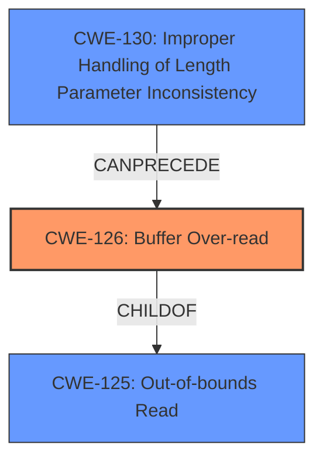

# Analysis Report for CVE-2022-1533

# Vulnerability Analysis Report: CVE-2022-1533

## Description


## Analysis (with Relationship Data)

# Summary
| CWE ID | CWE Name | Confidence | CWE Abstraction Level | CWE Vulnerability Mapping Label | CWE-Vulnerability Mapping Notes |
|---|---|---|---|---|---|
| CWE-126 | Buffer Over-read | 1.0 | Variant | Allowed | Primary CWE. The vulnerability stems from incorrect boundary checks, leading to a stack **buffer over-read**. |
| CWE-125 | Out-of-bounds Read | 0.7 | Base | Allowed | Secondary CWE. It is related to **buffer over-read** and represents a more general form of reading outside the intended buffer. |
| CWE-130 | Improper Handling of Length Parameter Inconsistency | 0.6 | Base | Allowed | Secondary CWE. The **incorrect boundary checks** imply that the length parameter might not be handled consistently with the actual data length. |

## Evidence and Confidence

*   **Confidence Score:** 0.9
*   **Evidence Strength:** HIGH

## Relationship Analysis
The primary CWE is CWE-126 (Buffer Over-read), which is a variant of CWE-125 (Out-of-bounds Read). CWE-126 is more specific because it explicitly states that the read is occurring *after* the targeted buffer. CWE-130 (Improper Handling of Length Parameter Inconsistency) can lead to out-of-bounds reads, creating a chain.



## Vulnerability Chain
The vulnerability chain starts with **incorrect boundary checks** (potentially due to **improper handling of length parameter inconsistency**, CWE-130), which leads to a **buffer over-read** (CWE-126), and can result in **arbitrary code execution**.

## Summary of Analysis
The initial assessment pointed to CWE-126 (Buffer Over-read) as the primary weakness. The description clearly states a **buffer over-read** due to incorrect boundary checks in the inflections parser within the `libmobi` library. The CVE Reference Links Content Summary confirms that the root cause is **incorrect boundary checks**, allowing the parser to read beyond allocated memory.

The selection of CWE-126 is based on the following evidence:
*   The vulnerability description explicitly states "**Buffer Over-read**".
*   The CVE Reference Links Content Summary states: "The vulnerability stems from incorrect boundary checks in the inflections parser within the `libmobi` library. This leads to a stack **buffer over-read** when processing corrupt input."
*   The CVE Reference Links Content Summary states: "The primary weakness is a **buffer over-read** vulnerability in the `mobi_decode_infl` function. **Incorrect bounds checking** allows the parser to read beyond allocated memory when handling specially crafted or corrupt input."

CWE-125 (Out-of-bounds Read) was considered but deemed less specific. While CWE-126 is a child of CWE-125, the description of CWE-126 explicitly mentions reading *after* the buffer, which aligns more closely with the vulnerability description.

CWE-130 (Improper Handling of Length Parameter Inconsistency) was also considered because the **incorrect boundary checks** suggest a potential issue with handling length parameters. This CWE could potentially *precede* the **buffer over-read**.

The selected CWEs are at the optimal level of specificity because they accurately represent the root cause and the immediate consequence of the vulnerability. CWE-126 (Buffer Over-read) is a variant-level CWE, which is a preferred level of abstraction.

Relevant CWE Information:

# Enhanced Context (25 CWEs)
The following CWEs were identified as potentially relevant to this vulnerability:

## CWE-805: Buffer Access with Incorrect Length Value
**Abstraction Level**: Base
**Similarity Score**: 0.80
**Source**: dense

**Description**:
The product uses a sequential operation to read or write a buffer, but it uses an incorrect length value that causes it to access memory that is outside of the bounds of the buffer.

**Mapping Guidance**:
- Usage: Allowed
- Rationale: This CWE entry is at the Base level of abstraction, which is a preferred level of abstraction for mapping to the root causes of vulnerabilities.

## CWE-131: Incorrect Calculation of Buffer Size
**Abstraction Level**: Base
**Similarity Score**: 0.80
**Source**: dense

**Description**:
The product does not correctly calculate the size to be used when allocating a buffer, which could lead to a buffer overflow.

**Mapping Guidance**:
- Usage: Allowed
- Rationale: This CWE entry is at the Base level of abstraction, which is a preferred level of abstraction for mapping to the root causes of vulnerabilities.

## CWE-191: Integer Underflow (Wrap or Wraparound)
**Abstraction Level**: Base
**Similarity Score**: 0.80
**Source**: dense

**Description**:
The product subtracts one value from another, such that the result is less than the minimum allowable integer value, which produces a value that is not equal to the correct result.

**Mapping Guidance**:
- Usage: Allowed
- Rationale: This CWE entry is at the Base level of abstraction, which is a preferred level of abstraction for mapping to the root causes of vulnerabilities.

## CWE-126: Buffer Over-read
**Abstraction Level**: Variant
**Similarity Score**: 0.79
**Source**: dense

**Description**:
The product reads from a buffer using buffer access mechanisms such as indexes or pointers that reference memory locations after the targeted buffer.

**Mapping Guidance**:
- Usage: Allowed
- Rationale: This CWE entry is at the Variant level of abstraction, which is a preferred level of abstraction for mapping to the root causes of vulnerabilities.

## CWE-124: Buffer Underwrite ('Buffer Underflow')
**Abstraction Level**: Base
**Similarity Score**: 0.79
**Source**: dense

**Description**:
The product writes to a buffer using an index or pointer that references a memory location prior to the beginning of the buffer.

**Mapping Guidance**:
- Usage: Allowed
- Rationale: This CWE entry is at the Base level of abstraction, which is a preferred level of abstraction for mapping to the root causes of vulnerabilities.

## CWE-823: Use of Out-of-range Pointer Offset
**Abstraction Level**: Base
**Similarity Score**: 0.78
**Source**: dense

**Description**:
The product performs pointer arithmetic on a valid pointer, but it uses an offset that can point outside of the intended range of valid memory locations for the resulting pointer.

**Mapping Guidance**:
- Usage: Allowed
- Rationale: This CWE entry is at the Base level of abstraction, which is a preferred level of abstraction for mapping to the root causes of vulnerabilities.

## CWE-125: Out-of-bounds Read
**Abstraction Level**: Base
**Similarity Score**: 0.78
**Source**: dense

**Description**:
The product reads data past the end, or before the beginning, of the intended buffer.

**Mapping Guidance**:
- Usage: Allowed
- Rationale: This CWE entry is at the Base level of abstraction, which is a preferred level of abstraction for mapping to the root causes of vulnerabilities.

## CWE-130: Improper Handling of Length Parameter Inconsistency
**Abstraction Level**: Base
**Similarity Score**: 0.78
**Source**: dense

**Description**:
The product parses a formatted message or structure, but it does not handle or incorrectly handles a length field that is inconsistent with the actual length of the associated data.

**Mapping Guidance**:
- Usage: Allowed
- Rationale: This CWE entry is at the Base level of abstraction, which is a preferred level of abstraction for mapping to the root causes of vulnerabilities.

## CWE-193: Off-by-one Error
**Abstraction Level**: Base
**Similarity Score**: 0.77
**Source**: dense

**Description**:
A product calculates or uses an incorrect maximum or minimum value that is 1 more, or 1 less, than the correct value.

**Mapping Guidance**:
- Usage: Allowed
- Rationale: This CWE entry is at the Base level of abstraction, which is a preferred level of abstraction for mapping to the root causes of vulnerabilities.

## CWE-127: Buffer Under-read
**Abstraction Level**: Variant
**Similarity Score**: 0.77
**Source**: dense

**Description**:
The product reads from a buffer using buffer access mechanisms such as indexes or pointers that reference memory locations prior to the targeted buffer.

**Mapping Guidance**:
- Usage: Allowed
- Rationale: This CWE entry


## CWE Relationship Analysis

Current CWEs represent these abstraction levels: .


### Vulnerability Chain Analysis

**Chain starting from CWE-131:**
- 131 (Incorrect Calculation of Buffer Size) - ROOT


**Chain starting from CWE-805:**
- 805 (Buffer Access with Incorrect Length Value) - ROOT


### CWE Relationship Diagram

```mermaid
graph TD
    classDef primary fill:#f96,stroke:#333,stroke-width:2px
    classDef secondary fill:#69f,stroke:#333
    classDef tertiary fill:#9e9,stroke:#333
```


*Report generated on 2025-03-30 17:51:53*
