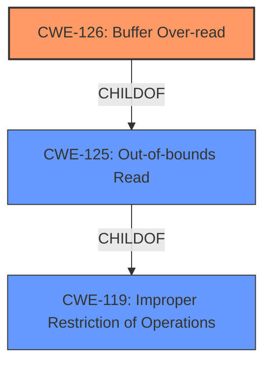

# Analysis Report for CVE-2022-1534

# Vulnerability Analysis Report: CVE-2022-1534

## Description


## Analysis (with Relationship Data)

# Summary
| CWE ID | CWE Name | Confidence | CWE Abstraction Level | CWE Vulnerability Mapping Label | CWE-Vulnerability Mapping Notes |
|---|---|---|---|---|---|
| CWE-126 | Buffer Over-read | 1 | Variant | Allowed | Primary CWE |
| CWE-125 | Out-of-bounds Read | 0.8 | Base | Allowed | Secondary Candidate |

## Evidence and Confidence

*   **Confidence Score:** 0.9
*   **Evidence Strength:** HIGH

## Relationship Analysis
The primary CWE, CWE-126 (Buffer Over-read), is a variant of CWE-125 (Out-of-bounds Read). This hierarchical relationship confirms that CWE-126 is a more specific classification of the **buffer over-read** vulnerability described. CWE-119 (Improper Restriction of Operations within the Bounds of a Memory Buffer) is a class-level CWE that is a parent of both CWE-125 and other buffer-related CWEs.



## Vulnerability Chain
The chain of events is as follows:
1.  **Root Cause:** A **buffer over-read** occurs due to insufficient bounds checking.
2.  **Weakness:** The program reads data past the end of the intended buffer.
3.  **Impact:** This can lead to reading sensitive information from other memory locations or a crash (Denial of Service).

## Summary of Analysis
The initial analysis identified a **buffer over-read** vulnerability in `libmobi`. The supporting evidence clearly indicates that the program reads data beyond the intended buffer, potentially leading to information disclosure or a crash.

The vulnerability description states "**Buffer Over-read** at parse_rawml.c1416 in GitHub repository bfabiszewski/libmobi prior to 0.11. The bug causes the program reads data past the end of the intented buffer. Typically, this can allow attackers to read sensitive information from other memory locations or cause a crash."

The CVE Reference Links Content Summary reinforces this by stating: "The primary weakness is an out-of-bounds read due to incorrect handling of array indices related to "inflections" during parsing of raw markup language in `libmobi`. The code attempts to access `infl->entries[parts[j]].label` without properly checking if `parts[j]` is within the bounds of valid `infl->entries` indices."

Given the evidence, CWE-126 (Buffer Over-read) is the most specific and appropriate classification, as it directly describes the **root cause** of the vulnerability. CWE-125 (Out-of-bounds Read) is also a valid candidate because it describes the general class of the vulnerability. However, CWE-126 is preferred because it specifies that the read occurs *after* the end of the buffer, which aligns precisely with the vulnerability description. Both CWEs have a usage of "Allowed".

The relationship analysis further supports this decision, as CWE-126 is a variant of CWE-125, indicating a more specialized form of out-of-bounds read.
I am confident in this assessment due to the clear evidence and the alignment of the selected CWE with the vulnerability details.

# Relevant CWE Information:

## CWE-126: Buffer Over-read
**Abstraction Level**: Variant
**Similarity Score**: 0.79
**Source**: dense

**Description**:
The product reads from a buffer using buffer access mechanisms such as indexes or pointers that reference memory locations after the targeted buffer.

**Mapping Guidance**:
- Usage: Allowed
- Rationale: This CWE entry is at the Variant level of abstraction, which is a preferred level of abstraction for mapping to the root causes of vulnerabilities.

## CWE-125: Out-of-bounds Read
**Abstraction Level**: Base
**Similarity Score**: 0.76
**Source**: dense

**Description**:
The product reads data past the end, or before the beginning, of the intended buffer.

**Mapping Guidance**:
- Usage: Allowed
- Rationale: This CWE entry is at the Base level of abstraction, which is a preferred level of abstraction for mapping to the root causes of vulnerabilities.

## Other CWE Considerations

*   CWE-122 (Heap-based Buffer Overflow): While a buffer overflow is mentioned, the description does not explicitly state where the buffer is allocated. The vulnerability is an over-read, not an overflow. Therefore, this is not the most appropriate CWE.
*   CWE-823 (Use of Out-of-range Pointer Offset): While pointer arithmetic might be involved, the core issue is reading past the end of the buffer, not the pointer offset itself. Thus, CWE-126 is more accurate.
*   CWE-119 (Improper Restriction of Operations within the Bounds of a Memory Buffer): This is a class-level CWE and is too general for this vulnerability. The more specific CWE-126 is preferred.


## CWE Relationship Analysis

Current CWEs represent these abstraction levels: .


### Vulnerability Chain Analysis

**Chain starting from CWE-823:**
- 823 (Use of Out-of-range Pointer Offset) - ROOT


**Chain starting from CWE-119:**
- 119 (Improper Restriction of Operations within the Bounds of a Memory Buffer) - ROOT


### CWE Relationship Diagram

```mermaid
graph TD
    classDef primary fill:#f96,stroke:#333,stroke-width:2px
    classDef secondary fill:#69f,stroke:#333
    classDef tertiary fill:#9e9,stroke:#333
```


*Report generated on 2025-03-31 05:03:04*
