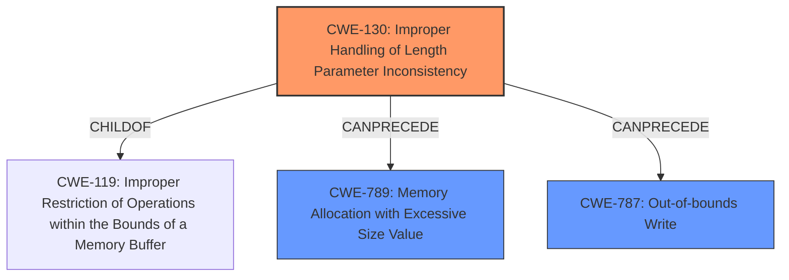

# Analysis Report for CVE-2022-1543

# Vulnerability Analysis Report: CVE-2022-1543

## Description


## Analysis (with Relationship Data)

# Summary
| CWE ID | CWE Name | Confidence | CWE Abstraction Level | CWE Vulnerability Mapping Label | CWE-Vulnerability Mapping Notes |
|---|---|---|---|---|---|
| CWE-130 | Improper Handling of Length Parameter Inconsistency | 0.9 | Base | Allowed | Primary CWE |
| CWE-789 | Memory Allocation with Excessive Size Value | 0.7 | Variant | Allowed | Secondary Candidate |
| CWE-787 | Out-of-bounds Write | 0.6 | Base | Allowed | Secondary Candidate |

## Evidence and Confidence

*   **Confidence Score:** 0.8
*   **Evidence Strength:** HIGH

## Relationship Analysis
The primary CWE, CWE-130, is related to buffer overflows and out-of-bounds writes because improper length handling can lead to writing beyond allocated memory. CWE-130 is a child of CWE-119 (Improper Restriction of Operations within the Bounds of a Memory Buffer), indicating a more specific case of buffer handling issues. CWE-789 (Memory Allocation with Excessive Size Value) is related as a potential consequence if the length parameter is used for memory allocation, while CWE-787 (Out-of-bounds Write) is a potential outcome of the improper handling.



## Vulnerability Chain
The vulnerability chain starts with the **improper handling of the length parameter** (CWE-130). This can lead to excessive memory allocation (CWE-789) or an out-of-bounds write (CWE-787), ultimately resulting in memory corruption and a denial-of-service.

## Summary of Analysis
The initial assessment identified **Improper handling of Length parameter** as the root cause, which aligns directly with CWE-130. The evidence from the CVE Reference Links Content Summary confirms this by highlighting the **lack of input validation** of the profile name field.

> **Vulnerability Description Key Phrases**
> - **rootcause:** **Improper handling of Length parameter**
> **CVE Reference Links Content Summary**
> - **2. Root Cause of Vulnerability:** The root cause is the lack of proper input validation and sanitization of the profile name field. Specifically, the code did not limit the length of the profile name, `originalName`, before storing it in the database or using it in the application.

CWE-130's description, "The product parses a formatted message or structure, but it does not handle or incorrectly handles a length field that is inconsistent with the actual length of the associated data," matches the vulnerability.

The graph relationships reinforce this by showing how CWE-130 can lead to other issues like excessive memory allocation (CWE-789) or out-of-bounds writes (CWE-787). The decision to select CWE-130 as the primary CWE is based on the direct match with the root cause and the supporting evidence from the vulnerability description and CVE reference. This is at the optimal level of specificity, as it identifies the exact flaw in handling the length parameter. Other CWEs were considered but are consequences of this **improper handling**.

Relevant CWE Information:

# Enhanced Context (25 CWEs)

## CWE-130: Improper Handling of Length Parameter Inconsistency
**Abstraction:** Base
**Similarity Score**: 0.78
**Source**: dense

**Description**:
The product parses a formatted message or structure, but it does not handle or incorrectly handles a length field that is inconsistent with the actual length of the associated data.

**Mapping Guidance**:
- Usage: Allowed
- Rationale: This CWE entry is at the Base level of abstraction, which is a preferred level of abstraction for mapping to the root causes of vulnerabilities.

## CWE-789: Memory Allocation with Excessive Size Value
**Abstraction:** Variant
**Similarity Score**: 6515.77
**Source**: sparse

**Description**:
The product allocates memory based on an untrusted, large size value, but it does not ensure that the size is within expected limits, allowing arbitrary amounts of memory to be allocated.

**Mapping Guidance**:
- Usage: Allowed
- Rationale: This CWE entry is at the Variant level of abstraction, which is a preferred level of abstraction for mapping to the root causes of vulnerabilities.

## CWE-787: Out-of-bounds Write
**Abstraction:** Base
**Similarity Score**: 0.292
**Source**: sparse

**Description**:
The product writes data past the end, or before the beginning, of the intended buffer.

**Mapping Guidance**:
- Usage: Allowed
- Rationale: This CWE entry is at the Base level of abstraction, which is a preferred level of abstraction for mapping to the root causes of vulnerabilities.


## CWE Relationship Analysis

Current CWEs represent these abstraction levels: .


### Vulnerability Chain Analysis

**Chain starting from CWE-787:**
- 787 (Out-of-bounds Write) - ROOT


**Chain starting from CWE-130:**
- 130 (Improper Handling of Length Parameter Inconsistency) - ROOT


### CWE Relationship Diagram

```mermaid
graph TD
    classDef primary fill:#f96,stroke:#333,stroke-width:2px
    classDef secondary fill:#69f,stroke:#333
    classDef tertiary fill:#9e9,stroke:#333
```


*Report generated on 2025-03-31 11:49:10*
