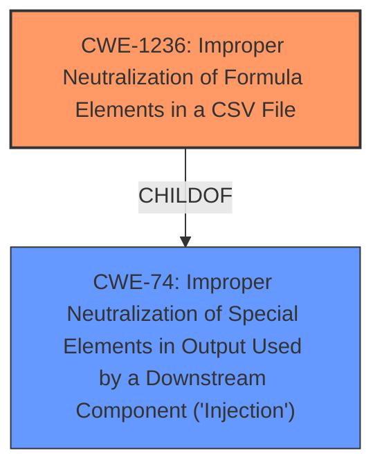

# Raw Analyzer Response for CVE-2022-1544

# Summary

| CWE ID | CWE Name | Confidence | CWE Abstraction Level | CWE Vulnerability Mapping Label | CWE-Vulnerability Mapping Notes |
|---|---|---|---|---|---|
| CWE-1236 | Improper Neutralization of Formula Elements in a CSV File | 1.0 | Base | ALLOWED | Primary CWE |
| CWE-74 | Improper Neutralization of Special Elements in Output Used by a Downstream Component ('Injection') | 0.5 | Class | DISCOURAGED | Secondary Candidate |

## Evidence and Confidence

*   **Confidence Score:** 1.0
*   **Evidence Strength:** HIGH

## Relationship Analysis
The primary relationship that influenced the decision was the parent-child relationship between CWE-74 (Improper Neutralization of Special Elements in Output Used by a Downstream Component ('Injection')) and CWE-1236 (Improper Neutralization of Formula Elements in a CSV File). CWE-1236 is a more specific case of injection, focusing on CSV files, making it a better fit than the more general CWE-74.

## Vulnerability Chain
The vulnerability chain starts with the **improper neutralization** of formula elements in a CSV file (CWE-1236). This leads to potential client-side command injection, code execution, and remote exfiltration of confidential data.

## Summary of Analysis
The initial analysis pointed towards CWE-1236 due to the explicit mention of "**Improper Neutralization of Formula Elements in CSV File**" in the vulnerability description, which aligns perfectly with the CWE's definition. The CVE Reference Links Content Summary further reinforces this by detailing the lack of proper sanitization and the resulting possibility of injecting malicious content into a CSV file.

The retriever results also list CWE-1236 as the top match, further strengthening the selection.

CWE-74 was considered as a broader "Injection" category but was deemed less specific than CWE-1236. The mapping guidance for CWE-74 discourages its use when more specific weaknesses are available.

Therefore, the final decision is to classify this vulnerability as CWE-1236, representing the **improper neutralization** of formula elements in a CSV file, as it is the most accurate and specific representation of the vulnerability based on the provided evidence.

Relevant CWE Information:

# Enhanced Context (25 CWEs)
The following CWEs were identified as potentially relevant to this vulnerability:

## CWE-74: Improper Neutralization of Special Elements in Output Used by a Downstream Component ('Injection')
**Abstraction Level**: Class
**Similarity Score**: 0.77
**Source**: dense

**Description**:
The product constructs all or part of a command, data structure, or record using externally-influenced input from an upstream component, but it does not neutralize or incorrectly neutralizes special elements that could modify how it is parsed or interpreted when it is sent to a downstream component.

**Mapping Guidance**:
- Usage: Discouraged
- Rationale: CWE-74 is high-level and often misused when lower-level weaknesses are more appropriate.

## CWE-1236: Improper Neutralization of Formula Elements in a CSV File
**Abstraction Level**: Base
**Similarity Score**: 0.76
**Source**: dense

**Description**:
The product saves user-provided information into a Comma-Separated Value (CSV) file, but it does not neutralize or incorrectly neutralizes special elements that could be interpreted as a command when the file is opened by a spreadsheet product.

**Mapping Guidance**:
- Usage: Allowed
- Rationale: This CWE entry is at the Base level of abstraction, which is a preferred level of abstraction for mapping to the root causes of vulnerabilities.

## CWE-79: Improper Neutralization of Input During Web Page Generation ('Cross-site Scripting')
**Abstraction Level**: Base
**Similarity Score**: 8378.97
**Source**: sparse

**Description**:
The product does not neutralize or incorrectly neutralizes user-controllable input before it is placed in output that is used as a web page that is served to other users.

**Mapping Guidance**:
- Usage: Allowed
- Rationale: This CWE entry is at the Base level of abstraction, which is a preferred level of abstraction for mapping to the root causes of vulnerabilities.

## CWE-1336: Improper Neutralization of Special Elements Used in a Template Engine
**Abstraction Level**: Base
**Similarity Score**: 8311.19
**Source**: sparse

**Description**:
The product uses a template engine to insert or process externally-influenced input, but it does not neutralize or incorrectly neutralizes special elements or syntax that can be interpreted as template expressions or other code directives when processed by the engine.

**Mapping Guidance**:
- Usage: Allowed
- Rationale: This CWE entry is at the Base level of abstraction, which is a preferred level of abstraction for mapping to the root causes of vulnerabilities.