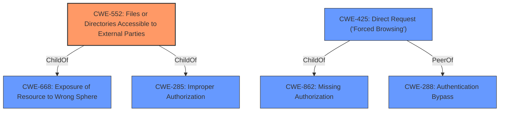

# Enhanced Analysis for CVE-2022-1551

# Summary
| CWE ID | CWE Name | Confidence | CWE Abstraction Level | CWE Vulnerability Mapping Label | CWE-Vulnerability Mapping Notes |
|---|---|---|---|---|---|
| CWE-552 | Files or Directories Accessible to External Parties | 0.9 | Base | Allowed | Primary CWE |
| CWE-425 | Direct Request ('Forced Browsing') | 0.7 | Base | Allowed | Secondary Candidate |

## Evidence and Confidence

*   **Confidence Score:** 0.8
*   **Evidence Strength:** HIGH

## Relationship Analysis
The primary CWE selected is CWE-552, which is a base-level CWE. It has a child relationship to CWE-668 (Exposure of Resource to Wrong Sphere) and CWE-285 (Improper Authorization). CWE-425 is also a base-level CWE and a peer to CWE-288 (Authentication Bypass) and a child of CWE-862 (Missing Authorization). The selection was influenced by the fact that the vulnerability involves direct access to files, aligning directly with the description of CWE-552.



## Vulnerability Chain
The chain of the vulnerability is as follows:
1.  **Root Cause:** **easily guessable path to store user files** (CWE-552)
2.  **Impact:** access other users sensitive files

## Summary of Analysis
The initial analysis focused on the description stating the vulnerability involved an **easily guessable path to store user files**, leading to unauthorized access to sensitive files.

The primary CWE mapping is CWE-552 (Files or Directories Accessible to External Parties). This CWE accurately captures the **root cause** where the system makes files accessible to unauthorized actors due to the predictable file path. The "CVE Reference Links Content Summary" explicitly states "The plugin uses an easily guessable path to store user files." which directly supports this mapping.

CWE-425 (Direct Request ('Forced Browsing')) was also considered as a secondary CWE. It is applicable because the vulnerability allows direct access to files through a predictable URL, bypassing intended access controls. However, it's more of a consequence of the insecure storage path rather than the primary **weakness**.

The selection of CWE-552 as the primary CWE is based on its direct alignment with the **root cause** and the evidence provided in the vulnerability description. The base level of abstraction is appropriate as it directly represents the nature of the flaw.

Relevant CWE Information:
# Enhanced Context (25 CWEs)
The following CWEs were identified as potentially relevant to this vulnerability:

## CWE-552: Files or Directories Accessible to External Parties
**Abstraction Level**: Base
**Similarity Score**: 0.81
**Source**: dense

**Description**:
The product makes files or directories accessible to unauthorized actors, even though they should not be.

**Mapping Guidance**:
- Usage: Allowed
- Rationale: This CWE entry is at the Base level of abstraction, which is a preferred level of abstraction for mapping to the root causes of vulnerabilities.

## CWE-425: Direct Request ('Forced Browsing')
**Abstraction Level**: Base
**Similarity Score**: 0.79
**Source**: dense

**Description**:
The web application does not adequately enforce appropriate authorization on all restricted URLs, scripts, or files.

**Mapping Guidance**:
- Usage: Allowed
- Rationale: This CWE entry is at the Base level of abstraction, which is a preferred level of abstraction for mapping to the root causes of vulnerabilities.


## CWE Relationship Analysis

Current CWEs represent these abstraction levels: .


### Vulnerability Chain Analysis

**Chain starting from CWE-552:**
- 552 (Files or Directories Accessible to External Parties) - ROOT


**Chain starting from CWE-862:**
- 862 (Missing Authorization) - ROOT


### CWE Relationship Diagram

```mermaid
graph TD
    classDef primary fill:#f96,stroke:#333,stroke-width:2px
    classDef secondary fill:#69f,stroke:#333
    classDef tertiary fill:#9e9,stroke:#333
```