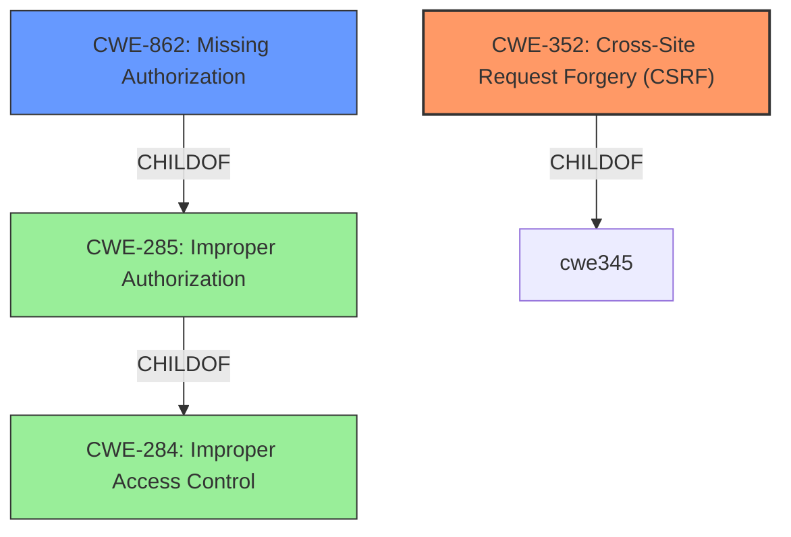

# Enhanced Analysis for CVE-2022-1570

# Summary

| CWE ID | CWE Name | Confidence | CWE Abstraction Level | CWE Vulnerability Mapping Label | CWE-Vulnerability Mapping Notes |
|---|---|---|---|---|---|
| CWE-352 | Cross-Site Request Forgery (CSRF) | 1.0 | Compound | Allowed | Primary CWE. The plugin lacks CSRF checks when resetting settings. |
| CWE-862 | Missing Authorization | 1.0 | Class | Allowed-with-Review | Secondary CWE. The plugin lacks authorization checks when resetting settings. |

## Evidence and Confidence

*   **Confidence Score:** 1.0
*   **Evidence Strength:** HIGH

## Relationship Analysis

The analysis focuses on the hierarchical relationships, specifically the ChildOf relationship. CWE-352 and CWE-862 are related to the **missing authorisation and CSRF checks**. CWE-352 is a compound weakness that requires multiple conditions to be met, making it a suitable primary classification. CWE-862 is a class-level weakness, and while it could have more specific base-level children, the provided information supports its inclusion as a secondary weakness.



## Vulnerability Chain

The vulnerability chain starts with the **missing authorisation and CSRF checks** in the Files Download Delay WordPress plugin. This allows any authenticated user, including subscribers, to reset the plugin's settings, leading to potential configuration manipulation and unintended behavior.

## Summary of Analysis

The initial analysis and the provided evidence strongly support the classification of this vulnerability as CWE-352 and CWE-862 because of the **missing authorisation and CSRF checks**.
The vulnerability description explicitly states the **missing authorisation and CSRF checks**, which aligns directly with the characteristics of CWE-352 and CWE-862. The "CVE Reference Links Content Summary" confirms this by stating that the root cause is the lack of authorization and CSRF checks, and the impact is that any authenticated user can reset the plugin's settings.

CWE-352: The plugin lacks CSRF checks when resetting settings, allowing any authenticated user to perform this action without proper verification that the request was intentionally provided by the user.
CWE-862: The plugin lacks authorization checks when resetting settings, allowing any authenticated user to perform this action without proper verification of their privileges.

The selected CWEs are at the optimal level of specificity because they accurately represent the **missing authorisation and CSRF checks**.

Relevant CWE Information:

# Enhanced Context (25 CWEs)

## CWE-1220: Insufficient Granularity of Access Control
This CWE was considered but not selected because the vulnerability is due to a complete lack of access control, not insufficient granularity.

## CWE-639: Authorization Bypass Through User-Controlled Key
This CWE was considered but not selected because the vulnerability does not involve bypassing authorization through user-controlled keys.

## CWE-807: Reliance on Untrusted Inputs in a Security Decision
This CWE was considered but not selected because the vulnerability is due to the **missing authorisation and CSRF checks**, not reliance on untrusted inputs in a security decision.

## CWE-274: Improper Handling of Insufficient Privileges
This CWE was considered but not selected because the vulnerability is not related to handling insufficient privileges.

## CWE-552: Files or Directories Accessible to External Parties
This CWE was considered but not selected because the vulnerability does not involve making files or directories accessible to external parties.

## CWE-184: Incomplete List of Disallowed Inputs
This CWE was considered but not selected because the vulnerability is due to the **missing authorisation and CSRF checks**, not an incomplete list of disallowed inputs.

## CWE-280: Improper Handling of Insufficient Permissions or Privileges
This CWE was considered but not selected because the vulnerability is not related to handling insufficient permissions or privileges.

## CWE-799: Improper Control of Interaction Frequency
This CWE was considered but not selected because the vulnerability does not involve improper control of interaction frequency.

## CWE-472: External Control of Assumed-Immutable Web Parameter
This CWE was considered but not selected because the vulnerability does not involve external control of assumed-immutable web parameters.

## CWE-183: Permissive List of Allowed Inputs
This CWE was considered but not selected because the vulnerability is due to the **missing authorisation and CSRF checks**, not a permissive list of allowed inputs.

## CWE-863: Incorrect Authorization
This CWE was considered but not selected because the vulnerability is due to **missing authorisation**, not incorrect authorization.

## CWE-285: Improper Authorization
This CWE was considered but not selected because the CWE-862 **Missing Authorization** is a better fit.

## CWE-116: Improper Encoding or Escaping of Output
This CWE was considered but not selected because the vulnerability does not involve improper encoding or escaping of output.

## CWE-425: Direct Request ('Forced Browsing')
This CWE was considered but not selected because the vulnerability is due to the **missing authorisation and CSRF checks**, not direct request.

## CWE-639: Authorization Bypass Through User-Controlled Key
This CWE was considered but not selected because the vulnerability does not involve bypassing authorization through user-controlled keys.

## CWE-434: Unrestricted Upload of File with Dangerous Type
This CWE was considered but not selected because the vulnerability does not involve unrestricted upload of files with dangerous types.

## CWE-178: Improper Handling of Case Sensitivity
This CWE was considered but not selected because the vulnerability does not involve improper handling of case sensitivity.

## CWE-430: Deployment of Wrong Handler
This CWE was considered but not selected because the vulnerability does not involve deployment of the wrong handler.

## CWE-613: Insufficient Session Expiration
This CWE was considered but not selected because the vulnerability does not involve insufficient session expiration.

## CWE-471: Modification of Assumed-Immutable Data (MAID)
This CWE was considered but not selected because the vulnerability does not involve modification of assumed-immutable data.

## CWE-98: Improper Control of Filename for Include/Require Statement in PHP Program ('PHP Remote File Inclusion')
This CWE was considered but not selected because the vulnerability does not involve improper control of filenames.

## CWE-351: Insufficient Type Distinction
This CWE was considered but not selected because the vulnerability does not involve insufficient type distinction.

## CWE-79: Improper Neutralization of Input During Web Page Generation ('Cross-site Scripting')
This CWE was considered but not selected because the vulnerability does not involve cross-site scripting.

## CWE-184: Incomplete List of Disallowed Inputs
This CWE was considered but not selected because the vulnerability is due to the **missing authorisation and CSRF checks**, not an incomplete list of disallowed inputs.

## CWE-183: Permissive List of Allowed Inputs
This CWE was considered but not selected because the vulnerability is due to the **missing authorisation and CSRF checks**, not a permissive list of allowed inputs.


## CWE Relationship Analysis

Current CWEs represent these abstraction levels: .


### Vulnerability Chain Analysis

**Chain starting from CWE-807:**
- 807 (Reliance on Untrusted Inputs in a Security Decision) - ROOT


**Chain starting from CWE-863:**
- 863 (Incorrect Authorization) - ROOT


### CWE Relationship Diagram

```mermaid
graph TD
    classDef primary fill:#f96,stroke:#333,stroke-width:2px
    classDef secondary fill:#69f,stroke:#333
    classDef tertiary fill:#9e9,stroke:#333
```