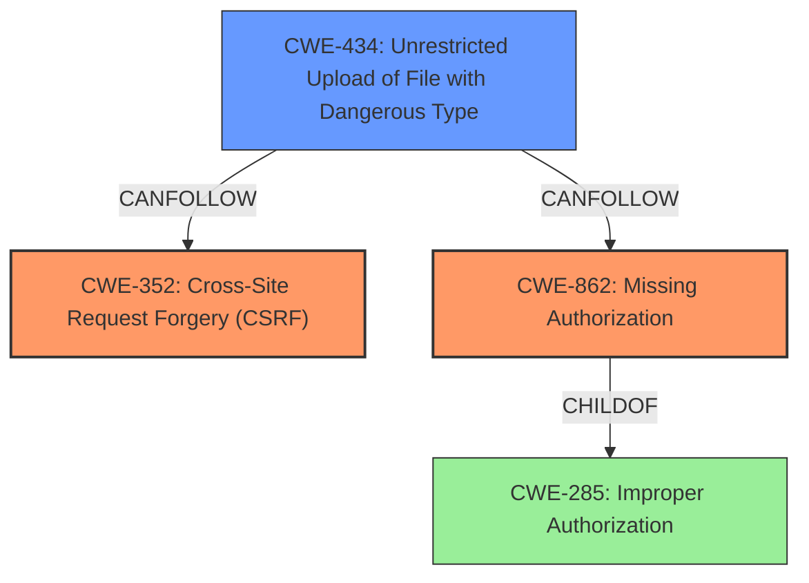

# Raw Analyzer Response for CVE-2022-1574

# Summary
| CWE ID | CWE Name | Confidence | CWE Abstraction Level | CWE Vulnerability Mapping Label | CWE-Vulnerability Mapping Notes |
|---|---|---|---|---|---|
| CWE-352 | Cross-Site Request Forgery (CSRF) | 0.9 | Compound | Allowed | Primary CWE: **Lack of CSRF Checks** |
| CWE-862 | Missing Authorization | 0.9 | Class | Allowed-with-Review | Primary CWE: **Lack of Authorization Checks** |
| CWE-434 | Unrestricted Upload of File with Dangerous Type | 0.8 | Base | Allowed | Secondary CWE: **Allows Arbitrary File Upload** |

## Evidence and Confidence

*   **Confidence Score:** 0.9
*   **Evidence Strength:** HIGH

## Relationship Analysis
The primary weaknesses identified are **CWE-352 [Cross-Site Request Forgery (CSRF)]** and **CWE-862 [Missing Authorization]**. These are compounded by **CWE-434 [Unrestricted Upload of File with Dangerous Type]**, which becomes possible due to the missing authorization and CSRF protections. **CWE-862 [Missing Authorization]** is a child of **CWE-285 [Improper Authorization]**, but **CWE-862 [Missing Authorization]** is more specific since the vulnerability description clearly indicates that there is a **lack of authorization checks**, not an incorrect one. **CWE-434 [Unrestricted Upload of File with Dangerous Type]** can be a consequence of missing input validation or improper authorization, linking it to the primary weaknesses.

## Vulnerability Chain
The vulnerability chain starts with the **lack of authorization and CSRF checks**, which directly leads to the ability to upload arbitrary files.
1.  **Root Cause:** **Missing Authorization (CWE-862)** and **Missing CSRF Protection (CWE-352)**
2.  **Weakness:** **Unrestricted Upload of File with Dangerous Type (CWE-434)**
3.  **Impact:** Remote Code Execution (RCE) by uploading and accessing a malicious PHP file.

## Summary of Analysis
The analysis is based on the provided vulnerability description and the identified root causes. The description explicitly mentions the **lack of authorization and CSRF checks**, making **CWE-352 [Cross-Site Request Forgery (CSRF)]** and **CWE-862 [Missing Authorization]** the primary CWEs. The ability to upload arbitrary files without validation is a direct consequence of these missing checks, which is represented by **CWE-434 [Unrestricted Upload of File with Dangerous Type]**.

The vulnerability description states: "The HTML2WP WordPress plugin through 1.0.0 does not have authorisation and CSRF checks when importing files, and does not validate them, as a result, unauthenticated attackers can upload arbitrary files (such as PHP) on the remote server." This statement is the basis for my selection.

The selection of **CWE-352 [Cross-Site Request Forgery (CSRF)]**, **CWE-862 [Missing Authorization]**, and **CWE-434 [Unrestricted Upload of File with Dangerous Type]** provides an optimal level of specificity. **CWE-862 [Missing Authorization]** is more specific than its parent **CWE-285 [Improper Authorization]**, because the vulnerability clearly states a **lack of authorization checks**, not an incorrect authorization implementation.

Other CWEs considered but not used:

*   **CWE-863 [Incorrect Authorization]:** While related to authorization, the vulnerability description emphasizes the **absence of authorization checks**, making **CWE-862 [Missing Authorization]** a more accurate fit.
*   **CWE-425 [Direct Request ('Forced Browsing')]:** Although the attack involves direct requests, the root cause is the **lack of authorization**, which allows these requests to succeed. Therefore, **CWE-425 [Direct Request ('Forced Browsing')]** is a secondary effect rather than a primary cause.
*   **CWE-646 [Reliance on File Name or Extension of Externally-Supplied File]:** While the plugin does not validate the files, this is a consequence of the missing authorization and CSRF checks. The primary issue is the ability to upload arbitrary files in the first place.
*   **CWE-306 [Missing Authentication for Critical Function]:** Authentication is not mentioned in the description. Authorization is the process of verifying if an identity has access to a resource.