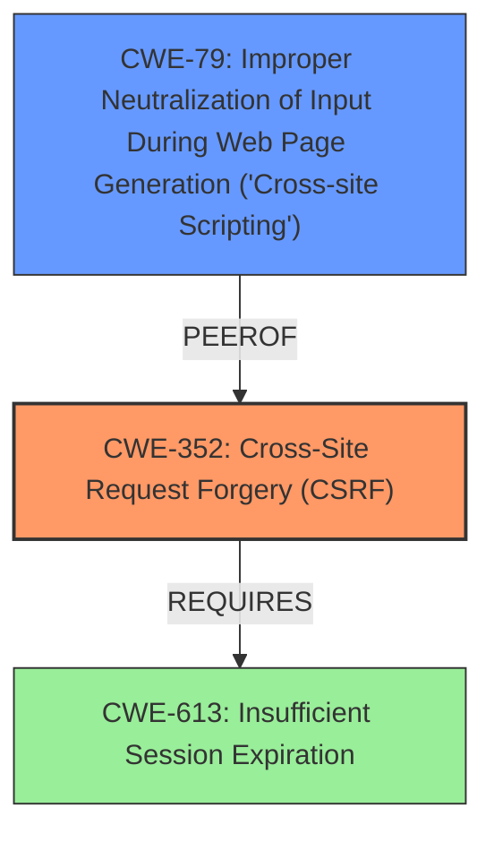

# Enhanced Analysis for CVE-2022-1593

# Summary
| CWE ID | CWE Name | Confidence | CWE Abstraction Level | CWE Vulnerability Mapping Label | CWE-Vulnerability Mapping Notes |
|---|---|---|---|---|---|
| CWE-352 | Cross-Site Request Forgery (CSRF) | 1.0 | Compound | Allowed | Primary CWE |
| CWE-79 | Improper Neutralization of Input During Web Page Generation ('Cross-site Scripting') | 1.0 | Base | Allowed | Secondary CWE |

## Evidence and Confidence

*   **Confidence Score:** 1.0
*   **Evidence Strength:** HIGH

## Relationship Analysis
The vulnerability is a combination of CWE-352 [Cross-Site Request Forgery (CSRF)] and CWE-79 [Improper Neutralization of Input During Web Page Generation ('Cross-site Scripting')].

CWE-352 is a compound weakness that requires multiple conditions to occur simultaneously. It also requires CWE-613 [Insufficient Session Expiration]. CWE-79 is a base level weakness describing the root cause of cross-site scripting. Both CWE-352 and CWE-79 are at acceptable levels of abstraction.



## Vulnerability Chain
The vulnerability chain starts with a **lack of CSRF protection (CWE-352)**, combined with **insufficient sanitization and escaping of user input (CWE-79)**. This leads to a stored XSS vulnerability, allowing attackers to inject malicious scripts into the plugin settings.

## Summary of Analysis
The primary weakness is the **lack of CSRF protection (CWE-352)**, which allows an attacker to inject malicious payloads. The secondary weakness is the **improper neutralization of input (CWE-79)**, which allows the injected payload to be interpreted as executable code.

The "Vulnerability Description" states the plugin is "**lacking sanitisation as well as escaping**" and indicates that attackers could inject Cross-Site Scripting payloads via a CSRF attack. The "CVE Reference Links Content Summary" confirms that the plugin lacks CSRF protection and fails to properly sanitize and escape user input. This evidence supports the selection of CWE-352 and CWE-79.

CWE-352 is a compound weakness, and CWE-79 is a base weakness. Both CWEs are at the recommended level of abstraction, making them appropriate choices for this vulnerability.

Relevant CWE Information:
# Enhanced Context (25 CWEs)
The following CWEs were identified as potentially relevant to this vulnerability:

## CWE-807: Reliance on Untrusted Inputs in a Security Decision
**Abstraction Level**: Base
**Similarity Score**: 0.77
**Source**: dense

**Description**:
The product uses a protection mechanism that relies on the existence or values of an input, but the input can be modified by an untrusted actor in a way that bypasses the protection mechanism.
**Rationale for not selecting**: The root cause is not that the product is relying on untrusted inputs, but that the product is missing CSRF checks.

## CWE-472: External Control of Assumed-Immutable Web Parameter
**Abstraction Level**: Base
**Similarity Score**: 0.77
**Source**: dense

**Description**:
The web application does not sufficiently verify inputs that are assumed to be immutable but are actually externally controllable, such as hidden form fields.
**Rationale for not selecting**: The root cause is not the lack of verification of immutable parameters, but rather the absence of CSRF protection.

## CWE-639: Authorization Bypass Through User-Controlled Key
**Abstraction Level**: Base
**Similarity Score**: 0.76
**Source**: dense

**Description**:
The system's authorization functionality does not prevent one user from gaining access to another user's data or record by modifying the key value identifying the data.
**Rationale for not selecting**: While this is related to authorization, the core issue here is the missing CSRF protection.

## CWE-74: Improper Neutralization of Special Elements in Output Used by a Downstream Component ('Injection')
**Abstraction Level**: Class
**Similarity Score**: 0.76
**Source**: dense

**Description**:
The product constructs all or part of a command, data structure, or record using externally-influenced input from an upstream component, but it does not neutralize or incorrectly neutralizes special elements that could modify how it is parsed or interpreted when it is sent to a downstream component.
**Rationale for not selecting**: This is a higher level class weakness that could be present, but CWE-79 is more specific to the "cross-site scripting" weakness.

## CWE-1289: Improper Validation of Unsafe Equivalence in Input
**Abstraction Level**: Base
**Similarity Score**: 0.76
**Source**: dense

**Description**:
The product receives an input value that is used as a resource identifier or other type of reference, but it does not validate or incorrectly validates that the input is equivalent to a potentially-unsafe value.
**Rationale for not selecting**: This doesn't accurately describe the vulnerability.

## CWE-184: Incomplete List of Disallowed Inputs
**Abstraction Level**: Base
**Similarity Score**: 0.76
**Source**: dense

**Description**:
The product implements a protection mechanism that relies on a list of inputs (or properties of inputs) that are not allowed by policy or otherwise require other action to neutralize before additional processing takes place, but the list is incomplete.
**Rationale for not selecting**: The vulnerability is not due to an incomplete list of disallowed inputs.

## CWE-41: Improper Resolution of Path Equivalence
**Abstraction Level**: Base
**Similarity Score**: 0.75
**Source**: dense

**Description**:
The product is vulnerable to file system contents disclosure through path equivalence. Path equivalence involves the use of special characters in file and directory names. The associated manipulations are intended to generate multiple names for the same object.
**Rationale for not selecting**: This is not related to path equivalence.

## CWE-425: Direct Request ('Forced Browsing')
**Abstraction Level**: Base
**Similarity Score**: 0.75
**Source**: dense

**Description**:
The web application does not adequately enforce appropriate authorization on all restricted URLs, scripts, or files.
**Rationale for not selecting**: While this is related to authorization, the more specific issue is the lack of CSRF protection.

## CWE-799: Improper Control of Interaction Frequency
**Abstraction Level**: Class
**Similarity Score**: 0.75
**Source**: dense

**Description**:
The product does not properly limit the number or frequency of interactions that it has with an actor, such as the number of incoming requests.
**Rationale for not selecting**: This doesn't accurately describe the vulnerability.

## CWE-668: Exposure of Resource to Wrong Sphere
**Abstraction Level**: Class
**Similarity Score**: 0.75
**Source**: dense

**Description**:
The product exposes a resource to the wrong control sphere, providing unintended actors with inappropriate access to the resource.
**Rationale for not selecting**: This is too high-level and doesn't accurately capture the specifics of the CSRF and XSS vulnerabilities.

## CWE-116: Improper Encoding or Escaping of Output
**Abstraction Level**: Class
**Similarity Score**: 8287.00
**Source**: sparse

**Description**:
The product prepares a structured message for communication with another component, but encoding or escaping of the data is either missing or done incorrectly. As a result, the intended structure of the message is not preserved.
**Rationale for not selecting**: This is similar to CWE-79, but less specific.

## CWE-352: Cross-Site Request Forgery (CSRF)
**Abstraction Level**: Compound
**Similarity Score**: 8003.40
**Source**: sparse

**Description**:
The web application does not, or can not, sufficiently verify whether a well-formed, valid, consistent request was intentionally provided by the user who submitted the request.
**Rationale for selecting**: This accurately describes the **missing CSRF protection** that is the root cause of the vulnerability.

## CWE-434: Unrestricted Upload of File with Dangerous Type
**Abstraction Level**: Base
**Similarity Score**: 7651.24
**Source**: sparse

**Description**:
The product allows the upload or transfer of dangerous file types that are automatically processed within its environment.
**Rationale for not selecting**: This is not related to file uploads.

## CWE-863: Incorrect Authorization
**Abstraction Level


## CWE Relationship Analysis

Current CWEs represent these abstraction levels: .


### Vulnerability Chain Analysis

**Chain starting from CWE-425:**
- 425 (Direct Request ('Forced Browsing')) - ROOT


**Chain starting from CWE-472:**
- 472 (External Control of Assumed-Immutable Web Parameter) - ROOT


### CWE Relationship Diagram

```mermaid
graph TD
    classDef primary fill:#f96,stroke:#333,stroke-width:2px
    classDef secondary fill:#69f,stroke:#333
    classDef tertiary fill:#9e9,stroke:#333
```