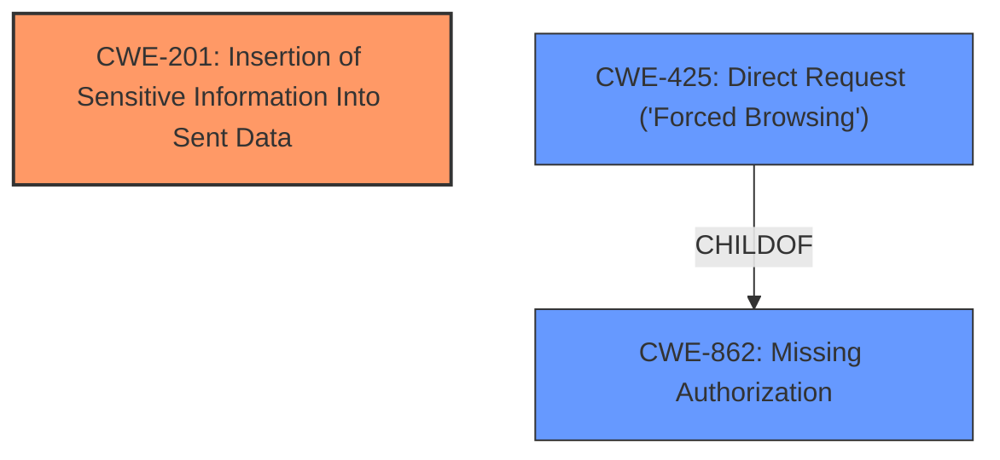

# Raw Analyzer Response for CVE-2022-1595

# Summary
| CWE ID | CWE Name | Confidence | CWE Abstraction Level | CWE Vulnerability Mapping Label | CWE-Vulnerability Mapping Notes |
|---|---|---|---|---|---|
| CWE-201 | Insertion of Sensitive Information Into Sent Data | 0.8 | Base | Primary | Allowed |
| CWE-425 | Direct Request ('Forced Browsing') | 0.6 | Base | Secondary | Allowed |

## Evidence and Confidence

*   **Confidence Score:** 0.7
*   **Evidence Strength:** MEDIUM

## Relationship Analysis
The primary CWE is CWE-201, which indicates the **insertion of sensitive information (the secret login URL) into sent data**. CWE-425 is a secondary concern because the vulnerability is triggered by a **direct request** to the `wp-login.php` endpoint, bypassing the intended access controls. CWE-201 focuses on the leakage of the secret URL, while CWE-425 highlights the **missing authorization** aspect. Both CWEs are at the Base abstraction level, which is the preferred level.

## Vulnerability Chain
The chain of events can be described as follows:

1.  A **crafted request** is sent to the `wp-login.php` endpoint.
2.  Due to **missing or inadequate checks** (CWE-425), the request is processed.
3.  The secret login URL is **inadvertently included in the response** (CWE-201).

## Summary of Analysis
Initially, the vulnerability description indicates that the HC Custom WP-Admin URL WordPress plugin leaks the secret login URL due to a **crafted request**. The **root cause** is the exposure of sensitive information, specifically the secret login URL. The **crafted request** aspect suggests a bypass of intended access controls.

The evidence supporting CWE-201 includes: "The plugin leaks the secret login URL" and "Unauthenticated secret URL disclosure." This aligns perfectly with CWE-201's description: "The code transmits data to another actor, but a portion of the data includes sensitive information that should not be accessible to that actor."

The evidence supporting CWE-425 is weaker, but the "crafted request" and "bypassing security measures intended to hide the login page" aspects hint at the web application not adequately enforcing appropriate authorization.

The graph relationships show that CWE-425 (Direct Request) is a ChildOf CWE-862 (Missing Authorization). However, since the primary issue is the leaking of the secret URL, CWE-201 is the better fit as the primary CWE.

CWEs 352, 472, 862, 306, 471, 863, 208, and 939 were considered but deemed less relevant. CWE-352 (CSRF) is not applicable as there is no mention of Cross-Site Request Forgery. CWE-472 (External Control of Assumed-Immutable Web Parameter) is less accurate, as it primarily concerns modification of parameters, not direct information leakage. CWE-862 (Missing Authorization) is a parent of CWE-425, and is too high level, while CWE-425 is applicable, it is not the primary issue. CWE-306 (Missing Authentication) is not the core issue since the leakage occurs even without proper authentication enforcement on the specific request. CWE-471 (Modification of Assumed-Immutable Data) is not applicable as the vulnerability does not involve modification of assumed-immutable data. CWE-863 (Incorrect Authorization) is again related to authorization which is not the primary concern. CWE-208 (Observable Timing Discrepancy) is not related to the vulnerability. CWE-939 (Improper Authorization in Handler for Custom URL Scheme) is too specific and doesn't fit the general nature of the vulnerability.

The selected CWEs are at the optimal level of specificity. CWE-201 accurately captures the sensitive information leakage, and CWE-425 provides additional context regarding the direct request nature of the attack.