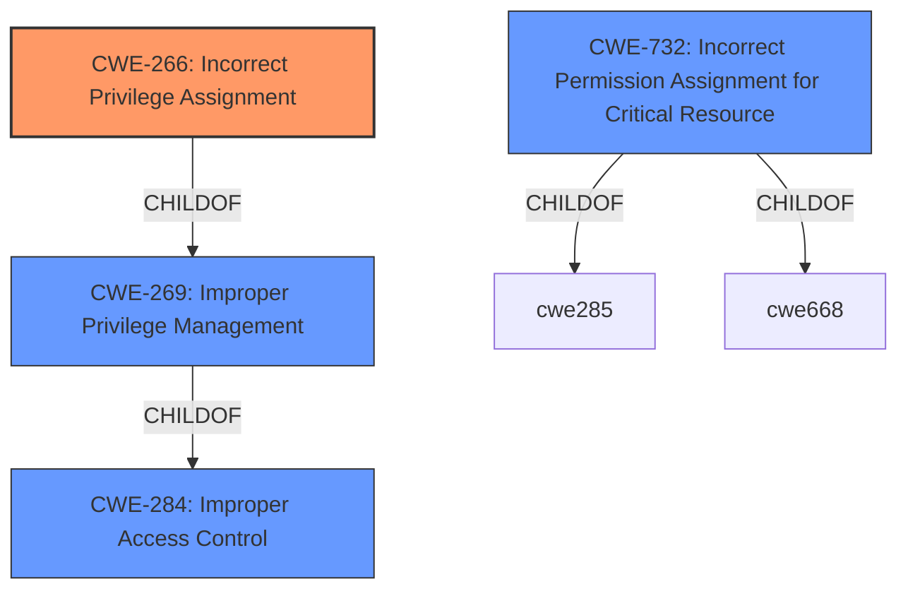

# Analysis Report for CVE-2022-1606

# Vulnerability Analysis Report: CVE-2022-1606

## Description


## Analysis (with Relationship Data)

# Summary
| CWE ID | CWE Name | Confidence | CWE Abstraction Level | CWE Vulnerability Mapping Label | CWE-Vulnerability Mapping Notes |
|---|---|---|---|---|---|
| CWE-266 | Incorrect Privilege Assignment | 1.0 | Base | Allowed | Primary CWE |
| CWE-732 | Incorrect Permission Assignment for Critical Resource | 0.7 | Class | Allowed-with-Review | Secondary Candidate |

## Evidence and Confidence

*   **Confidence Score:** 0.9
*   **Evidence Strength:** HIGH

## Relationship Analysis
The primary relationship that influenced the decision was the parent-child relationship between CWE-269 (Improper Privilege Management) and CWE-266 (Incorrect Privilege Assignment). CWE-266, being a more specific Base level CWE, was preferred over CWE-269, which is a Class level CWE. CWE-732 (Incorrect Permission Assignment for Critical Resource) was considered due to its relevance to resource access, but ultimately, the core issue was deemed to be the incorrect assignment of a privilege, making CWE-266 the more accurate classification.



## Vulnerability Chain
The vulnerability chain involves an **incorrect privilege assignment** (CWE-266) which leads to the ability to read unmanaged objects, effectively causing information disclosure. The chain is relatively short and direct.

## Summary of Analysis
The initial analysis identified **incorrect privilege assignment** as the root cause, which aligns well with the description of CWE-266. The "CVE Reference Links Content Summary" section confirms this by stating, "Incorrect privilege assignment within the M-Files Server. Specifically, the 'See and undelete deleted objects' permission grants unintended access." This statement provides strong evidence for the selection of CWE-266.

The graph relationships highlight the hierarchical structure of CWEs related to access control. While CWE-284 (Improper Access Control) is a high-level categorization, CWE-269 (Improper Privilege Management) and CWE-266 provide more specific classifications. The decision to select CWE-266 is based on the fact that the vulnerability is directly caused by the **incorrect assignment of a privilege**, rather than a general failure in access control.

CWE-266 is at the optimal level of specificity because it directly addresses the root cause of the vulnerability, which is the **incorrect assignment of the "See and undelete deleted objects" permission**. This assignment allows a user to read unmanaged objects, which is an unintended consequence of the privilege.

Relevant CWE Information:

# Enhanced Context (25 CWEs)
The following CWEs were identified as potentially relevant to this vulnerability:

## CWE-266: Incorrect Privilege Assignment
**Abstraction Level**: Base
**Similarity Score**: 0.76
**Source**: dense

**Description**:
A product incorrectly assigns a privilege to a particular actor, creating an unintended sphere of control for that actor.

**Mapping Guidance**:
- Usage: Allowed
- Rationale: This CWE entry is at the Base level of abstraction, which is a preferred level of abstraction for mapping to the root causes of vulnerabilities.

## CWE-732: Incorrect Permission Assignment for Critical Resource
**Abstraction Level**: Class
**Similarity Score**: 4884.96
**Source**: sparse

**Description**:
The product specifies permissions for a security-critical resource in a way that allows that resource to be read or modified by unintended actors.

**Mapping Guidance**:
- Usage: Allowed-with-Review
- Rationale: While the name itself indicates an assignment of permissions for resources, this is often misused for vulnerabilities in which "permissions" are not checked, which is an "authorization" weakness (CWE-285 or descendants) within CWE's model [REF-1287].

## CWE-269: Improper Privilege Management
**Abstraction Level**: Class
**Similarity Score**: 0.108
**Source**: sparse

**Description**:
The product does not properly assign, modify, track, or check privileges for an actor, creating an unintended sphere of control for that actor.

**Mapping Guidance**:
- Usage: Discouraged
- Rationale: CWE-269 is commonly misused. It can be conflated with "privilege escalation," which is a technical impact that is listed in many low-information vulnerability reports [REF-1287]. It is not useful for trend analysis.

CWE-284 was deemed too high-level, as the issue isn't a general access control problem but a specific **incorrect assignment**. CWE-269 was also considered, but the more specific CWE-266 was chosen as it describes precisely what happened. The "See and undelete deleted objects" permission was incorrectly assigned such that it provided the ability to read unmanaged objects.


## CWE Relationship Analysis

Current CWEs represent these abstraction levels: .


### Vulnerability Chain Analysis

**Chain starting from CWE-266:**
- 266 (Incorrect Privilege Assignment) - ROOT


**Chain starting from CWE-732:**
- 732 (Incorrect Permission Assignment for Critical Resource) - ROOT


### CWE Relationship Diagram

```mermaid
graph TD
    classDef primary fill:#f96,stroke:#333,stroke-width:2px
    classDef secondary fill:#69f,stroke:#333
    classDef tertiary fill:#9e9,stroke:#333
```


*Report generated on 2025-03-30 22:31:44*
